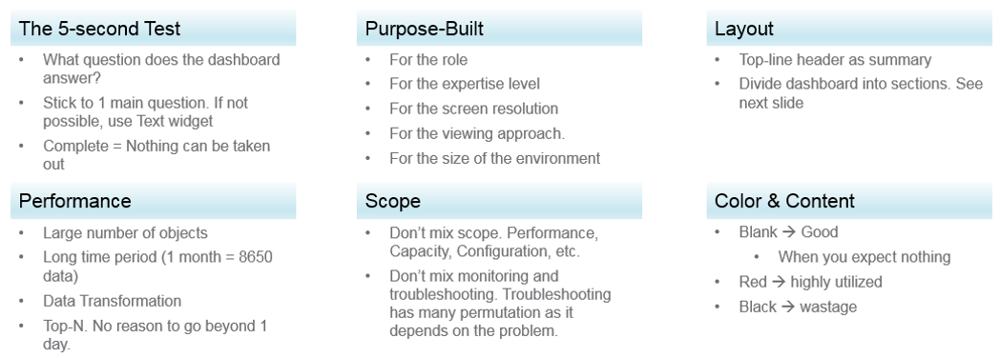
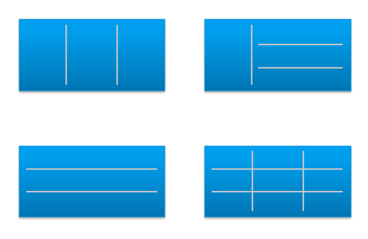
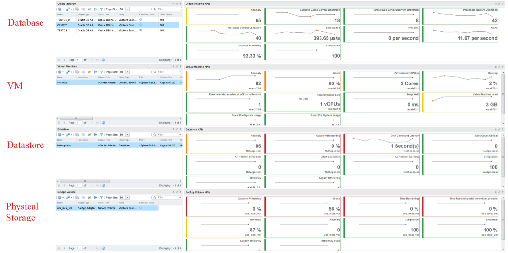

To a few of us who love visualizing information with vRealize Operations, we see the dashboard as a canvas. Granted, the widgets have limitation but that’s part of the art 😊

Creating dashboards is an art as you need to balance many conflicting requirements, such as:

Can the dashboard be understood within 5 seconds? If yes, you buy yourself a few more minutes. The user understands what the dashboard does, and is willing to spend more time mastering it. To pass this test, think of which information, object, metric can you take away from the dashboard? See the [KISS Principle](https://en.wikipedia.org/wiki/KISS_principle), because an uber-dashboard that tries to please everyone and cover all scenarios will end up not being used.

Begin with the end in mind. The purpose dictates the dashboard design. 2 dashboards can have an identical target role, purpose, and use case (e.g. performance), but if the size of the environment differs, the 2 dashboards will be different. An environment with 50,000 VMs is managed differently with an environment of 50 VMs.

A small environment with 100 VMs in just 8 hosts in 1 cluster (hence 1 data center, 1 vCenter) needs less dashboards than an environment with 10,000 VM spread over 800 ESXi hosts, 100 clusters, 10 data centers and 3 vCenters.

## Dashboard Design Method

This section introduces us to a few considerations surrounding dashboard design. We will walk through a method where we are able to understand the user, the activity, the workflow and the other aspects needed to understand the context before we start. 

When we create dashboards that are used by others in our team we have to consider a few aspects that are helpful in making information useful, usable and delightful.

##### Who

- Who (Role/ Persona) is going to use the dashboard?
- Start by creating a list of all users who would be accessing and using information in the dashboard 
- Against this list mention the kind of information they would find useful for the specific persona.

##### What

- What is the type of activity (granular vs. high level) they will perform?
- List next to the task if the information needs to be granular or high level. Sometimes users are looking for just a KPI number, sometimes they are looking for trends. Sometimes users might want to interact with the information, create drill downs etc. 
- The complexity of the activity will help you identify if you need a complex widget or a simple one. 

##### How
- How (workflow) will they use the dashboard?
- List down what happens after they view the information, do they need to use another application, another visualisation. Plan accordingly and place navigation to enable this to happen. 

##### When
- How often (hourly, daily, weekly, monthly, quarterly) will they use the dashboard?
- Think about the usage of the dashboard, is it a frequent use case needed for daily use to perform work, or is it for monitoring on an irregular basis. 

##### Why
- Why (outcome) do they need the dashboard? 
- Also list down outcomes from the dashboard usage. What is the usefulness of using the dashboard and what goals or outcomes the user is likely to achieve. 

Once we get this information we can better design dashboards based on the needs of the users. One way could be to plot it on a grid to understand the impact better. Let’s start with a grid like this one.

Now if take the example of Who from different roles/personas 

An executive might use the dashboard less frequently and the type of tasks they would perform could be high level. If you make a dashboard that is very granular and requires a lot of effort the executive might not have the time to use the dashboard. 

A manager might use the dashboard once a week, or on a monthly timeline, might need information on both granular or high-level.

Similarly an admin agent might use it on a daily basis and might need information at times that needs a lot of effort and at other times just a metric number would do.

Once you have reached a visualisation like this, you can better judge. If it needs to be a single dashboard or multiple based on the persona. What items should you prioritise and what kind of complexity is necessary based on the timeframe and time available with the stakeholder

## Clean Layout

Divide the screen into sections visually. This makes the dashboard easier to read. Here are some examples of how you can divide the screen.

Here is a good example of layout . Notice how simple it is. It is clear that it has 4 layers as layout is consistent among them.

## Past vs Present

The past is harder to visualize as it has >1 data points. Ideally, you show the data as a line chart so you can see the trend. Showing a single data such as the maximum or average can miss critical information such as “is it trending upwards or downwards” and “how long did the peak last?”. The problem with line chart is it takes up screen real estate.

If you need to show a lot of objects or metris, then you need to summarize. As covered in Leading Indicator, you may need to show 2 numbers, especially if one of them is an average. 