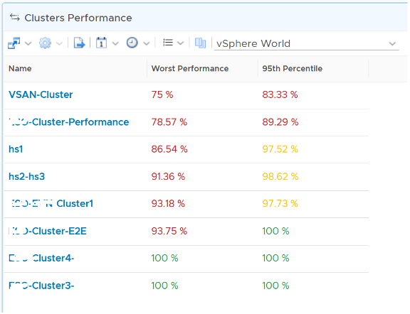

A table is simply a list, where each row represents an object, and each column shows a single value. This enables us to list hundreds of rows, with ability to filter and sort. Each cell value can also be color coded. 

Table is good for details. However, as a ***summary***, its main problem is how to give an insight over time as each cell can only hold 1 value. How to give an insight into what happens in the past? For example, how to see the performance in the last 1 week? There are 2016 datapoints in the last 7 days, which one do you pick to represent?

There are a few possible options in vRealize Operations 8.2
- The current number. It’s useful to show the present situation. However, this does not tell what happened 5 minutes ago. Its usefulness is hence limited.
- The average of the period. Average is a Lagging Indicator. By the time the average is bad, roughly 50% of the number is unlikely to be good. It is not suitable for proactive monitoring. 
- The worst of the period. This is suitable for daily average, as there are only 288 data points in 24 hours. If you find that results in outlier, then replace it with 99th percentile. As it only takes 1 peak to set this value, your chance of outlier is 7x higher in a week. It’s great for peak detection, but needs to be complemented with 95th percentile when looking at weekly or monthly period.
- The 95th percentile number. This is a good midpoint between Average and Worst. For performance monitoring, 95th percentile is a better summary than average. Use both the Worst and 95th percentile numbers together for better insight. If the numbers are far apart, that indicates the Worst number is likely an outlier. If the numbers are similar, you have a problem.

From the above, we should choose Max and 95th percentile. 

The following table implements the above concept.

