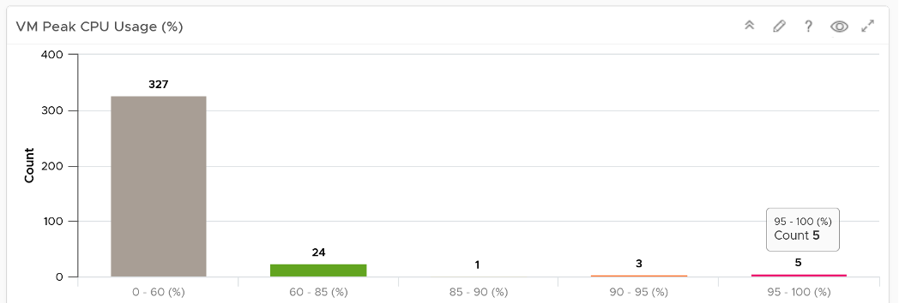

The **VM Utilization** dashboard complements the **VM Contention** dashboard. Together, their goal is to help VMware Administrator in performance management. 

## Design Consideration

This dashboard is designed to support the VM Contention dashboard. Use it to identify VMs with high utilization in a selected data center. When utilization exceeds 100%, performance can be negatively impacted especially when queue developed inside the Windows or Linux. By default, vRealize Operations has a 5-minute collection interval. For 5 minutes, there may be 300 seconds worth of data points. If a spike is experienced for a few seconds, it may not be visible if the remaining of the 300 seconds is low utilization.

See the Performance Dashboard page for common design consideration among all the dashboards for performance management. 

## How to Use

Select a data center from the **Data center** table
- For small environment, select vSphere World to see VMs from all the data centers. 
- Note that the count of VM includes powered off VMs. If you need to exclude them, modify the widget and choose running VM metric.

The **VM Peak CPU Usage** bar charts will be automatically shown

- There is no Peak Memory usage as it's not actually that applicable. Memory is a form of storage. Consider the hard disk space occupied. A 90% utilization of the space is not slower than 10%. It's a capacity issue, not performance. 
- The bar chart is color coded. This time around, there are 5 colors not 4. The color grey is introduced to convey wastage. Resources that are hardly utilized may not mean performance is at peak. In fact, it could be the opposite. If a VM just need 1+ vCPU, configuring it with 2 CPU will result in better performance than configuring it with 128 CPU.

The table listing all the VMs in the selected data center is automatically shown.

- Analysing by data center makes sense as performance problems tend to be isolated in a single physical environment. A performance problem in country A typically does not cause performance problem in country B. 
- The table focuses on peak utilization, because the context is performance, not capacity. You want an early warning, and the peak value delivers that. If you think this is too aggressive, change the formula to show the 99thpercentile value. 
- For memory counter, the table shows counter from inside the Guest OS. The VM counter Consumed and Active are not shown as they are not about VM performance.
- I've customized the table above to use Gbps for storage and Mbps for network, as that's more appropriate.

Choose a VM from the table. 

- Use Disk IOPS and Throughput together, especially for applications that use large block size. An IO with 250x block size (e.g. 1 MB instead of 4 KB) will generate equal throughput at 250x less IOPS, all else being equal
- Memory Paging is added in VM utilization dashboard and not VM contention dashboard, as paging metrics are not measuring slowness in memory. The only thing faster than memory is CPU, so memory performance means CPU is waiting for RAM. The waiting is typically caused by the page is not in the physical DIMM or CPU cache. Paging does not measure this slowness. In addition, virtual memory is an integral part of Windows and Linux memory management. It's used alongside physical RAM, not after physical RAM is fully utilized. Microsoft Windows Super Fetch is an example of that integrated memory management. 
- Disk Space is per Guest OS Partition. Reason is that's how Windows or Linux manages their partitions or drives. 
- If the Guest OS counters does not appear, that likely means either VMware Tools, ESXi, or vCenter fail to meet the minimum requirement. Once these are met, the counters will appear as no other configuration is needed in vRealize Operations.
- Compliment the free memory with the memory IOPS or the memory throughput metric. The metrics in gigabyte measure the space, and not the speed. Memory is a form of storage, so what you must measure is the rate, for example, read-write per second.

## Points to Note

See the Points to Note section of VM Contention dashboard as this dashboard is designed to complement it.

Health chart is not used for these 2 reasons: 
- Some utilization metrics do not have a "ceiling", meaning we don't know what "high utilization" is, as 100% is hard to define. Example of such metrics are disk IOPS and network throughput.
- High utilization actually means good performance. 100% utilization is in fact perfect performance, as that means more work is being done.