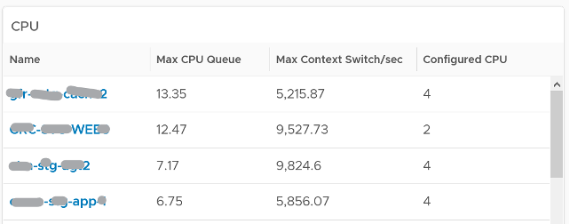

There are counters that directly impact the performance of Windows or Linux, the Operating Systems running inside a VM. These KPIs are outside the control of the hypervisor, meaning ESXi VMkernel is not able to control the increase or decrease of their values. Visibility into these KPIs also requires an agent, such as VMware Tools. As a result, they are typically excluded in performance monitoring. 

Because these KPIs are closer to the applications, it is critical to know their values and establish an acceptable range, which will vary in your environment. By profiling the actual performance over time and from of all VMs, you can establish a threshold that is supported by facts. Since there are 8766 instances of 5 minutes in a month, profiling 1000 VM over a month means you are analyzing 8.8 million datapoints, more than enough to draw a conclusion.

## Design Consideration

In larger environments, loading thousands of VMs into dashboards takes time. To make these dashboards load faster, we have grouped them by data center. For smaller environments, the vSphere World group is available to see all VMs.

## How to Use

Select a data center from the data centers list. 
- The three tables listing CPU, memory and Disk will automatically show the VMs in the selected data center or vSphere World. 
- Each table shows the highest value in the last 1 week (2016 datapoints based on 5-minute collection cycles), hence their columns are prefixed with Max.

About the CPU table widget

- The CPU queue is the sum of all vCPU. A larger VM can tolerate higher queue as it simply has more processors. If you want to compare VMs of different size, create a super metric that calculates the queue per vCPU. 
- The Max CPU Queue column shows the highest number of processes in the queue during the given period. Best practices indicate you should stay below 3 for each queue. For a VM with 8 CPUs (8 queues), you want to be below 24. 
- I can't find documentation that states if CPU Hyper Threading (HT) technology provides 2x the number of queue length. Logically it should as the threads are at the start of the CPU pipelines, and both threads are interspersed in the core pipeline. 
- CPU Context Switch. There is cost associated with context switch. The problem is there is no guidance for this number, and it varies widely. This is the very purpose of this dashboard!

About the Memory list widget
- Memory paging: Modern operating systems (Linux and Windows) use memory as cache, it's much faster than disk. It proactively pre-fetches pages and anticipates future needs (Windows calls this Super Fetch). The rate pages that are being brought in and out can reveal memory performance abnormalities. A sudden change, or one that has sustained over time, can indicate page faults. Page faults indicate pages aren't readily available and must be brought in. If a page fault occurs too frequently it can impact application performance. While there is no concrete guidance, as it varies by application, you can view relative size. Operating Systems typically use 4KB or 2MB page sizes.

About the Disk list widget
- Disk Queue are queued IO commands not sent to the VM. They have been retained inside the Guest OS (either at kernel level or driver level). High disk queue in the guest OS, accompanied by low IOPS at the VM, can indicate that the IO commands are stuck waiting on processing by Windows/Linux. There is no concrete guidance regarding these IO commands threshold as it varies for different applications. You should view this in relation to the Outstanding Disk IO at the VM layer.

Select any VM from any tables above. The three line charts will appear automatically and will show data from the same VM to facilitate correlation.

## Points to Note

- These guest OS metrics do not appear unless [vSphere prerequisites](https://kb.vmware.com/s/article/55697) have been met. 
- Once you determine an acceptable threshold for your environment, consider adding thresholds to the table so you can easily see the VMs that exceed a threshold.
- Group the VM by clusters of the same class of service (e.g. Gold), so you can see the profile for each environment
- For smaller environment, consider changing the table from listing data centers to listing clusters.