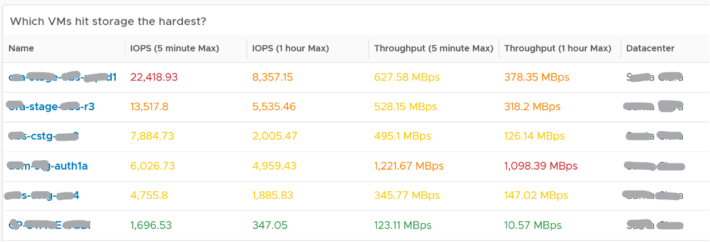

The **Storage Heavy Hitters** dashboard forms a pair with the **Network Top Talkers** dashboard. To understand the IO demands in your environment, use them concurrently. If you are using ethernet based storage, storage traffic will run over the same physical network your ethernet based network traffic is using.

## Design Consideration

The Storage Heavy Hitters dashboard forms a pair with the Network Top Talkers dashboard, so they share the same consideration behind their design. 

## How to Use

See the **Network Top Talkers** dashboard as they basically have the same design. 
- The main difference is storage IO has 2 dimensions: IOPS and throughput. 
- Network IO does not have the IOPS dimension as the packet size is identical (1500 bytes being the standard packet, and 9000 bytes being the [jumbo frames](https://en.wikipedia.org/wiki/Jumbo_frame)). 
- Storage IOPs and throughput are related, so use both to gain insight, they should display a similar pattern. If not, that indicates varying block sizes. For example, a throughput spike without an accompanying IOPs spike indicates large block sizes. 

About the “Which VMs hit storage the hardest” table

 
- The table shows the most demanding VM. You can identify the villain VM and compare their demands with the capabilities of the underlying IaaS. Knowing the infrastructure capability is important, because different class of SSD have different IOPS and throughput capabilities. 

After identifying the villain VM, talk to the VM owners if the numbers are excessive during peak hours and identify the reasons behind the excessive usage. You must ensure that they do not create a hot spot, for example, vSAN cluster with >100 disk can handle numerous IOPS but if the VM objects are only on a few disks, those disks can become a hot spot. 

## Points to Note
Interpreting IOPs and throughput metrics depends on your underlying physical storage. For visibility into this hardware layer, add physical storage metrics to the dashboard.
