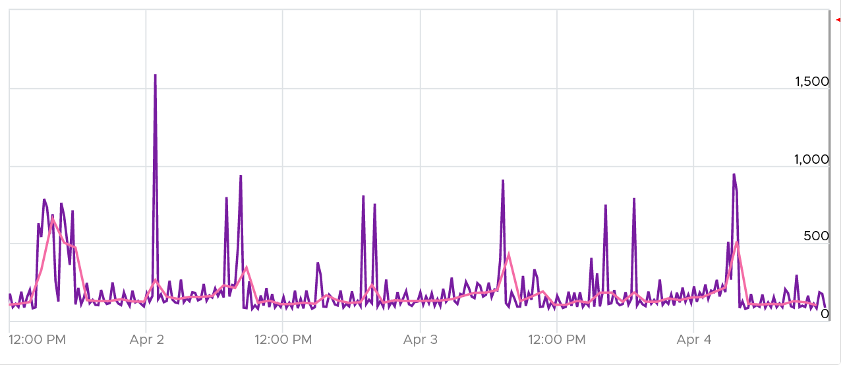

Use the Network Top Talkers dashboard to monitor network demand in your IaaS. In a shared environment, a few VMs generating excessive activity can impact the entire data center. While a single VM might not cause a serious problem, a few of them can. Understanding high demand helps you monitor IaaS and allows you to plan capacity. 

IaaS provides four services, CPU, Memory, Disk, and Network. CPU, Memory, and Disk are bound, but an active VM can consume all your network bandwidth, packet per second capacity and storage IOPS capacity.

A VM with 4 vCPU and 16 GB memory cannot consume more than this amount, the same applies to disk space. A VM configured with 100 GB disk space cannot consume more than that. 

Network throughput, disk throughput, and disk IOPS can spike as their physical limit is generally very high per VM. This means that IaaS has enough capacity for all workloads and performs well until VMs start consuming abnormally high amounts of network and disk bandwidth. 

## Design Consideration

This dashboard is designed to help you analyze the impact of these VMs on your IaaS. It classifies the workload into two categories: short bursts and sustained hits.

Short burst last for a few minutes, while sustained hits can last much longer. A sustained hit that lasts for an hour can cause serious problems.

The Network Top Talker dashboard forms a pair with the Storage Heavy Hitter dashboard. To understand the IO demand in your environment, use both for a more complete picture.

## How to Use

The dashboard shows the big picture, while allowing you to see the individual VM. It is important to see the VM utilization in the larger context.

The dashboard begins by showing the current workload. This is the total network load (received and transmit) from all vSphere environments monitored by vRealize Operations. The idea is to give you an indicator on how hard the overall load is.
Select a data center from the data centers list. 
- The columns show the number of clusters, ESXi Hosts and VM for each Data center. The VM count includes powered off VM. If you need to show only the running VM count, edit the widget.
- If you want to see from all Data center, select the vSphere World row.
- Upon selection, the Total Demand line chart and the Top Talkers table will be automatically filled up.

About the Total Demand line chart:

 
This shows the total throughput (received and transmit) in the selected data center.

It shows both the 5-minute peak and the hourly average into 1 line chart. You would expect that the 5-minute peak is much higher than the hourly average, indicating it is just a short burst. You can click on the metric name to hide the corresponding line chart. 

About the Top Talkers table:

The table shows the most demanding VM. To help you focus on the VMs that hit the network hard, VMs that are not hitting the network hard are filtered out. The threshold used is 1 Megabyte/second sustained in the last collection cycle.

You can identify the villain VM and compare their demands with the capabilities of the underlying IaaS. Knowing the infrastructure capability is important. For example, an ESXi with 2 x10 Gb port can theoretically handle 20 Gb TX + 20 Gb RX as its full duplex. 

After identifying the villain VM, talk to the VM owners if the numbers are excessive during peak hours and identify the reasons behind the excessive usage. You must ensure that they do not create a hot spot, for example, vSAN cluster with >100 disk can handle numerous IOPS but if the VM objects are only on a few disks, those disks can become a hot spot. 

## Points to Note
- A heat map would enable us to visualize the data easier. However, it can’t show the past data, hence it’s not used. If you want see in heat map form, see the Live! Heavy Hitters dashboard.