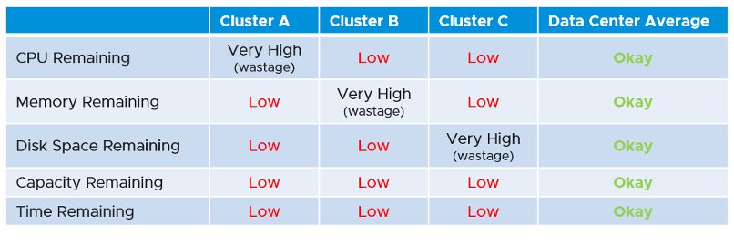

Capacity Management dashboards share the same design principles. They are intentionally designed to be similar, as it will be confusing if each dashboard looks totally different from one another, considering they have the same objective.

The dashboard is designed “top down”. It has 2 sections: summary and detail.
- The summary section is typically placed at the top of the dashboard. It gives the big picture. 
- The detail section is placed below the summary section. It lets you drill down into a specific object. For example, if it’s a VM capacity, you can get the detail capacity of a specific VM. 

Not all objects lend themselves for capacity management. Take the data center object for example. It can contain clusters of different purpose, with different performance characteristic. It might not make sense to combine the metrics into a single data center Capacity (%) metric, if the member clusters are not interchangeable.

This section is designed with quick context switch, as you may want to check the capacity of multiple objects in the course of capacity analysis. Take for example VM capacity analysis. The dashboard gives you all the VM-specific information and allows you to see the capacity summaries without changing screens. You can move from one VM to another and view the details without opening multiple windows.

UI wise, the dashboard uses progressive disclosure to minimize information overload and ensure the webpage loads fast. On the other hand, so long your browser session remains, it remembers your last selection.

You may notice that the performance dashboards and the capacity dashboards share similar layout. The reason is there is commonality in both pillars of operations.
 
The dashboard is design to complement the out of the box pages by visualizing information differently and giving more choice of customization. For examples, the reclamation size is grouped into buckets so you can focus on the largest reclamation opportunities first, and trend charts are provided so you can quickly see the growth over time, without changing context (e.g. open a new screen).
