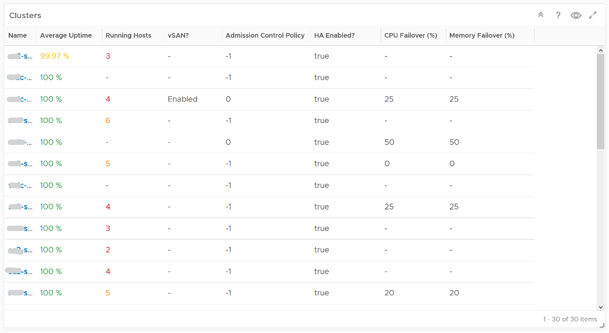
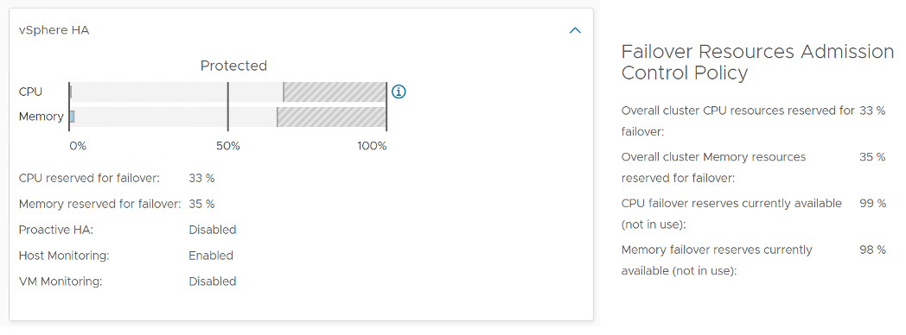
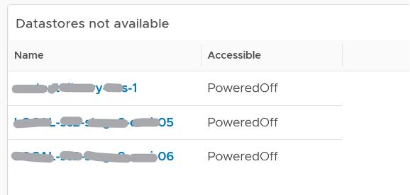

There are two layers of Availability, that is, the Consumer layer and the Provider layer. The vSphere Availability dashboard covers the Provider layer. This dashboard includes a cluster and not an ESXi host because the cluster is operationally a single compute provider. This dashboard considers the N+1 design, where the cluster can withstand one host failure. Logically, a cluster with fewer hosts has a higher risk.

The dashboard is designed to help you analyze and report the uptime, as availability is typically part of official business SLA. It's also often required in the monthly operational summary report.

The dashboard is not designed for live monitoring of the uptime. An NOC style of dashboard is better suited for that use case. Tools such as vRealize Log Insight should also be leveraged as fault is typically preceded with soft errors. 

## How to Use

The table Clusters lists all the clusters in your environment. In a very large environment, creating a filter for the list of clusters can make it more manageable. One is is to group the clusters by their class of services. Group your clusters into Gold, silver, and bronze and default the selection to Gold. In this way, you can see your Gold clusters more easily.

 
It is sorted by the lowest uptime, so your attention is drawn to the cluster with the lowest uptime in the last 1 month. The column is based on the *average* of the last 1 month as availability SLA is should be calculated per month (but reported much more frequently).

The metric used is `Summary \ Cluster Availability (%)`, which assumes N+1 design. That means if there is 1 node failure, the metric is still showing 100%.

The column **Running Hosts** are color coded as logically a smaller cluster has higher risk. A single host failure results in relatively higher capacity degradation.

The column **vSAN?** is added as hyper-converged means you need to consider both the compute part and the storage part.

The Admission Control Policy is based on the property `Cluster Configuration \ DAS Configuration \ Active`. The mapping between code to name is:
- -1 = Disabled
- 0 = Cluster Resource percentage
- 1 = Slot Policy (Powered-on VMs)
- 2 = Dedicated Failover Hosts

The cluster failover percentage columns map to the following values in vCenter client UI.

Select a cluster from the above
- The cluster uptime will be automatically plotted. It's using 25%, 50%, and 75% as the threshold for red, orange and yellow respectively. The reason for low threshold is the 5 minute window. A complete 5 minute downtime is only 0.0116% when measured against a 30-day SLA. If the uptime was 100%, it will only go down to 99.9884%
- The ESXi in the selected cluster table will be automatically filled up. For more context, you can add a property widget that lists the selected ESXi Host properties. 
- The 'Connected to vCenter' and 'Maintenance State' columns are not the average values, as both are string. However, they display the last state in the selected period. This allows you to go back to a specific point in time and view availability at that point.

About the "Datastore not available" list

- It filters to only those datastores with status powered off. This covers both local and shared datastore. To add context, consider adding extra column such as the data center where it resides, and the datastore type (e.g. NFS, VMFS)

About the Port Group availability list
- This lists port groups which at present has uptime of less than 100%. 
- To add context, consider adding extra column such as the data center where it resides, used number of ports and maximum number of ports

## Points to Note
Consider adding vCenter Server availability and NSX components availability. This requires the VMware SDDC Health monitoring solution.