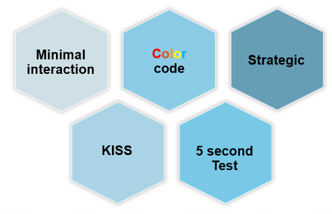
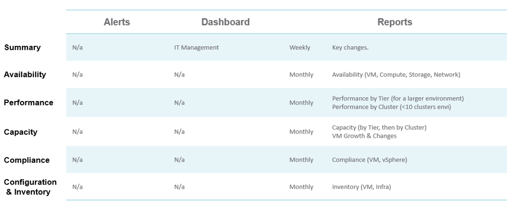

CIO, Head of Global Infrastructure, and other IT Senior Management have a different requirement than technical folks. Generally they want the big picture, not details. Or at the very least, the big picture is presented first, and then drill down is provided.

As part of showing the big picture, trend should be included. Show the situation in the last few months, ideally coupled with projection. The data should be averaged out, so that a 5-minute spike should not show up.

Exception. Things that they need their attention. Complete means nothing else can be taken out. Which information, object, metric can you take out from the dashboard?
No technical info. Ideally, present in business terms, not IT jargons. Terminology such as datastore, distributed switch may need to be replaced with something suitable in your organization.

UI that is easy to understand. So keep each dashboard to a specific question. Make sure the dashboard is easy to use. So keep the interaction, clicking, zooming, sorting, etc. minimal.

Can the dashboard be understood within 5 seconds? 

If yes, you buy yourself a few more minutes. Your IT Management has understood what the dashboard does, and is willing to spend more time appreciating its full capabilities. 

Take note of the “size” of your dashboard.

KISS. Keep it simple solution. Keep the interaction, clicking, zooming, sorting, etc. minimal. Use larger fonts, round numbers (law of significant number)

If they ask for a self-service portal, then make it easy to access. They may not want to login to vRealize Operations. If they do, they may forget their password, so the portal should not require a password.

 
That’s what ***they*** want from you. You also need to think of what you want from them.

You also want to show them problems that you can get help, which is budget and resource. You do this by showing data. By giving visibility into **live** environment to senior management, you prove that you do need additional hardware. If there is wastage to be reclaim, you also prove on where and how large the wastage is. 

 
vRealize Operations provide two example dashboards to get you started. They are designed for you to present live information to your senior management. They are not designed as self service. 

As each executive may have a unique requirements and preferences, customize the dashboard accordingly.