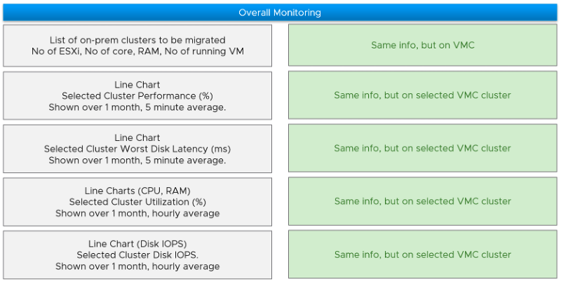

When you are migrating your customers workload to another infrastructure, the onus is on you to prove that You are not causing problems to the VMs or Applications. This is especially true if it’s your idea to migrate, and You are not giving them a choice.

There are many examples of migration. Popular ones are:

- From old DC to new DC.
- From on-prem to VMware Cloud on AWS.
- From on-prem to Cloud. This is typically VMware-based cloud as you can simply move without changing VM.

In the above, you typically change all infrastructure. New server, new network, new storage, new vSphere. You may virtualize network by adding NSX. You may also virtualize storage by going vSAN.

Regardless, your Application Team do not and should not care. It’s transparent to them. In fact, it should be better as You are using **faster & bigger hardware**. You have more CPU cores, faster RAM, faster storage, bigger network, less network hops, etc.

And that’s exactly where the problem might start.

A VM that takes 8 hours to complete its batch job may now take 2 hours, all else being equal. So it completes the same amount of work, doing as many disk, network, CPU, memory operations in 4x shorter duration.

So what happens to the VM IOPS? Yes, it went up by 400%, all else being equal.

What happens to VM CPU Usage? It also went up by 400%. It has to, as it completes the same amount of logic. Suddenly, a VM that runs relatively idle at 20% becomes highly utilized 80%.

All the above is fine, if not for the next factor. Can you guess what is it?

Hint: it’s how you justify the budget to your management.

Yes, you promise higher consolidation. You have more CPU cores, more RAM, so logically you use higher [over-commit ratio](https://blogs.vmware.com/vsphere/2015/11/vcpu-to-pcpu-ratios-are-they-still-relevant.html). As [Mark Achtemichuk](https://blogs.vmware.com/vsphere/author/mark_achtemichuk) said in [this article](https://blogs.vmware.com/vsphere/2015/11/vcpu-to-pcpu-ratios-are-they-still-relevant.html), use it carefully.

Since you have to increase overcommit ratio, how do you then prove that performance will not be affected as you drive utilization higher?

The answer is to look at what KPI can impact a VM performance. A VM Owner looks at her VM performance, not your IaaS utilization. The VM Contention dashboard is designed for that.

Moving a busy VM to another ESXi only needs to see the VM external footprint. It matters not if Guest OS is doing excessive memory paging or has long CPU run queue. None of these internal works are visible by the hypervisor, hence they are irrelevant.

Before vs After comparison cannot be done *immediately* after a VM is migrated. The First VM will experience greatest performance improvement. It is the only VM in the VMC cluster, so it has 0 contention. The Last VM will experience greatest performance degradation. It was the only VM in the on-prem cluster, so it had 0 contention.

The following table shows a sample design of a comparison dashboard. It has two identical columns, allowing you to do show before vs after comparison.

