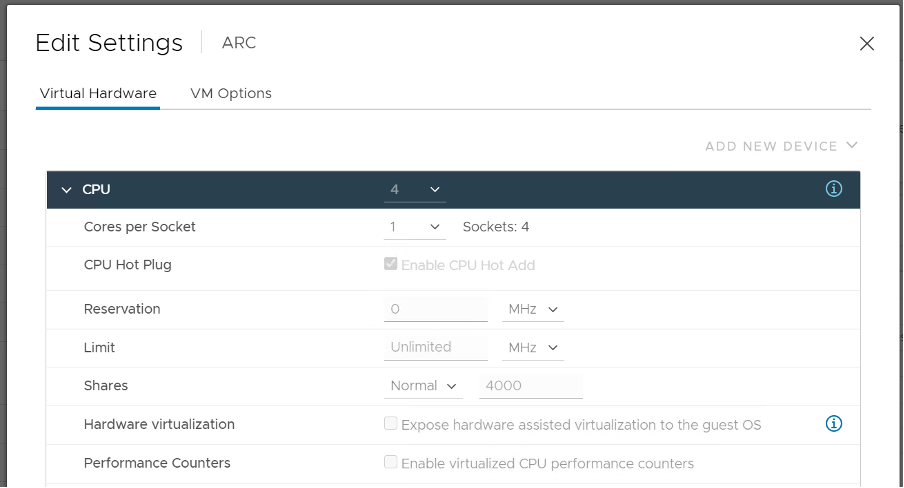

You need to know the following concepts that vSphere uses to manage the shared resources:

- Reservation
- Limit
- Share
- Entitlement

Reservation represents a guarantee. It impacts the Provider (e.g. ESXi) as that’s where the reservation takes place. However, it works differently on CPU vs RAM. 

##### CPU

If the VM does not use the resource, then it does not come into play as far as the VM is concerned. It’s only enforced during the period where the VM actually uses it.

##### RAM

If it’s not yet used, then it does not take effect. Meaning ESXi Host does not allocate any physical RAM to the VM. However, once a VM asks for memory and it is served, the physical RAM is reserved. From then on, ESXi continues reserving the physical RAM even though the VM is no longer using it. In a sense, the page is locked despite the VM become idle for days. The Consumed metric includes this to reflect this behaviour. No other VM can touch it even though it’s not used.

---

Limit should not be used as it’s not visible to the Guest OS. The result is unpredictable and could create a worse performance problem than reducing the VM configuration. For CPU, it impacts the CPU Ready counter. For RAM, in the VMX file, this is sched.mem.max.

Unlike Reservation and Share, which are statically configured, Entitlement is calculated *dynamically*. It considers Limit, Reservation, and Shares. For Shares, it certainly must consider Shares of other VMs running on the same host. A VM can’t use more than what ESXi entitles it.

Reservation, Share and Limit are relatively static. They do not fluctuate unless they are manually changed. Hence, they behave more like a property than a metric.