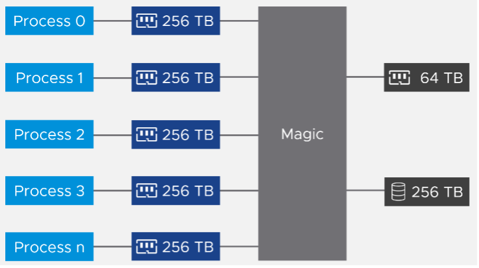
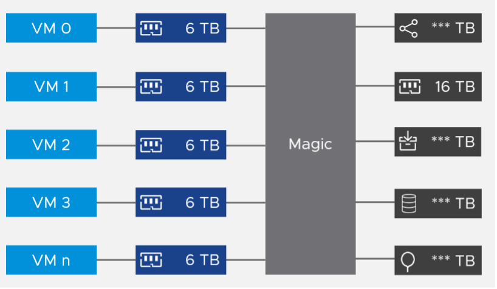

Before we talk about memory counter, we need to cover virtual memory, as it’s an integral part of memory management. The following shows how Windows or Linux masks the underlying physical memory from processes running on the OS.

From the process’ point of view, this technique provides a contiguous address space, which makes memory management easier. It also provides isolation, meaning process A can’t see the memory of process B. This isolation provides some level of security.

Virtual Memory abstraction provides the possibility to overcommit. Linux may have 16 GB of physical RAM, but by using pagefile the total memory available to its processes can exceed 16 GB. The process is unaware what is backing its virtual address. It does not know whether a page is backed by Physical Memory or Swap File.

With virtualization, VM adds another layer. So we actually have 4 layers from Process à Guest OS àVM à ESXi. Each of these layers have their own address space.

From the VMs point of view, it provides a contiguous address space and isolation (which is security). The underlying physical pages at ESXi layer may not be contiguous, as it’s managed differently. The [VM Monitor](/metrics/chapter-1-overview/2.1.2-guest-os-vs-vm/) for each VM maps the VM pages to the ESXi pages[^1]. This page mapping is not always 1:1. Multiple VM pages may point to the same ESXi pages due to transparent page sharing. On the other hand, VM page may not map to ESXi page due to balloon and swapped. The net effect is the VM pages and ESXi pages (for that VM) will not be the same, hence we need two sets of counters.

#### VM Memory

Counters tracks the VM Pages. There are 2 sets, one for each VM, and one a summation at ESXi level for all running VMs. Do not confuse the summation with ESXi memory counters.

- Examples: Granted or Memory Shared

#### ESXi Memory

Counters tracks the ESXi Pages. There are also 2 sets, but the summation at ESXi level contains Vmkernel own memory and VM overhead

- Examples: Consumed or Memory Shared Common

This abstraction provides the possibility to overcommit, because the VM is unaware what is backing the physical address. It could be Physical Memory, Swap File, Copy On Write, zipped, or ballooned.

Further reading: [vSphere Resource Management](https://www.vmware.com/techpapers/2006/resource-management-with-vmware-drs-401.html) technical paper.

[^1]: Officially the term is Guest Physical Page and Machine Page. I find it unnecessarily confusing, so I just call it VM pages and ESXi pages.