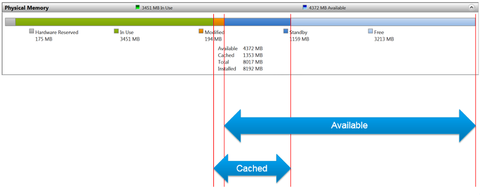
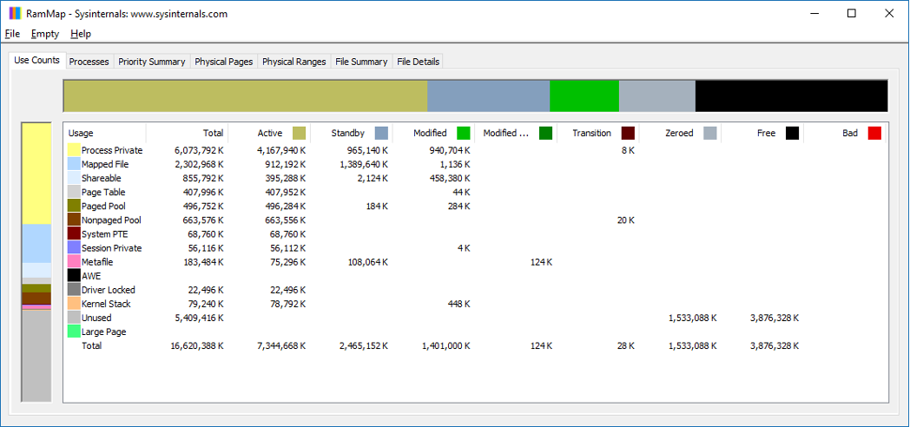
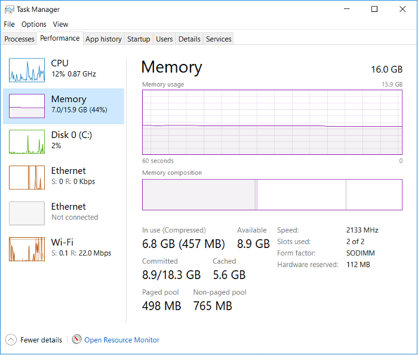
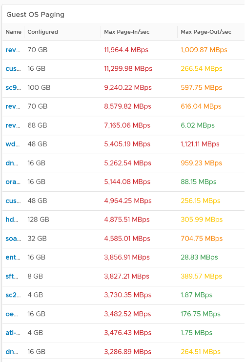
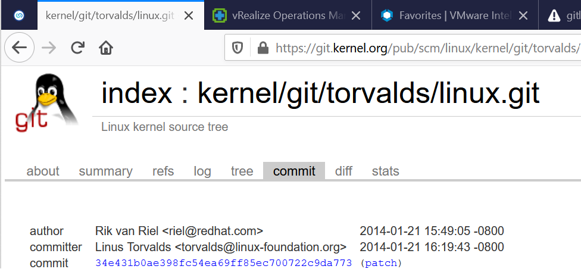
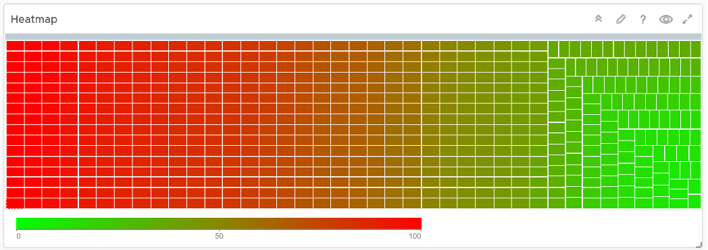
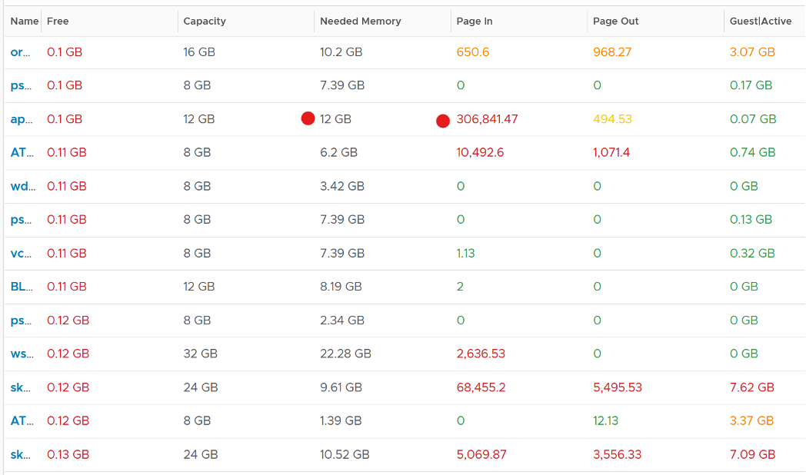

Windows memory management is not something that is well explained. [Ed Bott](https://www.zdnet.com/meet-the-team/us/ed-bott/) sums it [this](http://www.zdnet.com/article/windows-7-memory-usage-whats-the-best-way-to-measure/) article by saying “Windows memory management is rocket science”. Like what Ed has experienced, there is conflicting information, including the ones from Microsoft. [Mark Russinovich](https://www.linkedin.com/in/markrussinovich/), cofounder of Winternals software, explains the situation in [this](https://blogs.technet.microsoft.com/markrussinovich/2008/11/17/pushing-the-limits-of-windows-virtual-memory/) TechNet post.

Available means exactly what the word means. It is the amount of physical memory immediately available for use. Immediately means Windows does not need to copy the existing page before it can be reused.

In formula, here is their definition:

- Cached = Standby + Modified
- Available = Standby + Free

It is easier to visualize it, so here it is:



Windows and Linux manage memory differently, and they also name their metrics differently. VMware Tools provide a set of universal metrics from these two popular types of Guest OSes. The following shows what it looks like in Linux


A popular tool for Windows monitoring is SysInternal. In addition to the above, it shows Transition and Zeroed.



## In Use

This is the main counter used by Windows, as it's featured prominently in Task Manager.



This is often thought as the **minimum** that Windows needs to operate. This is not true. If you notice on the preceding screenshot, it has compressed 457 MB of the 6.8 GB In Use pages, indicating they are not actively used. Windows compresses its in-use RAM, even though it has plenty of Free RAM available (8.9 GB available). This is a different behaviour to ESXi, which do not compress unless it's running low on Free.

Look at the chart of Memory Usage above. It's sustaining for the entire 60 seconds. We know this as the amount is too high to sustain for 60 seconds if they are truly active, let alone for hours.

Formula:

`In use = Total – (Modified + Standby + Free`

## Modified

Page that was modified but **no longer** used, hence it's available for other usage but requires to be saved to disk first. It's not counted as part of Available, but counted as part of Cache.

## Standby

Windows has 3 levels of standby. As reported by VMware Tools, their names are:

- Standby Core
- Standby Normal
- Standby Reserve

Different applications use the memory differently, resulting in different behaviour of the metrics. As a result, determining what Windows actually use is difficult.

The Standby Normal counter can be fluctuating wildly, resulting in a wide difference if it's included in rightsizing. The following VM is a Microsoft Exchange 2013 server mailbox utility.


Notice the Standby Normal fluctuates wildly, reaching as high at 90%. The other 2 cache remains constantly negligible. The chart above is based on >26000 samples, so there is plenty of chance for each 3 counters to fluctuate.

Now let's look at another example. This is a Windows Server 2016. I think it was running Business Intelligence software Tableau.


Notice the VM usable memory was increased 2x in the last 3 months. Standby Normal hardly move, but Standby Reserve took advantage of the increments. It simply went up accordingly, although again it's fluctuating wildly.

## Cache

Cache is an integral part of memory management, as the more you cache, the lower your chance of hitting a cache miss. This makes sense. RAM is much faster than Disk, so if you have it, why not use it? Remember when Windows XP introduced pre-fetch, and subsequently Windows SuperFetch? It's a clue that Memory Management is a complex topic. There are many techniques involved. Unfortunately, this is simplified in the UI. All you see is something like this:


Linux and VMkernel also has its fair share of simplifying this information. This [Linux Ate My RAM](http://linuxatemyram.com/) documents it well. For ESXi, a common misperception is “we are short on RAM, but fine on CPU”, when it is actually the **other way around**. To prove it, check the performance counters for each cluster. You may see that the VMs have CPU performance while cluster CPU utilization is lower than cluster memory utilization.

## Free

As the name implies, this is a block of pages that is immediately available for usage. This excludes the cached memory. A low free memory does not mean a problem if the Standby value is high. This number can reach below <100 MB, and even touch 0 MB momentarily. It's fine so long there is plenty of cached. I'd generally keep this number > 500 MB for server VM and >100 MB for VDI VM. I set a lower number for VDI because they add up. If you have 10K users, that's 1 TB of RAM.

When a Guest OS frees up a memory page, it normally just updates its list of free memory; it does not release it. This list is not exposed to the hypervisor, and so the physical page remains claimed by the VM. This is why the Consumed counter in vCenter remains high when the Active counter has long dropped. Because the hypervisor has no visibility into the Guest OS, you may need to deploy an agent to get visibility into your application. You should monitor both at the Guest OS level (for example, Windows and Red Hat) and at the application level (for example, MS SQL Server and Oracle). Check whether there is excessive paging or the Guest OS experiences a hard [page fault](https://en.wikipedia.org/wiki/Page_fault). For Windows, you can use tools such as *pfmon*, a page fault monitor.

## Page File

[Memory paging](https://en.wikipedia.org/wiki/Memory_paging) is an integral part of Guest OS Memory Management. OS begins using it even though it still has plenty of physical memory. It uses both physical memory and virtual memory at the same time. Microsoft recommends that you do not delete or disable the page file. See [this](http://windows.microsoft.com/en-us/windows/change-virtualmemory-size) for reference.


As shown on the diagram, processes see virtual memory, not physical memory. Guest OS presents this as system API to processes. The virtual memory is backed by the page file and physical memory. Guest OS shields the physical memory and hardware. Paging is an operation of reading/writing from the page file into the physical memory, not from physical disk into the page file.

Let Windows manages the pagefile size. This is the default setting, so you likely have it already. By default, windows sets the pagefile size to the same size with the physical memory. So if the VM has 8 GB of RAM, the pagefile is an 8 GB file. Anything above 8 GB indicates that Windows is under memory pressure.

The size of Page File is not a perfect indicator of the RAM usage, because they contain pages that are never demanded by the App. Windows does SuperFetch, where it predicts what pages will be used and prefetch them in advance. Some of these pages are never demanded by the application. Couple with the nature that Guest OS treats RAM as cache, including the page file will result in oversized recommendation. Paging rate is more realistic as it only considers the recent time period (300 seconds in vRealize Operations case).

A page would be used as cache if it was paged out at some point due to memory pressure and it hasn't been needed since. The OS will reuse that page as cache. That means that at some point the OS was constrained on memory enough to force the page out to happen.

A page that was paged out earlier, has to be brought back first before it can be used. This creates performance issue as the application is waiting longer, as disk is much slower than RAM.

There are 2 types of page operations:

- **Page In**: This is a potential indicator for performance.
- **Page-out**: This is a potential indicator for capacity.

While Paging impacts performance, the correlation between the paging counters and performance varies per application. You can't set a threshold and use it to monitor many VMs. The reason is paging is not always used when Guest OS runs out of memory. There are a few reasons why paging may not correlate to memory performance:

- Memory mapped files. This is essentially a file that has a mapping to memory. Processes use this to exchange data. It also allows the process to access a very large file (think of database) without having to load the entire database into memory.
- Proactive pre-fetch. It predicts the usage of memory and pre-emptively reads the page and bring it in. This is no different to disk where the storage array will read subsequent blocks even though it's not being asked. This especially happens when a large application starts. Page-in will go up even though there is no memory pressure (page out is low or 0).
- Windows performs memory capacity optimization in the background. It will move idle processes out into the page file.

If you see both Page-in and Page-out having high value, and the disk queue is also high, there is a good chance it's memory performance issue.

The counter `%pagefile` tracks how much of the pagefile is used, meaning the value 100% indicate the pagefile is fully utilized. While the lower the number the better, there is no universal guidance. If you know, let me know!

Reference: [this](https://docs.microsoft.com/en-US/troubleshoot/windows-server/performance/ram-virtual-memory-pagefile-management) is an old article as it covers 32 bit Windows. If you find a newer one, kindly let me know.

## Guest OS Paging Metrics

There are 2 metrics. Page-in and Page-out.

The unit is in number of pages, not MB. It's not possible to convert due to mix use of Large Page (2 MB) and Page (4 KB). A process can have concurrent mixed usage of large and non-large page in Windows. The page size isn't a system-wide setting that all processes use. The same is likely true for Linux Huge Pages.

The page-in rate metric tracks the rate OS brings memory back from disk to DIMM per second. Another word, the rate of reads going through paging/cache system. It includes not just swap file I/O, but cacheable reads as well (so it's double pages/s).

Page Out is the opposite of the above process. It is not as important as Page In. Just because a block of memory is moved to disk that does not mean the application experiences memory problem. In many cases, the page that was moved out is the idle page. Windows does not page out any Large Pages.

The block size is likely 4 KB. Some applications like Java and databases use 2MB pages.

You can profile your environment to see which VMs are experiencing high paging. Create a view, and convert the paging rate into MB/second, by assuming the page size is 4 KB. I'd say > 1 GB/second is high.



From the above table, it's interesting to note the page-in dwarf page-out. I plotted one of the VM and page-in far exceed page-out consistently over 7 days.


## Committed

This tracks the currently committed virtual memory, although not all of them are written to the pagefile yet. It measures the demand, so commit can go up without In Use going up, as Brandon Paddock shares [here](http://brandonlive.com/2010/02/21/measuring-memory-usage-in-windows-7/). If Committed exceeds the available memory, paging activity will increase. This can impact performance.

**Commit Limit**: Commit Limit is physical RAM + size of the page file. Since the pagefile is normally configured to map the physical RAM, the Commit Limit tends to be 2x. Commit Limit is important as a **growing** value is an **early warning sign**. The reason is Windows proactively increases its **pagefile.sys** if it's under memory pressure.

The pagefile is an integral part of Windows total memory, as explained by [Mark Russinovich](https://blogs.technet.microsoft.com/markrussinovich/2008/11/17/pushing-the-limits-of-windows-virtual-memory/) explains here. There is Reserved Memory, and then there is Committed Memory. Some applications like to have its committed memory in 1 long contiguous block, so it reserves a large chunk up front. Databases and JVM belong in this category. This reserved memory does not actually store meaningful application data or executable. Only when the application commits the page that it becomes used. Mark explains that “when a process commits a region of virtual memory, the OS guarantees that it can maintain all the data the process stores in the memory either in physical memory or on disk”.

Notice the word **on disk**. Yes, that's where the pagefile.sys comes in. Windows will use either the physical memory or the pagefile.sys.

So how do we track this committed memory?

The metric you need to track is the Committed Byte. The % Committed metric should not hit 80%. Performance drops when it hits 90%, as if this is a hard threshold used by Windows. We disabled the pagefile to verify the impact on Windows. We noticed a visibly slower performance even though Windows 7 showing >1 GB of Free memory. In fact, Windows gave error message, and some applications crashed. If you use a pagefile, you will not hit this limit.

We have covered Free Memory and Committed Memory. Do they always move in tandem? If a memory is committed by Windows, does it mean it's no longer free and available?

The answer is **no**. Brandon Paddock demonstrated [here](http://brandonlive.com/2010/02/21/measuring-memory-usage-in-windows-7/) that you can increase the committed page without increasing the memory usage. He wrote a small program and explained how it's done. The result is Windows committed page is double that of memory usage. The Free Memory & Cached Memory did not change.

## Active File Cache Memory

This is the actively in-use subset of the file cache. Unused file cache and non-file backed anonymous buffers (mallocs etc) are not included. 

This is the size of the portion of the system file cache which is currently resident and active in physical memory. The System Cache Resident Bytes and Memory \ Cache Bytes counters are equivalent. Note that this counter displays the last observed value only; it is not an average during the collection period.

In Linux, this is the amount of file cache memory, in kibibytes, that is in active use, or was in active use since the last time the system reclaimed memory. This is retrieved via the command:

```bash
$ cat /proc/meminfo | grep Active
Active:         50955636 kB
Active (anon):  30148196 kB
Active (file):  20807440 kB
```

For further reading, refer to [Linux](https://stackoverflow.com/questions/45487506/what-is-inactivefile-and-activefile-in-proc-meminfo) and [Windows](https://wutils.com/wmi/root/cimv2/win32_perfrawdata_perfos_memory/#systemcacheresidentbytes_properties).

## Linux Memory Metrics

As you can guess from above, Linux does it differently. These are the counters that we're interested from right sizing use case.

Linux has 2 types of cache: Slab Reclaim and Cached.

vSphere Tools 10.3.5 provides the following counters:

- Total
- Available
- Free
- Buffers
- Used = total - free - buffers - cached
- Cached = guest.mem.cached + guest.mem.slabReclaim

From the [kernel documentation](https://git.kernel.org/pub/scm/linux/kernel/git/torvalds/linux.git/commit/?id=34e431b0ae398fc54ea69ff85ec700722c9da773), the definition are:

- “Cached includes memory that is not freeable as page cache, for example shared memory segments, tmpfs, and ramfs, and it does not include reclaimable slab memory, which can take up a large fraction of system memory on mostly idle systems with lots of files.”
- Available = An _estimate_ of how much memory is available for starting new applications, without swapping. Calculated from MemFree, SReclaimable, the size of the file LRU lists, and the low watermarks in each zone. The estimate takes into account that the system needs some page cache to function well, and that not all reclaimable slab will be reclaimable, due to items being in use. The impact of those factors will vary from system to system.
- Buffers: Relatively temporary storage for raw disk blocks shouldn't get tremendously large (20MB or so)

I notice the above was committed by Linus himself, on Jan 2014. Hats off for doing low level things like this!



## Guest OS Free Memory

This is one the 3 major counters for capacity monitoring. The other 2 counters are Page-in Rate and Commit Ratio. These 3 are not contention counters, they are utilization counters. Bad values can contribute to bad performance, but they can't measure the severity of the performance. Windows and Linux do not have a counter that measures how long or how often a CPU waits for memory.

In Windows, this is the Free Memory counter. This excludes the cached memory. If this number drops to a low number, Windows is running out of Free RAM. While that number varies per application and use case, generally keep this number > 500 MB for server VM and >100 MB for VDI VM. The reason you should set a lower number for VDI because they add up quickly. If you have 10K users, that's 1 TB of RAM.

Further reading for Linux, read [this](http://www.chrisjohnston.org/ubuntu/why-on-linux-am-i-seeing-so-much-ram-usage).

It's okay for this counter to be low, so long other memory counters are fine. The following table shows VMs with near 0 free memory. Notice none of them are needing more memory. This is the perfect situation as there is no wastage.


## Guest OS Memory Needed

We shared earlier that the purpose of memory is to act as disk cache. So you want to utilize all the cache given to you. Because the static nature of memory consumption, you can create a heat map that plots all your VMs memory consumption. You want it near 100% while making sure the page in and page out rate within normal expectation.



This is not a raw counter from Windows or Linux. This is a derived counter provided by VMware Tools to estimate the memory needed to run with minimum swapping. It's a more conservative estimate as it includes some of the cache.

The counter Memory Needed tracks the amount of memory needed by the Guest OS. It has 5% buffer for spike, based on the general guidance from Microsoft. Below this amount, the Guest OS may swap.

```text
Formula for Linux   = physical memory – Maximum of (0, ( Available - 5 % of physical ))
Formula for Windows = physical memory - Maximum of (0, ( Unneeded  - 5 % of physical )) 
where Unneeded = Free + Reserve Cache + Normal Priority Cache
```

Example: the VM has 10 GB of RAM. So the Physical RAM = 10 GB

So 5% of physical = 0.5 GB

### Situation 1: Max Memory Utilization

Memory Available = 0 GB.

Tools will calculate Memory Needed as

```text
= 10 GB - Maximum (0, 0 – 0.5)
= 10 - Maximum (0, -0.5)
= 10 - 0 GB
= 10 GB
```

Memory Needed is the same as it's already maxed.

### Situation 2: High Memory Utilization

Memory Available = 2 GB.

Tools will calculate Memory Needed as

```text
= 10 GB - Maximum (0, 2 – 0.5)
= 10 - Maximum (0, 1.5 GB)
= 10 - 1.5 GB
= 8.5 GB
```

You actually still have 2 GB here. But Tools adds around 5%

### Situation 3: Low Memory Utilization

Memory Available = 8 GB.

Tools will calculate Memory Needed as
```text
= 10 GB - Maximum (0, 8 – 0.5)
= 10 - Maximum (0, 7.5 GB)
= 10 - 7.5 GB
= 2.5 GB
```

Again, Tools adds around 5%.

We've covered that you need to look at more than 1 metric before you decide to add more memory. I'm afraid it is case by case, as shown in the following table. All these VMs are low on free memory, but other than VM on row no 3, the rest has sufficient memory.



## Other Metrics

**Page Size**: Size of the page. In Windows, this is 4 KB by default. This is not the size of the pagefile.sys in c:\\.

**Paged pool**: this is a part of Cache Bytes. Based on [this](http://www.appadmintools.com/documents/windows-performance-counters-explained/) great article, it includes Pool Paged Resident Bytes, the System Cache Resident Bytes, the System Code Resident Bytes and the System Driver Resident Bytes.

**Non-paged pool**: this is kernel RAM. It cannot be paged out. It's part of In Use.

**Working Set**: this measures the active usage by all processes. If this number exceeds the available memory, Windows decreases the working set of processes to minimize paging.

**Remaining Swap**: The amount of swap space remaining, taking into account the possibility of swap file growth where possible. A low remaining will trigger paging. If the system is configured to run without a swap file, this will return zero.