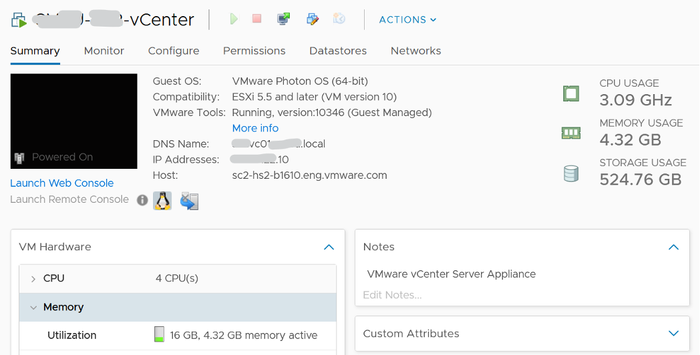
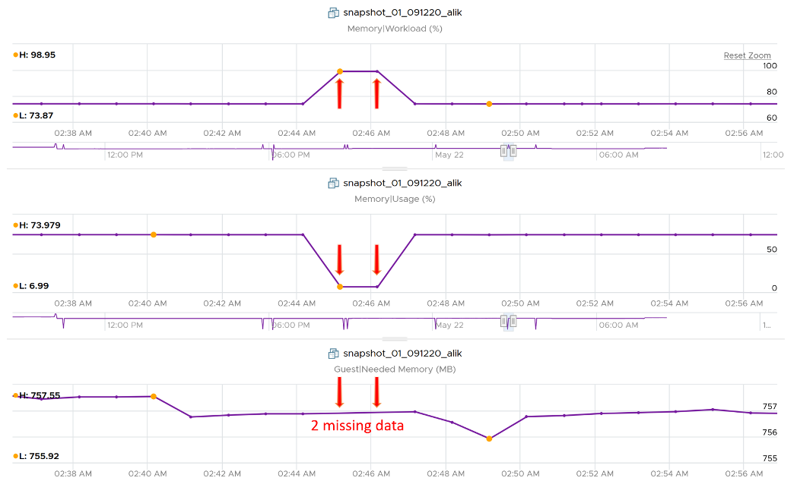

## Demand

Can you spot a major counter that exists for CPU, but not for RAM?

That’s right. It’s Demand.

To figure out demand, we need to figure out unmet demand, as demand is simply unmet demand + used (which is met demand). Since the context here is VM, and not Guest OS, then unmet demand includes only VM level counters. The counters are ballooned + swapped + compressed.

Do you agree with the above?

If we are being strict with the unmet demand definition, then only the memory attributed to contention should be considered unmet demand. That means balloon, swap, or compressed memory can’t be considered unmet demand. Swap in and decompression are the contention portion of memory. The problem then becomes the inability to differentiate contention due to limits using host level metrics, which means we’d need to look at VM level metric to exclude that expected contention.

## Memory \ Usage (%)

Memory Usage in vCenter maps to Active. What you see on the vCenter UI is Active, not Consumed.

Mapping to Active makes more sense as Consumed contains inactive pages. As covered earlier, neither Active nor Consumed actually measures the Guest OS memory. This is why vRealize Operations maps Usage to Guest OS. The following shows what Usage (%) = Guest OS Needed Memory over configured memory. The VM has 1 GB of memory, so 757 MB / 1024 = 74%.

Take note that there can be situation where Guest OS metrics do not make it to vRealize Operations. In that case, Usage (%) falls back to Active (notice the value dropped to 6.99%) whereas Workload (%) falls back to Consumed (notice the value jump to 98.95%).

## Memory \ Utilization (KB)

Equals to Guest Needed Memory (KB) + (Guest Page In Rate per second * Guest Page Size (KB) ) + Memory Total Capacity (KB) – Guest Physically Usable Memory (KB).

Because of the formula, the value can exceed 100%. The following is an example:

It’s possible that vRealize Operations shows high value when Windows or Linux show value. Here are some reasons:

- Guest metrics from VMware Tools are not collecting. The value falls back to Consumed (KB). Ensure your collection is reliable, else the values you get over time contains mixed source. If their values aren’t similar, the counter values will be fluctuating wildly.
- Guest Physically Usable Memory (KB) is less than your configured memory. I’ve seen in one case where it’s showing 58 GB whereas the VM is configured with 80 GB. My first guess is the type of OS licensing. However, according to [this](https://www.compuram.de/blog/en/how-much-ram-can-be-addressed-under-the-current-32-bit-and-64-bit-operating-systems/), it should be 64 GB not 58 GB.
- Low utilization. We add 5% of Total, not Used. A 128 GB VM will show 6.4 GB extra usage.
- Excessive Paging. We consider this.
- We include Available in Linux and cache in Windows, as we want to be conservative.