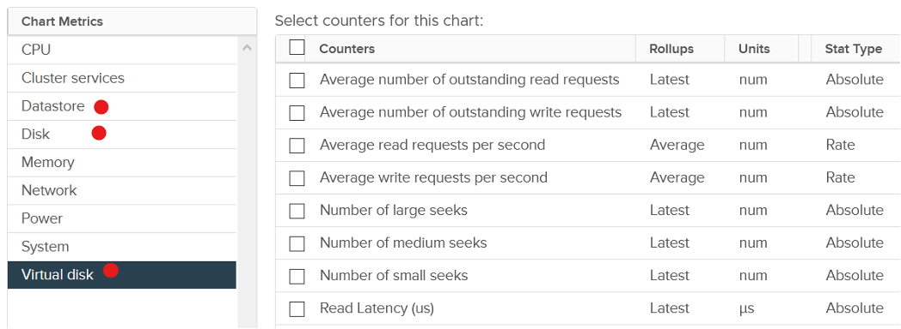
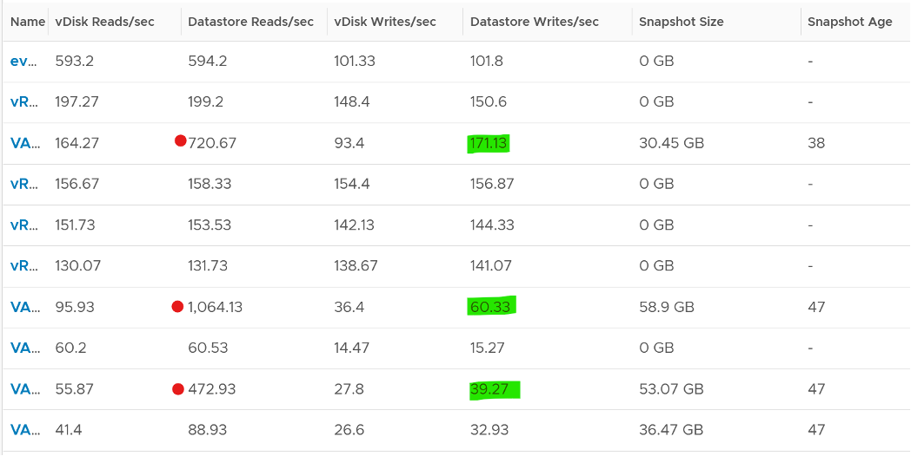
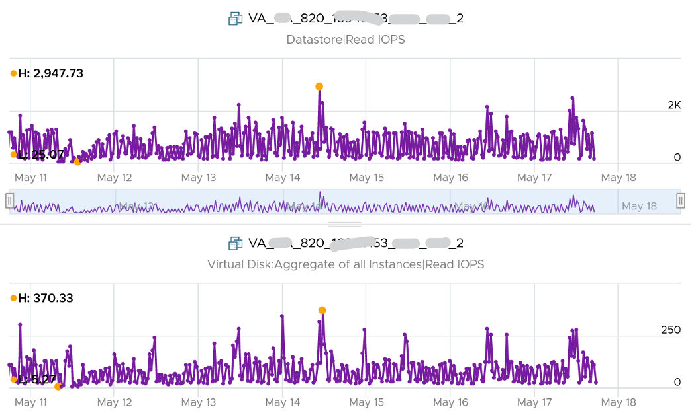
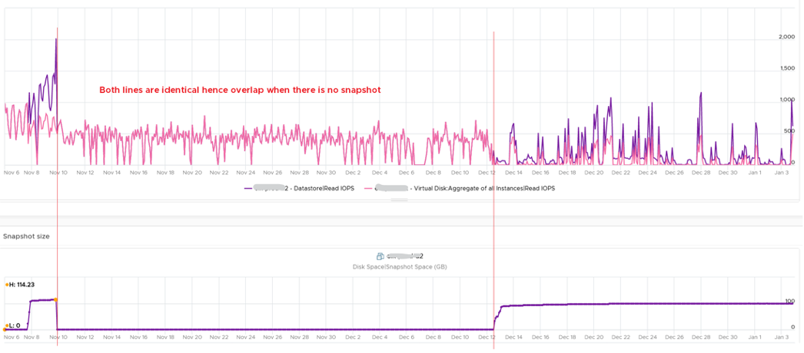

A VM does not see the underlying shared storage. It sees local SCSI disks only. So regardless of whether the underlying storage is NFS, VMFS, VSAN or RDM, it sees all of them as virtual disks. You lose visibility in the physical adapter (for example, you cannot tell how many IOPSs on vmhba2 are coming from a particular VM) and physical paths (for example, how many disk commands travelling on that path are coming from a particular VM).

At the VM level, you can look at counters at the individual virtual disk level, at the datastore level, and at the disk level. Which ones should you when?

Use the **virtual disk** counters to see VMFS vmdk files, NFS vmdk files, and RDMs. However, you don’t get data below the virtual disk. For example, if the VM has snapshot, the data does not know about it. Also, a VM typically has multiple virtual disks (OS drive, swap drive, data drive), so you need to add them manually if you use vCenter. In vRealize Operations, you use the “aggregate of all instances”.

Use the **datastore** counters to see VMFS and NFS, but not RDM. Because snapshots happen at Datastore level, the counter will include it. Datastore figures will be higher if your VM has a snapshot. You don’t have to add the data from each virtual disk together as the data presented is already at the VM level. It also has the Highest Latency counter, which is useful in tracking peak latency.

Use the **disk** counters to see VMFS and RDM, but not NFS. The data at this level should be the same as at Datastore level because your blocks should be aligned; you should have a 1:1 mapping between Datastore and LUN, without extents. It also has the Highest Latency counter, which is useful in tracking peak latency.

VMs consume storage in 3 different ways:

- Virtual disk. This can be VMFS, vSAN, vVOL, NFS, RDM. If it’s vmdk files, they can reside in different datastores and/or RDM
- Network mount point, from inside Windows or Linux. This is not feasible by the hypervisor. Both the space, and the IO are not visible. It goes out as network throughput.
- Overhead. This is not visible to the Guest OS. They are shown in blue in the following diagram.

There are more file types than shown above. However, from monitoring and troubleshooting viewpoint, the above is sufficient.

## Outstanding IO

vSphere also provides information about the number of I/Os that have been issued, but not yet completed. The Number of Outstanding I/O counter tracks these, and it provides a separate counter for read and write. Certainly, the higher the number of outstanding I/Os is, the higher the latency becomes.

Outstanding IO tracks the IO requests that are not yet executed. They are waiting in the queue, hence this counter is a good counter to track if the storage subsystem is unable to cope with demand. The number is provided for each virtual disk, meaning it can cover RDM disk. There is also a separate number for read and write.

What should be the threshold value?

The range varies widely. Use the profiling technique to establish the threshold that is suitable for your environment. In the following analysis, we take more than 63 million data points (2400 VM x 3 months worth of data)

## Snapshot Impact

Snapshot requires additional read operations, as the reads have to be performed on all the snapshots. The impact on write is less. I’m not sure why it goes up so high, my guess is there are many files involves. Based on the manual, a snapshot operation creates .vmdk, -delta.vmdk, .vmsd, and .vmsn files. Read more [here](https://docs.vmware.com/en/VMware-vSphere/7.0/com.vmware.vsphere.vm_admin.doc/GUID-38F4D574-ADE7-4B80-AEAB-7EC502A379F4.html).

For Write, ESXi just need to write into the newest file.

The pattern is actually identical. I take one of the VM and show it over 7 days. Notice how similar the 2 trend charts in terms of pattern.

You can validate if snapshot causes the problem by comparing before and after snapshot. That’s exactly what I did below. Notice initially there was no snapshot. There was a snapshot briefly and you could see the effect immediately. When the snapshot was removed, the 2 lines overlaps 100% hence you only see 1 line. When we took the snapshot again, the read IOPS at datastore level is ***consistently*** higher.

How I know that’s IOPS effect as the throughput is identical. The additional reads do not bring back any data. Using the same VM but at different time period, notice the throughput at both levels are identical.

And here is the IOPS on the same time period. Notice the value at datastore layer is consistently higher.

