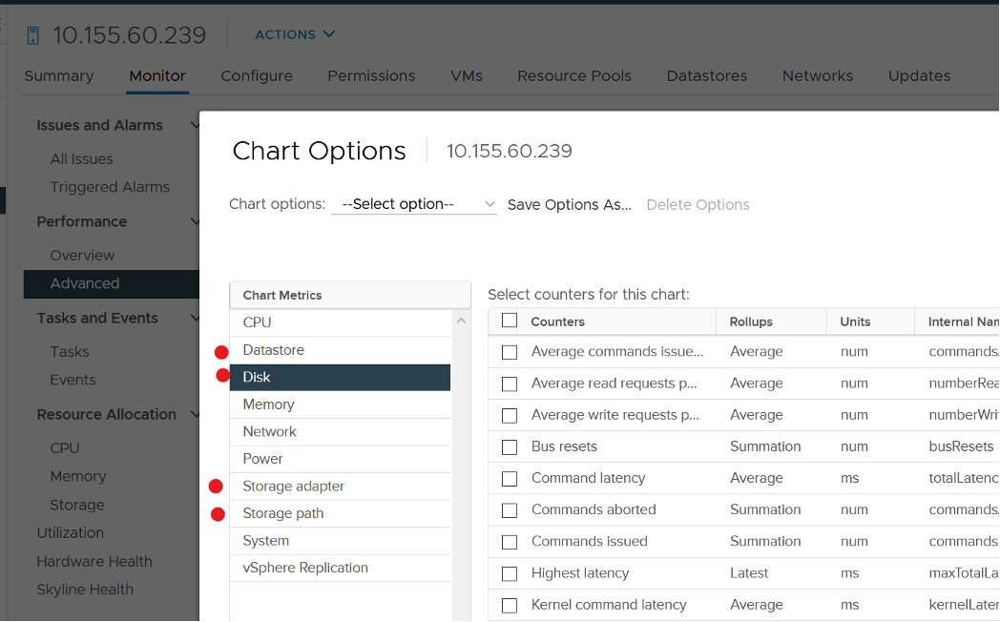
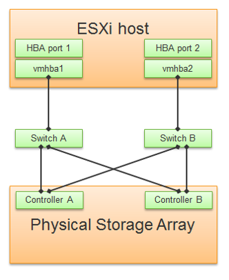
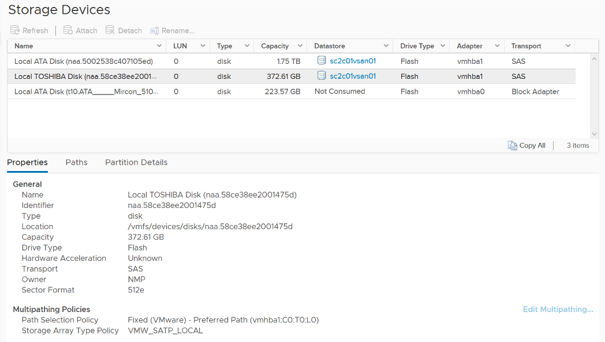
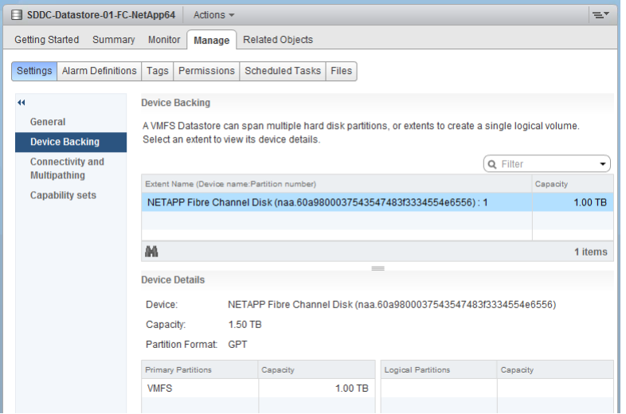
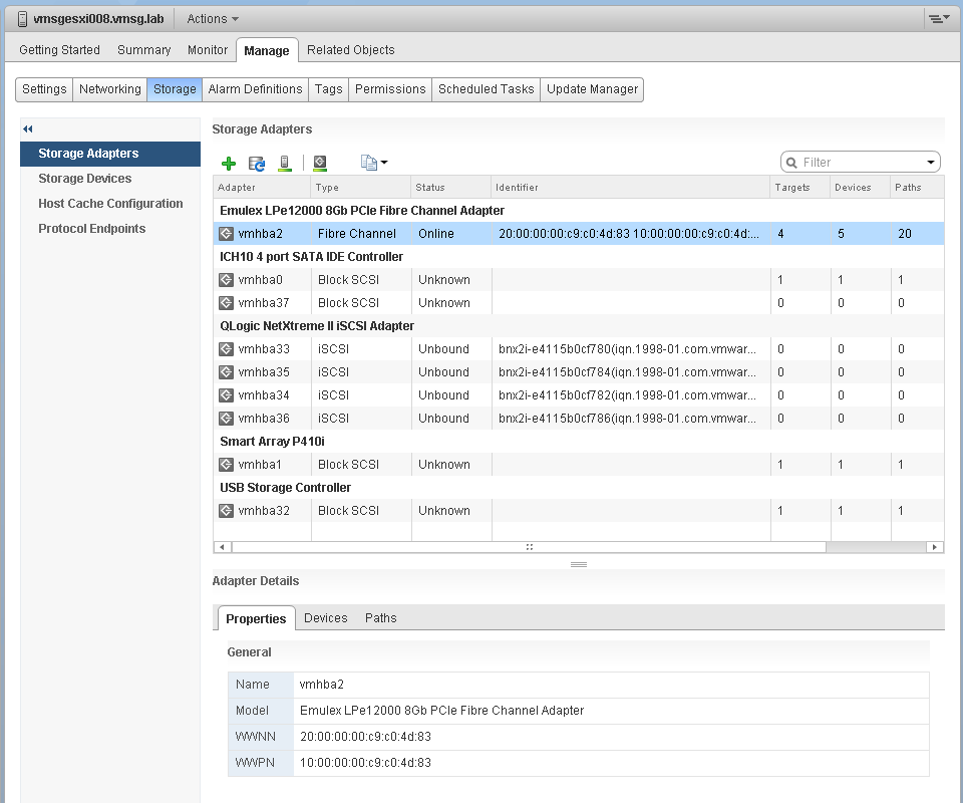
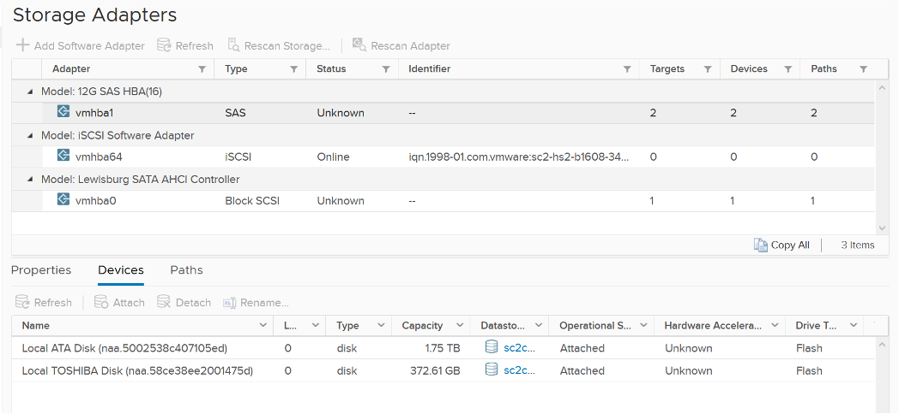
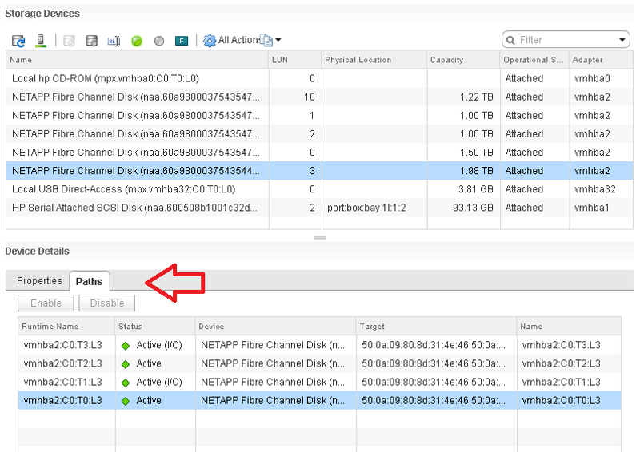
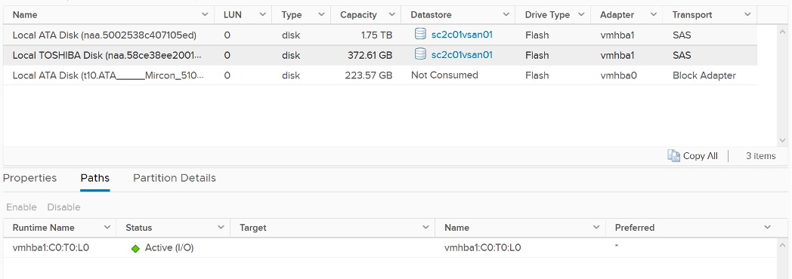

Look at the ESXi metric groups for storage in the vCenter performance chart. There are 4 metrics groups: storage adapter, storage path, datastore and disk.

How do they relate to one another? When do we use which metric group?

How do they work in distributed storage such as vSAN?

The following diagram explains the relationship. The green boxes are what you are likely to be familiar with. You have your ESXi host, and it can have NFS Datastore, VMFS Datastore, vSAN Datastore, vVOL datastore or RDM objects. vSAN & vVOL present themselves as a VMFS datastore, but the underlying architecture is different. The _blue_ boxes represent the metric groups you see in vCenter performance charts.

Storage at ESXi is a lot more complex than storage at VM level. Reason is ESXi virtualizes the different storage, and VM consumes it as local SCSI drive. The counter at ESXi level contains data from all VMs. There is no breakdown. For example, the counter at vmnic, storage adapter and storage path are all aggregate counters. It's not broken down by VM. The same with vSAN objects (cache tier, capacity disk, disk group). None of them shows details per VM.

Can you figure out why there is no path to the VSAN Datastore?

We'll do a comparison, and hopefully you will realize how difference distributed storage and central storage is from performance monitoring point of view.

In the central storage architecture, NFS and VMFS datastores differ drastically in terms of counters, as NFS is file-based while VMFS is block-based.

- For NFS, it uses the vmnic, and so the adapter type (FC, FCoE, or iSCSI) is not applicable. Multipathing is handled by the network, so you don't see it in the storage layer.
- For VMFS or RDM, you have more detailed visibility of the storage. To start off, each ESXi adapter is visible and you can check the counters for each of them. In terms of relationship, one adapter can have many devices (disk or CDROM). One device is typically accessed via two storage adapters (for availability and load balancing), and it is also accessed via two paths per adapter, with the paths diverging at the storage switch. A single path, which will come from a specific adapter, can naturally connect one adapter to one device. The following diagram shows the four paths: 

## Storage Devices

The term drive, disk, device, storage can be confusing as they are often used interchangeably in the industry. In vSphere, this means a physical disk or physical LUN partition mounted by the host. The following shows that the ESXi host has 3 storage devices, all are flash drive and the type = disk. The first two are used in vSAN datastore and are accessed via the adapter vmhba1.

A storage path takes data from ESXi to the LUN (the term used by vSphere is Devices), not to the datastore. So if the datastore has multiple extents, there are four paths per extent. This is one reason why you should not use more than one extent, as each extent adds 4 paths. If you are not familiar with VMFS Extent, Cormac Hogan explains it [here](http://blogs.vmware.com/vsphere/2012/02/vmfs-extents-are-they-bad-or-simply-misunderstood.html).

For VMFS (non vSAN), you can see the same counters at both the Datastore level and the Disk level. Their value will be identical if you follow the recommended configuration to create a 1:1 relationship between a datastore and a LUN. This means you present an entire LUN to a datastore (use all of its capacity). The following shows a VMFS datastore with a NetApp LUN backing it.

In vSAN, there is no connectivity and Multipathing menu. There is also no _Capability Sets_ menu. vSAN datastore is not mapped to a LUN. It is supported by disk groups.

## Storage Adapter

The screenshot shows an ESXi host with the list of its adapters. We have selected vmhba2 adapter, which is an FC HBA. Notice that it is connected to 5 devices. Each device has 4 paths, giving 20 paths in total.

What do you think it will look like on vSAN? The following screenshot shows the storage adapter vmhba1 being used to connect to two vSAN devices. Both devices have names begin with “Local”. The storage adapter has 2 targets, 2 devices and 2 paths. If you are guessing it is 1:1 mapping among targets, devices and paths, you are right.

We know vSAN is not part of Storage Fabric, so there is no need for Identifier, which is made of WWNN and WWPN.

vRealize Operations provide the `Storage Adapter|Outstanding Requests` metric, which is required to track if the adapter is struggling to meet demands.

Let's expand the **Paths** tab. We can see the LUN ID here. This is important. The fact that the hypervisor can see the device is important. That means the VMkernel can report if there is an issue, be it performance or availability. This is different if the disk is directly passed through to the VM. The hypervisor loses visibility.

## Storage Path

Continuing our comparison, the last one is Storage Path. In a fibre channel device, you will be presented with the information shown in the next screenshot, including whether a path is active or not.

Note that not all paths carry I/O; it depends on your configuration and multipathing software. Because each LUN typically has four paths, path management can be complicated if you have many LUNs.

What does Path look like in vSAN? As shared earlier, there is only 1 path.

