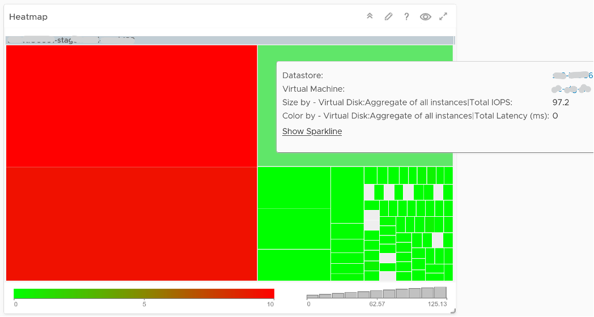

Storage in VMware IaaS is presented as datastore. In some situation, RDM  and network file shares are also used by certain VM.

The underlying storage protocol can be files (NFS) or blocks (VMFS). vSAN uses VMFS as its consumption layer as the underlying layer is unique to vSAN, and hence vSAN requires its own monitoring technique. 

For NFS, as it’s network file share (as opposed to block), you have no visibility to the underlying storage. The type of counters will also be more limited.

Take note that datastores that share the same underlying physical array can experience problem at the same time. The underlying array can experience a hot spot on its own, as it is made of independent magnetic disks or SSD.

VMs in the same datastores can experience different latency. The following heat map shows all the VMs in a single VMFS datastore, backed by ExtremeIO. Notice two of the VMs experience latency above 10 ms, while many other VMs experience less than 1 millisecond. 

There are more counters available via vCenter API than what’s presented in the UI. Just to recap, this is what you get in the UI.

Counters such as Datastore \ Outstanding Read Requests and Datastore \ Outstanding Write Requests are available only in the API. They are required for performance troubleshooting and capacity monitoring. 

## Capacity

| The information you need | Counter to use|
| ---- | -----|
| The total capacity of a datastore | 	Capacity \| Total Capacity (GB)|
| The actual space consumed in a datastore|	Capacity \| Used Space (GB) This is the actual consumption, not the allocated/provisioned as in Thin Provisioning case.|
|The consumption number in % | Capacity \| Used Space (%)|
|The actual free space in your datastore| 	Capacity \| Available Space (GB)|
|The total provisioned space for VM	| Capacity \| Total Provisioned Consumer Space (GB)|

As you can see from the following, the last metric will be blank if there is no VM in the datastore. 

You should be using Datastore Cluster, especially in environment where a cluster uses multiple datastores. Other than the benefits that you get from using it, it also makes capacity management easier. You need not manually exclude local datastore, and you need not manually group the shared datastores, which can be complex if you have multiple clusters.