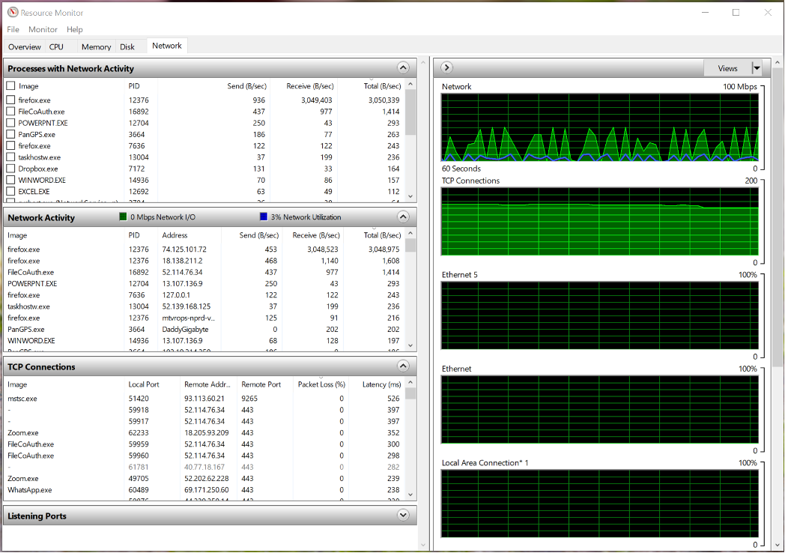
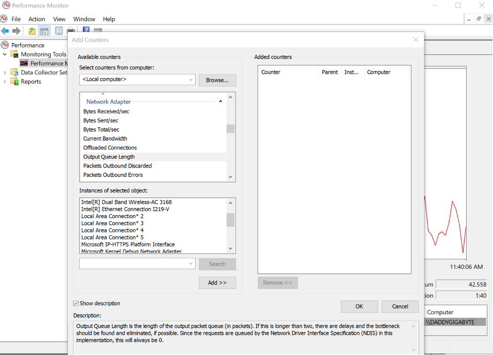

Understanding network counter at Guest OS level is important as the data inside the guest provides better visibility. The following screenshot shows Windows 10 Resource Monitor. You will notice quickly that a lot of this information is not available at the hypervisor layer. The VM does not report process level information. Looking at the columns in the table, what critical counters are missing at the VM layer?

Windows reports the packet loss (%) and latency (ms) counters per TCP connections. This is crucial in troubleshooting at application level. Unfortunately, Windows does not report the overall latency and overall packet loss.

Take note that Windows mixes bit and byte, which it should not. The chart is showing in bit, while the table is showing in byte.

Another counter that could be potentially useful is Output Queue Length. You can monitor it on a per network adapter basis, as shown in the Performance Monitor screenshot below. I said it could be useful, because unfortunately the value is always 0. As you can see in the screenshot, Windows 10 states that “since the requests are queued by the Network Driver Interface Specification (NDIS) in this implementation, this will always be 0.“

