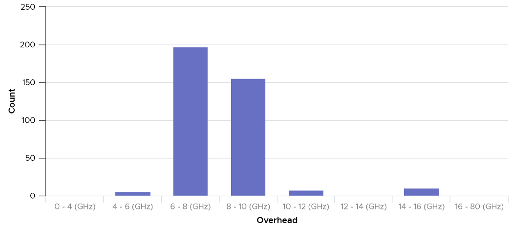
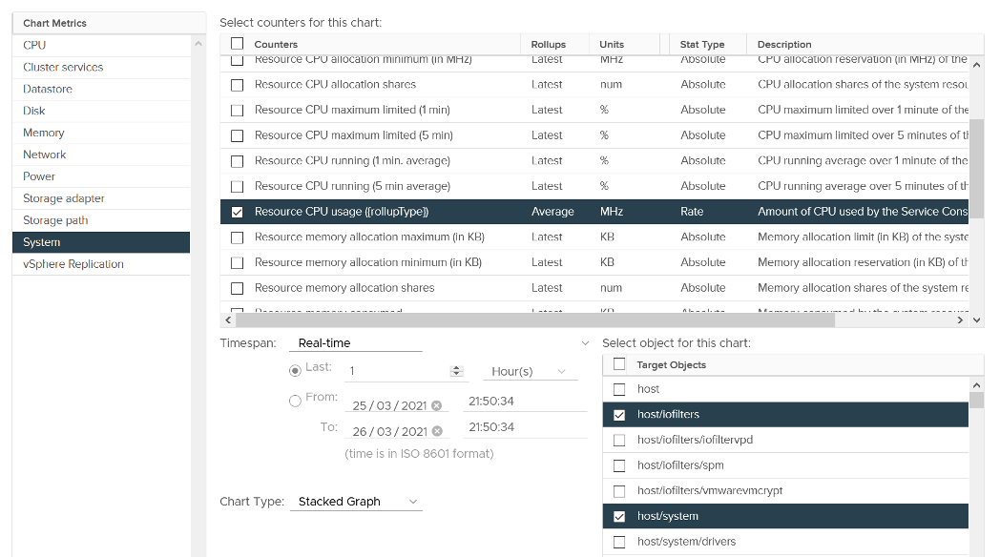
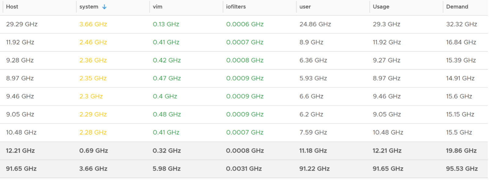
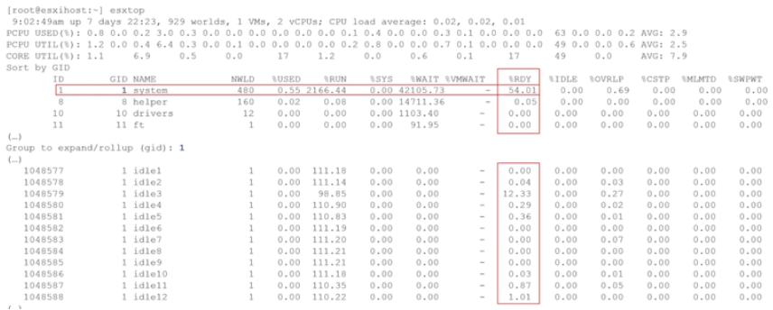

There are two types of counters here: reservation and actual consumption.

What you're interested is the actual utilization, unless you use a lot of reservation in your cluster. We discussed earlier that reservation will directly impact your ability to overcommit.

All these counters are grouped by their respective resource pool, because each process running on ESXi belongs to one these four **top-level** resource pools:
- System (host/system resource pool)
- IO Filter (host/iofilter resource pool)
- VIM (host/vim resource pool)
- User (host/user resource pool)

All the running VMs are children of the User resource pool. This includes the VM overhead.

## Reservation

This is more of a property than a metric, as it does not change often. The formula is `Overhead = CPU Total Capacity – CPU Capacity Available to VMs`.

Where capacity available to VMs is the capacity reserved by and available for VMs. 

Since it is just a reservation (allocation), its not included in the calculation of the parent cluster usable capacity.

If you are curious about the actual values, they sort of map to the actual size of the ESXi. Based on a sample of almost 400 ESXi in production environment, here is what I got. By far the majority of the value is 6 – 10 GHz.

Their values tend to be stable over days, although from time to time I see fluctuating counters. I'm unsure why they are fluctuating so frequently as it's a reservation, so if you know let me know. The following chart shows both the fluctuating pattern and steady pattern (most common).

## Consumption

What if you want to know the actual consumption? vCenter provides visibility into the VMkernel utilization. It's available under **System**, and you can get CPU and memory usage and reservation (allocation).

You need to select host/iofilters, host/system, and host/vim. 

Everything else runs under one of the three resource pools. You can plot their values in vCenter by stacking up their values, as shown below. 

The above is for one ESXi Host. If you have many and want to see all the values in one go, create a view in vRealize Operations. Here is a sample from ~400 ESXi hosts, where I shot the top 7 from highest System usage. 

The bottom two rows show the summary. The first summary is the average among all the hosts, while the last row is the highest value.

BTW, a high CPU Ready in system group in esxtop is perfectly normal as this group includes idle threads.

You can see from the following that Idle accumulates 2400% CPU Ready 

