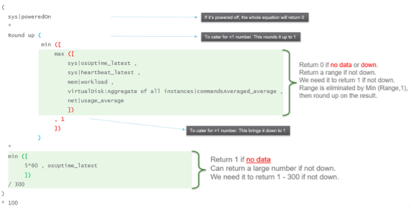
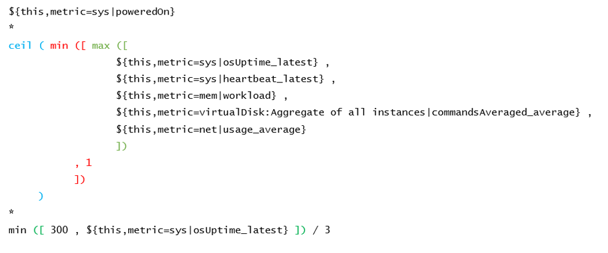

This is where you vrealize the full capability of super metric. It's actually a programming language that gets executed as a straight line. That means it can't loop.

## Tools Status

**Use Case:** check the VM Tools running status. If it is running, return the value of OS uptime, else return the value zero.

In this example, we're combining **where** clause and **If Then Else**.

```text
count( ${this, metric=summary|guest|toolsRunningStatus, where= (!($value contains 'Not Running'))}) != 0
?
( ${this, metric=sys|osUptime_latest} )
:
0
```

## Weighted KPI

**Use Case:** transform raw value into KPI

Recall in the KPI that you typically have metrics with different units and range. To combine them into a single metric, you need to convert them into the same unit-less range.

Let's say you have the following metrics that you want to combine into a single KPI


For each metric, you have established the range for each color.

Take **IO Wait** for example. The green range is only from 0% - 1%, where 0% IO Wait equals to 100%, while 1% IO Wait becomes 75%. That means 0.8% IO Wait is 80%. The yellow range is wider, so 2% IO Wait gets translated into 62.5% as it's in between 50% and 75%.

Super metric does not have a Case statement, so we have to use nested IF. The logic looks something like this

```text
If it's in the green range
then calculate for green range
else if it's in the yellow range
then calculate for yellow range
else if in the orange range
then calculate for orange range
else calculate for red range
```

In addition to the above, you can also assign weightage. This is critical if you have many metrics forming a KPI. for example, if there are 10 metrics, then a single red will not have enough weight to change the overall KPI red. To solve this, you assign higher weightage to red. A good technique is to give yellow 2x the weight of green, orange 2x the weight of yellow, and red 2x the weight of orange. All else being equal, a red has 8x more weight than green.

The code in red show how the weigtage being applied.

```text
${this, metric=cpu|iowaitAvg} as ioWait == 0
    ?
    100
    :
    ( ioWait < 1
        ?
        ( ioWait - 0) / (1 - 0) * 25 + 75
        :
        ( ioWait < 3
            ?
            ( (ioWait - 1) / (3 - 1) * 25 + 50 ) * 2
            :
            ( ioWait < 5
                ?
                ( (ioWait - 3) / (5 - 3) * 25 + 25 ) * 4
                :
                ( min ( [ (ioWait - 5 ), 2 ] ) / (7 - 5) * 25 ) * 8
            )
        )
    )
```

The above code has extra logic to handle corner cases at the edge of the spectrum. The first corner case is IO Wait = 0%, which must be translated as 100%. The other corner case is where IO Wait exceed the red range, in which case it must be translated at 0% instead of going negative.

Can you spot a missing logic in the above?

Yes, the multiplier creates a problem. When you multiply by 2x, 4x, 8x, you need to normalize it back to the values fall within 0 – 100%.

But how do you normalize, since each metric can have their own multiplier?

You need to have another set of nested IF statement, this time you increase the denominator correspondingly. The following shows the logic for 2 of the metrics. The multiplier is shown in red.

```text
Sum ([
    ( ioWait < 1 ? 1 : ( ioWait < 3 ? 2 : ( ioWait < 5 ? 4 : 8 ) ) ) ,
    ( coStop < 1 ? 1 : ( coStop < 2 ? 2 : ( coStop < 3 ? 4 : 8 ) ) )
])
```

Once you have the above 2 sets, it's a matter of dividing one over the other. The following shows part of the logic, as I want to focus on the 2 sum statements.


Pretty cool isn't it? If you agree, send your thanks to [Gautam Kumar](https://www.linkedin.com/in/gautam-kumar-b4036867/) and [Artavazd Amirkhanyan](https://www.linkedin.com/in/artavazdamirkhanyan/).

## VM Uptime

**Use Case:** calculate the VM uptime within the 5-minute collection cycle.

This particular super metric wasn't fully implemented in the product due to the false positive from the raw vCenter counter that was discovered during validation. So I'm providing as an example of what you can do with super metric.

The up time of a VM is more complex than that of a physical machine. Just because the VM is powered on, does not mean the Guest OS is up and running. The VM could be stuck at BIOS, Windows hits BSOD or Guest OS simply hang. This means we need to check the Guest OS. If we have VMware Tools, we can check for heartbeat. But what if VMware Tools is not running or not even installed? Then we need to check for sign of life. Does the VM generate network packets, issue disk IOPS, consume RAM?

Another challenge is the frequency of reporting. If you report every 5 minutes, what if the VM was rebooted within that 5 minutes, and it comes back up before the 5<sup>th</sup> minute ends? You will miss that fact that it was down within that 5 minutes!

From the above, we can build a logic:

If VM Powered Off then Return 0. VM is definitely down.

Else Calculate up time within the 300 seconds period.

In the above logic, to calculate the up time, we need first to decide if the Guest OS is indeed up, since the VM is powered on.

We can deduce that Guest OS is up is it's showing any sign of life. We can take Heartbeat from Tools. What if there no Tools or Tools not returning heartbeat? We need to have fail back plan. So we check memory usage, network usage and Disk IOPS.

Can you guess why we can't use CPU Usage?

VM does generate CPU even though it's stuck at BIOS. We need a counter that shows 0, and not a very low number. An idle VM is up, not down.

So we need to know if the Guest OS is up or down. We are expecting binary, 1 or 0. Can you see the challenge here?

Yes, none of the counters above is giving you binary. Disk IOPS for example, can vary from 0.01 to 10000. The “sign of life” is not coming as binary.

We need to convert them into 0 or 1. 0 is the easy part, as they will be 0 if they are down.

I'd take Network Usage as example.

-   What if Network Usage is >1? We can use Min (Network Usage, 1) to return 1.

-   What if Network Usage is <1? We can use Round up (Network Usage, 1) to return 1.

So we can combine the above formula to get us 0 or 1.

The last part is to account for partial up time, when the VM was rebooted within the 300 seconds sampling period. The good thing is vR Ops tracks the OS up time every second. So every 5 minute, the value goes up by 300 seconds. As VM normally runs >5 minutes, you end up with a very large number. Our formula becomes:

If the up time is >300 seconds then return 300 else return it as it is.

Let's now put the formula together. Here is the logical formula:


Can you write the above formula differently? Yes, you can use If Then Else. I do not use it as it makes the formula harder to read. It's also more resource intensive.

Let's translate the above into a pseudcode.



Lastly, here is what it looks like in actual code. I've optimized the last bit to **/3**. No point multiply by 100 then divide by 300.

