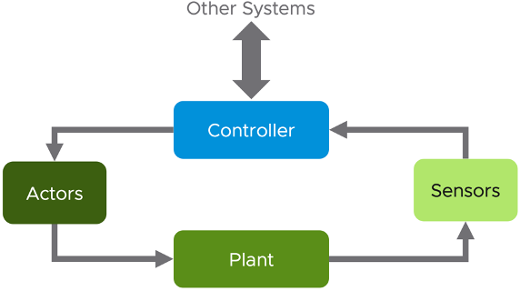

I bet you still remember that part "Yes, I did not cover **Automation**. For me, that's part of Architecture. You should not automate what you cannot operate."

In other words, what you can operate should be automated.

And "Using an analogy, it's like a plane with many automation features. That's a feature of the plane." The times where pilots had to do everything manually while flying a plane are long gone. Nowadays a modern plane is supporting the crew through automation - think of the autopilot.

**vRealize Operations** is doing automation out of the box in form of automated control routines; it is "automatically" monitoring the environment thorough pre-defined or custom **Symptoms**, **Alert Definitions** and **Compliance Packs**. These routines control the creation of **Alarms** and provides information presented through **Dashboards** and **Reports**.

Various Compliance Packs help reduce risk and enforce IT and regulatory standards for vSphere through continuous checks and automated drift remediation.

But there is more.

And this is exactly how you should operate your environment. **Self-Driving Operations** should not remain just a catchword, let us make it a reality!

## Benefits

Probably everybody knows the impact automation has on the industry, not only since the invention of industrial robotics in the 50s and 60s of the last century.

But why is automation important, what are the reasons behind introducing a technology which may be complex and cost intensive as it might appear at first sight?

Yes, automation may indicate that you will need to invest time initially, and time means money. You are making a one-time invest or if you will, increasing your **CAPEX**.

What does it give you back? The answer is actually pretty easy:

-   Repetitive work does not have to be done manually anymore; you are reducing your **OPEX**

-   You free up time to focus on more **important** things for your **business**

-   Repetitive work is done the same way, following a **descriptive** procedure, eliminating human errors (except for the ones in your procedure)

-   It makes **auditing** easier or even possible in first place

-   It increases **productivity**, **reliability** and **performance**

-   Automation is work force multiplier

## Basic Principles of Automation

Before we jump into the essentials of this chapter, let us take a quick look on the typical ingredients of automated systems. The following picture shows the four basic elements comprising an automated system. **Controller**, **sensors**, **actors** and the **plant** build a closed loop.

This is example of a closed is also called **closed-loop feedback control**. Another, less complex kind of automated system is shown in the next picture. It is a so called **open-loop control**.

How does this translate to an environment managed by vRealize Operations? Let us start with the less complex example, the ingredients are at the end the same in both examples.

As you can see in the next figure, some parts are easy to be mapped to components that you will find in your SDDC.

The *sensors* are our adapter instances collecting metrics and properties, the *controller* is vRealize Operations itself and the *plant* that we would like to control or automate is e.g., our vCenter instance managing ESXi hosts, VMs, Datastores etc.

But what are the *actor*s and how could the controller, so vRealize Operations, interact with other systems?

I will answer both questions in the next sections, so keep reading, you have made it through the dry theory.

## Inter-System Communication

I start with the second part of the question; how can vRealize Operations interact with other systems?

With "*other systems*" I am referring to systems contributing to the automation but not necessarily being the *plant* we want to control.

Many customers have extended vRealize Operations to interact with other systems using interfaces provided by those systems. In context of automation, we usually use the term Application Programing Interfaces - APIs. Interacting with other systems means outgoing as well as incoming communication as seen from the vRealize Operations perspective.