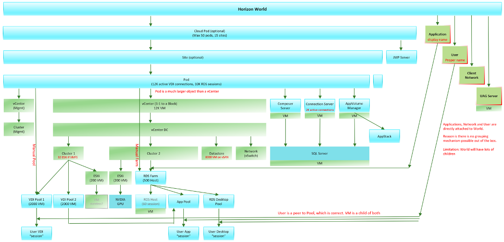
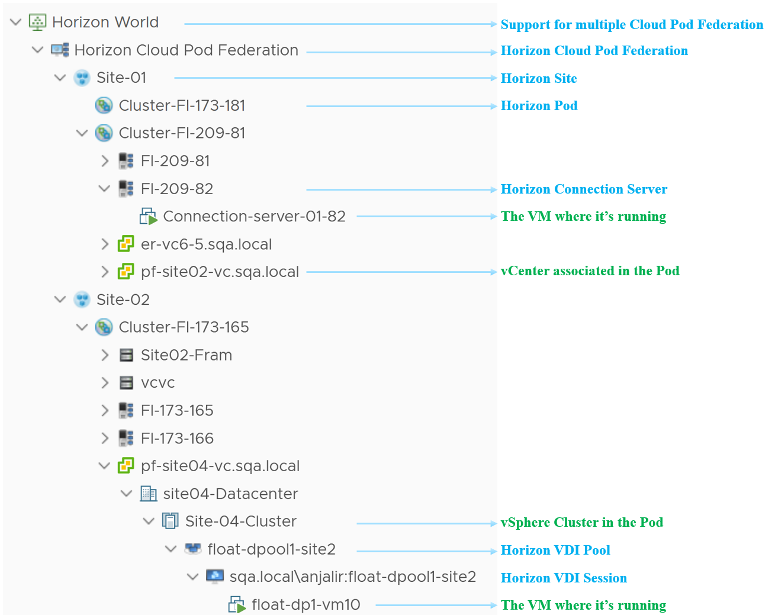
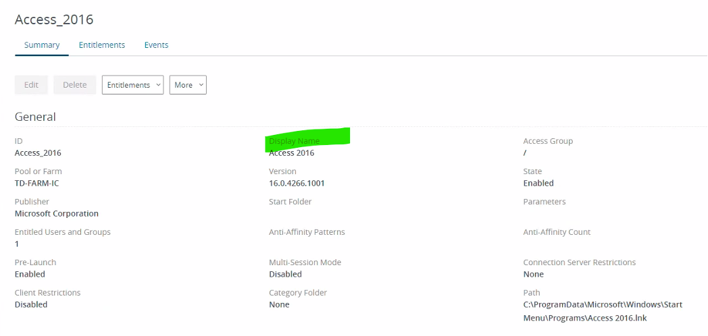

A critical foundation in managing a mission critical VDI is the object model. This means the objects and relationship among the objects. It will be impossible to roll up if the correct hierarchy is not in place.

vRealize Operations 8.4 sports a new adapter, replacing the previous adapter (called V4H). It sports a revamped object model, blending vSphere and Horizon objects as one traversal path, as shown in the following diagram.

The object model introduces a new super parent object called Horizon World, to make dashboard creation easier and support cloud provider who provides Horizon as a service.

Because of the revamped object model, there is *no migration* from the old adapter (V4H) to this new adapter.

{}
Take note of a special object called Application Session. This object can be RDS or VDI. If it’s RDS, naturally it has less metrics.
{}

## Horizon + vSphere

The following shows an example of how the implementation is vrealized. Notice how vSphere objects and Horizon objects are blended in a single hierarchy. The object in blue is Horizon, while the object in green is vSphere.

The interwoven hierarchy is required for summarizing information.

Notice the farm name Site02-Fram. Why is it directly under a Pod?

The answer is it’s a manual farm. The hierarchy is aware that you can have manual pool across vCenter and will show it accordingly.

