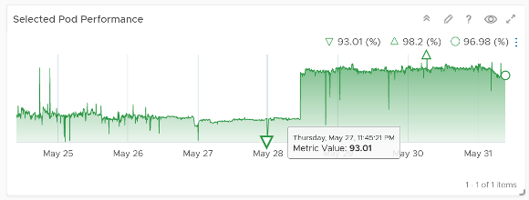
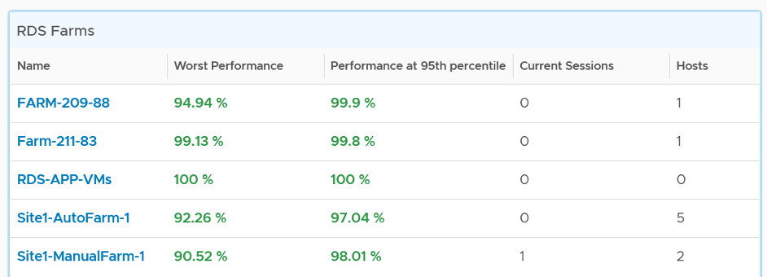
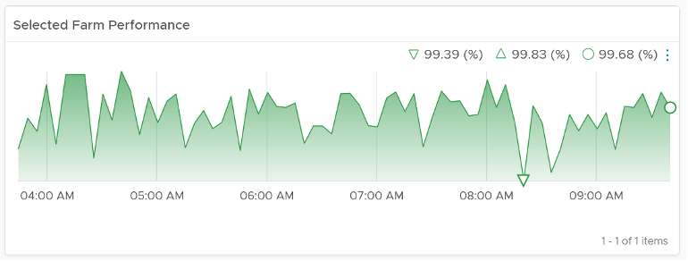
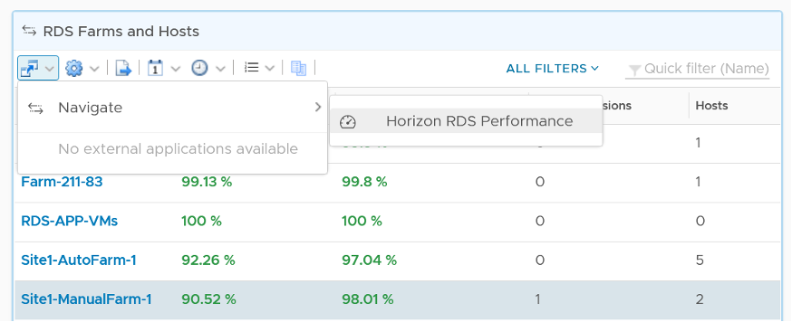
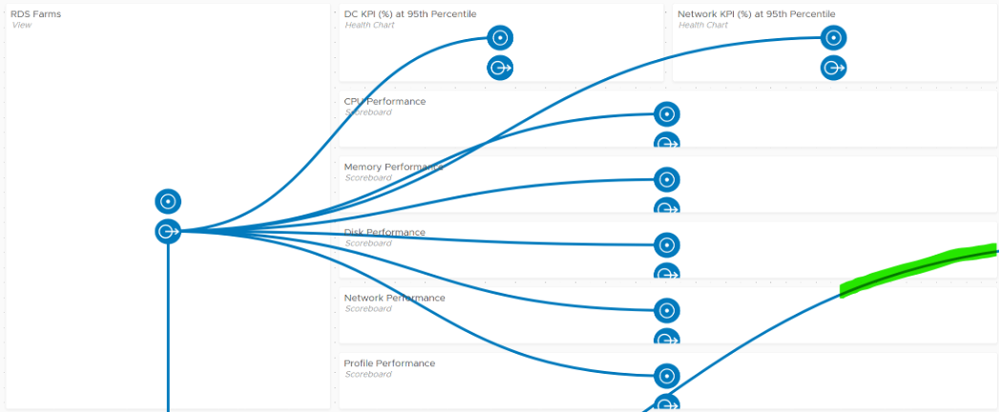
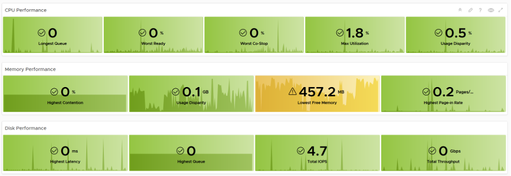
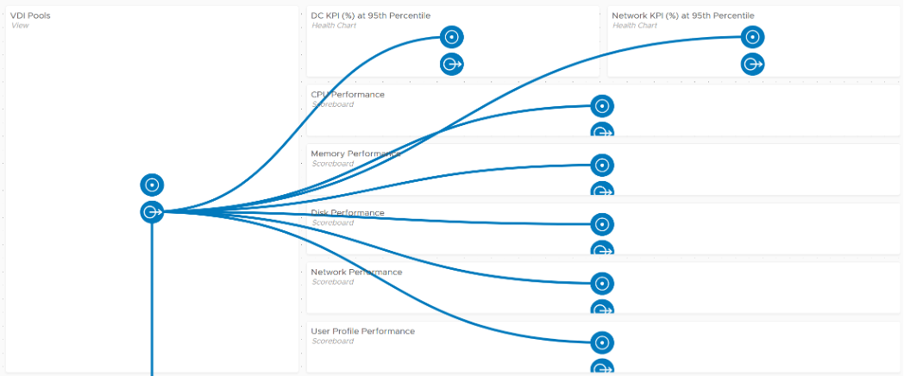
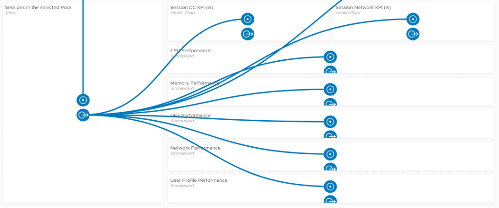

### Performance Dashboards

Now that you've seen what the performance metrics are and how they are meant to be used together, designing the dashboards become easier. Armed with knowledge of vRealize Operations, creating all the dashboards can be done within a day.

In DaaS, you're outnumbered by your users. There are users than administrators, and problems can also come from non users. As a result, there is a good chance that by the time you look into the problem, 5 minute have passed or the problem no longer happens. This means the performance dashboard should show you a trend, not just the present time or a point in time in the past.

The dashboard needs to cover

-   Horizon DC Performance

-   Horizon Network Performance

To complete the picture, the dashboard should enable you to see from vSphere viewpoint, because a problem at lower layer can impact upper layer. This is especially important in Horizon as you will overcommit.

The following shows an *example* of such implementation. It splits performance into 2 (DC and Network). Both are able to drill down into the VDI Pool dashboard and RDS Farm dashboard. Because they drill down into the same dashboard, the destination dashboard has to cover both DC and network.

The VDI dashboard includes session, while RDS dashboard includes host and session. From both, you can drill down into the vSphere VM dashboard.

The dashboards are designed to work with the object summary page. If you need the most details of an object, drill down to the summary page.

## DC Performance Dashboard

This dashboard acts as the overall dashboard for all DC related performance.

-   Information is color coded: Green, Yellow, Orange and Red.

-   It should list all the pods, along with their KPI. Selecting a pod should show its performance over time.

-   From a pod, you should be able to drill down to its VDI Pools and RDS Farms. The KPI should be shown. Selecting a pod should show its performance over time.

-   Finally, selecting a pod, a pool or a farm should give its key information so you have better context.

The dashboard is designed to provide a quick overview, enabling convenient access to cycle among pods, farms and pools as you try to establish the performance issue. It's not suitable when you already know the farm or pool with problem. If you already know the specific, then simply go direct to the VDI dashboard or RDS dashboard.

We can visualize the overall performance over time using a health chart and pick the KPI metric at the Horizon World object.

From the above, you drill down to the Pod level, bypassing the Cloud Pod level and Site level for more efficient process. The following table show all the Pods. For each pod, it shows the worst performance, meaning the lowest value of the Pod DC KPI (%) any given 5 minute in the last 24 hours. To change to other time period, click on the date icon. To determine if the worst performance is just a one time blip, use the Performance at 95th percentile metric.

The columns Farms and Pools show the numbers at present. Customize this table with information that you need.

Select a pod and its historical performance is automatically shown. VDI tends to follow working hours of having a trend is important to see the pattern during working hours and non working hours (where you do a lot of maintenance activities).

The pod key properties will also be shown for better context.

From the Pod, you can drill down into its RDS Farms or VDI Pools. The navigation is similar, so we will take one of them as example. You get the list of farm, with their performance information.

The table has a blue border as you can drill down into the RDS Farm dashboard.

The column Sessions show the numbers at present. It's not the highest number of sessions in the last 24 hours.

You can select any of the farm, and its KPI will be shown over time

The farm key properties will also be shown for better context.

To troubleshoot further, select a farm and then navigate to RDS Performance dashboard. The selected farm will be passed as a context.

For VDI Pool, select a pool and navigate to the VDI Performance dashboard. The experience is ***consistent*** with RDS.

## Network Performance 

The dashboard follows the same design principle with DC Performance. Both acts as the overview dashboard, showing you the overall performance over time, and allowing quick cycles among farms and hosts to find which one to investigate further.

## RDS Performance

The RDS Performance dashboard has more details, all the way down to hosts and sessions. It begins by listing all the farms, color coded by performance. You can sort them by their performance, number of active sessions, etc. Selecting a farm with automatically show the KPI. This helps you cycle quickly among many farms.

The partially visible line, marked with green, is a drill down from RDS Host into the underlying VM. You'll in the following screenshot that the line starts from the host.

From the Farm, you can drill down into the hosts and the sessions in the farm. The following shows the host section of the dashboard.

And here is the session portion of the dashboard.

First, it shows the farm performance in more details.

If the above is not green, then you drill down into specific area (CPU, Memory, Disk, Network, User Profile).

The last part if the host status. This scoreboard focuses on the host status that needs attention. There are more status that can fit here, so if you want to see them all, customize this and make it 2 rows.

The dashboard is kept simple so it's easy to use. Add necessary widgets to tailor to your need. For example, if you think the performance is caused by high utilization, add the utilization metrics. Do not color coded as high utilization can be healthy (productive).

From the farm, you can drill down to the hosts. The usual KPI (%) is shown, both at its worst and 95th percentile during the last 24 hours.

As you can expect, selecting a host shows you the host performance over time.

You get the usual raw detail metrics associated with the host. I'm showing CPU as an example below.

From the farm, you can drill down to the sessions.

As you can expect, selecting a session shows you the host performance over time. You also get the usual raw detail metrics associated with the session.

## VDI Performance

The VDI dashboard has the same design with RDS. The main difference lies in the counters.

As you can expect, you have the same layout. It begins with a list of VDI Pools.

From one of the pools, you can drill down to the session. From the session, you can drill down to the vSphere VM where the session is running.

For VDI, there are 2 sets of status counters. One for the agent, and one for the VM.

