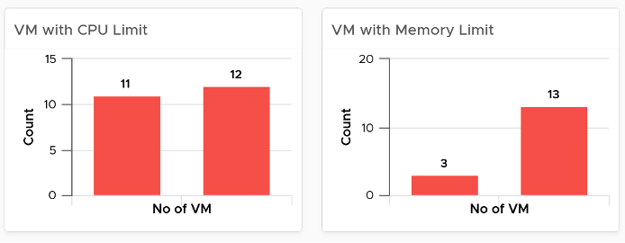
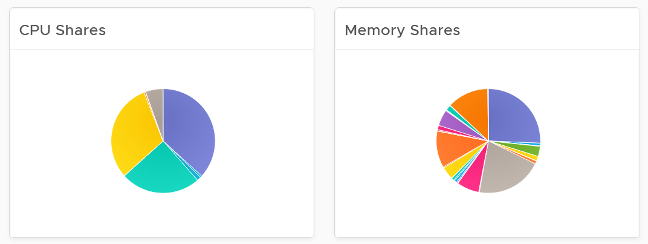
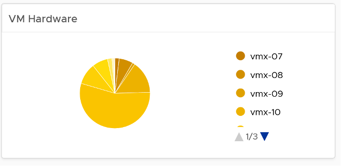

Use the VM Configuration dashboard to view the overall configuration of VMs in your environment, especially for areas that need attention.

See the [Configuration Dashboard](/dashboards/chapter-4-configuration-dashboards/) page for common design consideration among all the dashboards for configuration management.

## How to Use

Select a data center from the Data center table

- In a large environment, loading thousands of VMs increase the web page loading time. As a result, the VM is grouped by data center. In addition, it may make sense to review the VM configuration per data center.
- For a small environment, the vSphere World is provided so you can see all the VMs in the environment.

The dashboard is organized into 3 sections for ease of use.

- All 3 sections will automatically display the VM configuration in the selected data center

The first section covers limit, share and reservation

- Limit should not be used, as explained previously [here](/metrics/chapter-1-overview/2.1.4-resource-management/).

- Their share and reservation values can easily become inconsistent among VMs, especially in an environment with multiple vCenter Servers. The following shows an environment with far too many variations in shares.

- Shares should be mapped to a service level, to provide a larger proportion of shared resources to those VMs who pay more. This means that you should only have as many shares as your service levels. If your IaaS provides Gold, silver, and bronze, then you should have only three types of shares.
- The value of share is relative. If you move a VM from one cluster to another (be it in the same or different vCenter Server), you may have to adjust the shares.
- Reservation impacts your capacity. Memory reservation works differently from CPU reservation, it's more permanent.

The second section covers VMware Tools

- Tools is a key component of any VM, and should be kept running and up to date.
- The distribution chart shows the various versions. You should keep them minimal

The third section covers other VM key configuration

- Keep the configuration consistent by minimizing variants. This helps to reduce complexity.
- Pay attention to VMs with many virtual disks or many virtual network cards.

- Keep the number of VM hardware versions minimal, and keep them current.

- VM Network Card widget. It you suspect your environment may have VM with no NIC card, consider adding it as dedicated bucket.

The last part of the dashboard is collapsed by default.

- It shows all the VMs with their key configuration.
- You can sort the columns and export the result into spreadsheet for further analysis.

## Points to Note

- The number of buckets on the pie chart or bar chart are balanced between the available screen estate, ease of use and functionality. Modify the buckets to either reflect your current situation or your desired ideal state.
