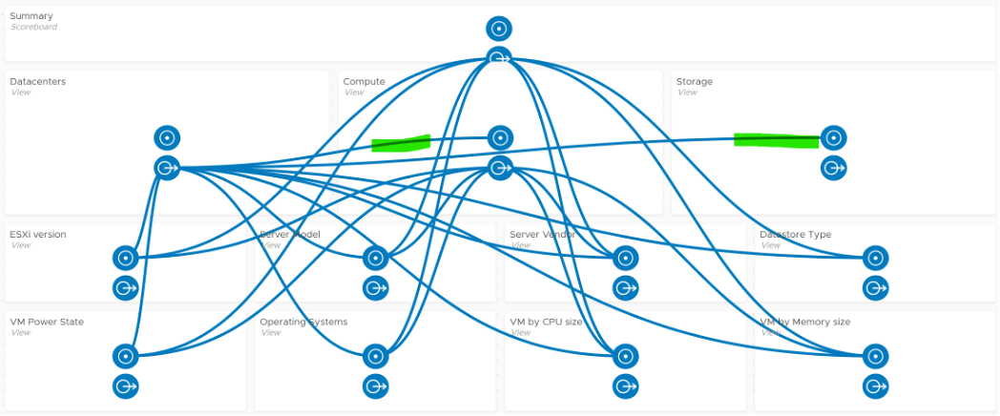

This dashboard is used by the Ops team to provide insight the IT Management team on the inventory. This dashboard works together with the Capacity Summary dashboard. The inventory provides details on available resources and what is running on these resources. The capacity provides details on the resources remaining capacity and time remaining to act.

See the Executive Summary Dashboards page for common design consideration among all the dashboards for IT senior management.

## How to Use

The dashboard is designed top down, starting with a banner scoreboard.

The **Summary** scoreboard provides a quick view into the key inventory numbers.

The scoreboard is interactive. It drives both the following 3 tables and the 8 pie charts under the table. The table in turn drive the 8 pie charts. It looks complicated in static image, but feels natural when used as you will expect the interaction.

Since all the information is at vSphere World level, clicking any of them will show break down of this total inventory. The Datacenter table lets you drill down, showing the clusters and storage in the DC.

Select a data center from the "Data centers" table. It drives Clusters and Datastores, so that you can quickly view what you have in a given Data center and related capacity.

For a small environment, the vSphere World is provided so you can see all the VMs in the environment.

To sort by any of the columns in the table, simply click on the column title.

About the 8 pie charts

- They provide break down of the inventory. 
- They are driven by 3 tables above them and by the **Summary** scoreboard

## Points to Note

- Be aware of the relationship hierarchy in vSphere. For example, Compute (Cluster) is not a parent of Storage (Datastore), so logically it is not possible to display Datastores in a Cluster. Data centers consist of Compute (Cluster), Network (Distributed Switch), and Storage (Datastore).
- If you have screen real estate, add Network.
- Datastores do not drive the pie chart Widgets. This is a known limitation in the View Widget as it can't handle multiple traversal spec.
- If your senior management wants to see the largest VM in a given environment, add a Top-N widget to list Top 10 largest consumers so that CPU, Memory, Disk details are highlighted.
- If required, you can drill down into specific cluster or datastore for performance. You need to build the dashboard to dashboard navigation.
