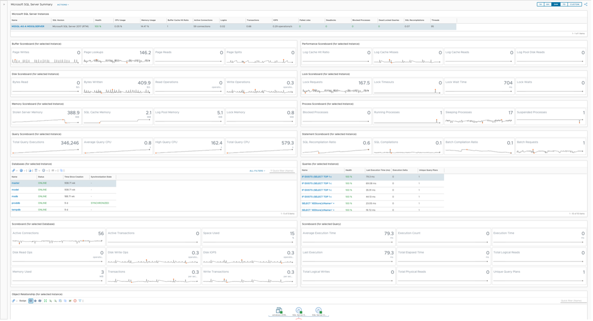
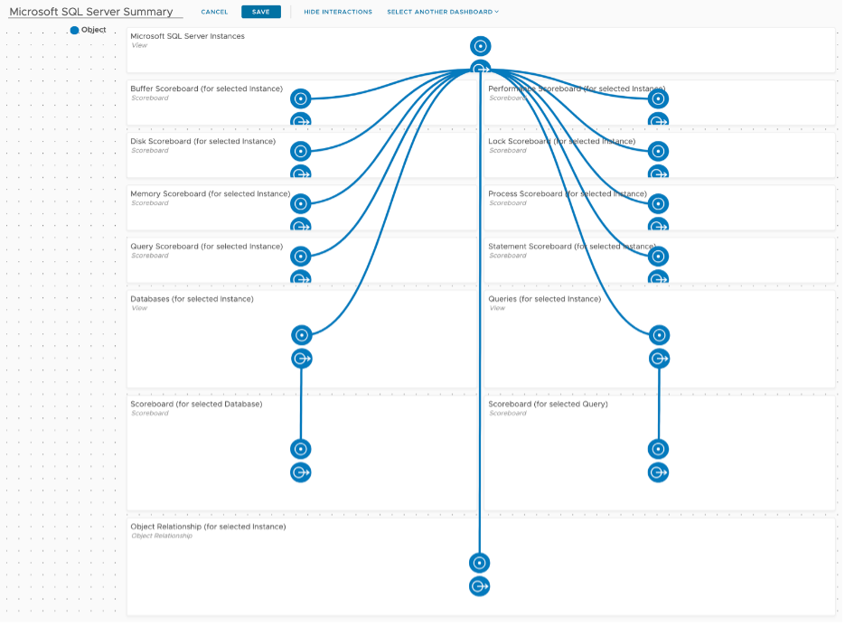
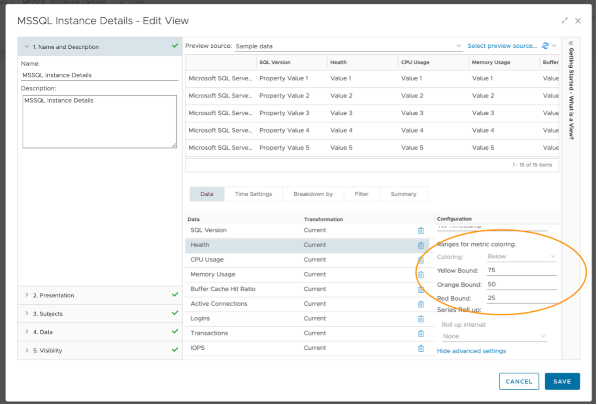
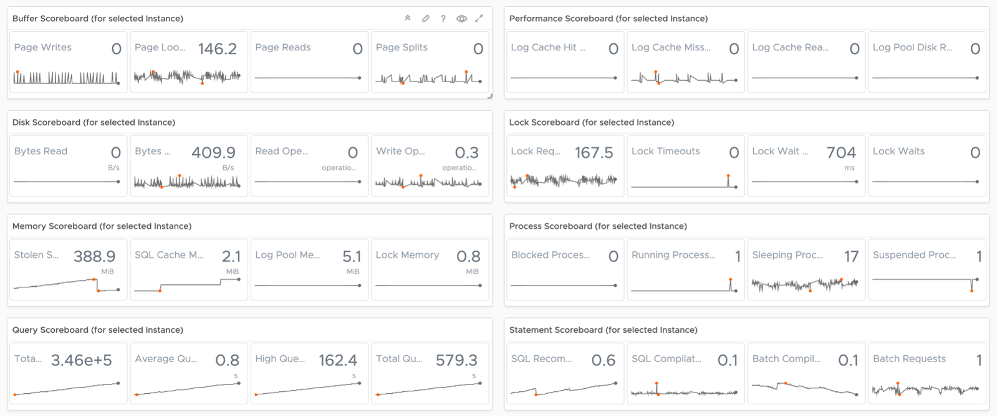
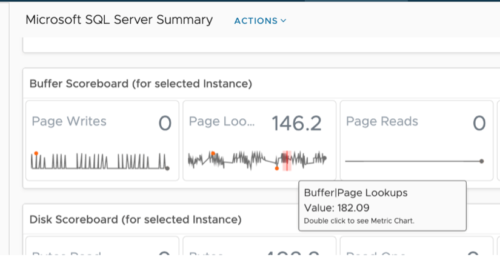
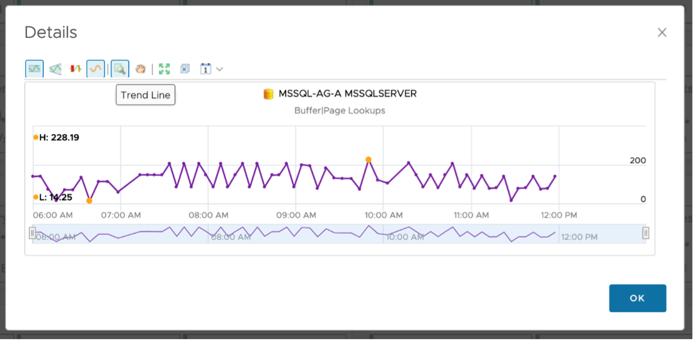
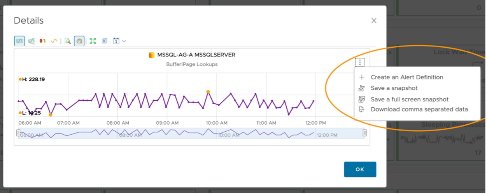
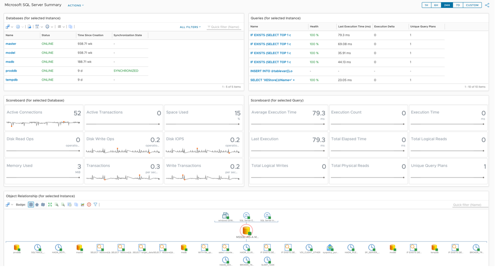
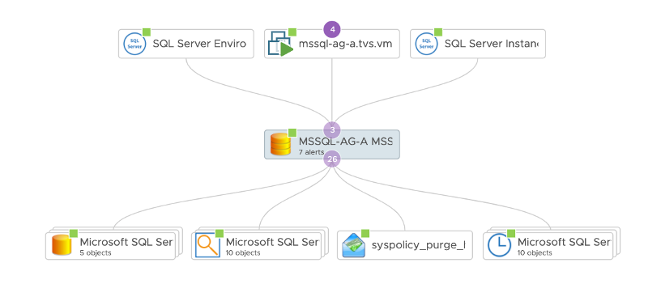

The Microsoft SQL (MS SQL) Server summary dashboard is generally used by Database Administration (DBA) teams. They use it to explore problematic MS SQL Instances.

This is a custom dashboard. You can download it [here](https://code.vmware.com/samples?id=7580.) on VMware {code}.

## Design Consideration

The MS SQL Server Summary was designed to allow the user to select a MS SQL Instance, then be shown all child objects, their health, and metrics that could reflect problems. Once the MS SQL Instance is selected the user immediately sees Key Performance Indicators (KPIs) in the widgets below. The two Views in the sixth row of widgets have "Auto Select First Row" turned on, such that their respective Scoreboards are populated with data upon selection.

The design is simple, clean, and efficient, allowing DBAs to search for a database instance and work their way into the details. It's designed to flow from top to bottom and left to right, which is reflected by the widget interaction canvas.

## How to Use

Select a MS SQL Instance in the top View widget by single clicking it, which will populate all other widgets. We'll explore the first five rows of the dashboard first, the Instance and its metrics.

The MS SQL Server Instance View offers several sortable columns, the first and most relevant being Health. vRealize Operations Health is based on Alerts and severity of those Alerts, a powerful construct used to gauge general well-being of objects. The View has been built such that unhealthy Instances are shown in red, while healthy instances are shown in green, helping the user to immediately identify problems.

SQL Version, CPU Usage, Memory Usage, Buffer Cache Hit Ratio, and several other KPIs are also shown in the top View. These provide the user with some context around a potentially unhealthy Instance. These columns are also sortable, giving the user the ability to see the most active Instances.

Once an Instance has been identified and chosen, the four rows of Scoreboard widgets are populated with historical data. These Scoreboards have been configured to show Instance metrics by group: Buffer, Performance, Disk, Lock, Memory, Process, Query, and Statements.

They have been configured to show four metrics each, including the most current value and historical data using Dashboard Time. That is, the timeframe you select for your dashboard will be propagated into these widgets. This provides the user with some texture when troubleshooting a problem. They can now see when metrics values started changing and if there is any correlation between them.

As you hover over KPIs, the dashboard will show you details about it (name and value) and give you the option to double click to explore the trend of that particular metric via a Metric Chart.

Double clicking launches this metric in a Metric Chart, giving the user even more options.

The user now has the ability to use all of the Metric Chart Features: Show Dynamic Thresholds, Anomalies, Trend Lines, and the ability to adjust the period of time. They can take snapshots to share with others, create alert definitions against the selected metric, or download the data being shown in a comma separated format.

Moving to the bottom half of the dashboard, we see two child objects of the selected Instance: Databases and Queries. Jobs and Wait Types are also available child objects but aren't quite as rich with metrics as Databases and Queries. The scoreboard widgets are driven from the Views and show object KPIs. At the bottom of the dashboard is an Object Relationship showing the original MS SQL Instance and all its children.

Starting with the row of Views, we see two important child objects of our selected Instance, namely Databases and Queries. I've included navigation information in each widgets title so the user knows exactly what's driving each View. I've included Health and a couple other KPIs for each object.

Using Views allowed me make 100% green and 25% or less Red. I've done something similar for Database Status and Job Last Run Status, to bring the users attention to OFFLINE/Failed statuses. All columns are sortable, giving the user the ability to see the least healthy object immediately.

Auto Select First Row has been turned on such that the Scoreboard widgets are populated with data. All of the same Scoreboard features are available here as they were above.

The last widget in this dashboard is the Object Relationship, which is being driven from the original MS SQL Instance. It has been configured to show parents and children, and the health of each, represented by the green squares (healthy), yellow triangles (marginally healthy), or red circles (unhealthy). If an object doesn't have any alerts against it, that doesn't mean it's necessarily healthy, but it does mean no Alert/Symptom combinations are active against it.

If you hover over an object, you are given some details: Type and Health. The user is also given an option to select Alerts or Details. If you double click the object the widget will re-center on that particular object, showing its parent and child objects. This can be quite useful during troubleshooting.

Selecting Alerts will show you any Active Alerts for that object. Selecting Details will take you to the Summary page for that object, in this case the MS SQL Database Summary. Another way to see relationships from the original MS SQL Instance is to explore them via the object Summary page.

The object in the middle is our original MS SQL Instance. The objects below it from left to right are its child objects: Databases, Queries, Jobs, and Wait Types. Objects above the MS SQL Instance are the parent objects, including the vSphere VM the Instance is sitting on. vRTVS documentation for these relationships can be found [here](https://docs.vmware.com/en/VMware-vRealize-True-Visibility-Suite/1.0/microsoft-sql-server/GUID-E83B417A-2E87-46E6-9827-DDF2E75D62D2.html).
