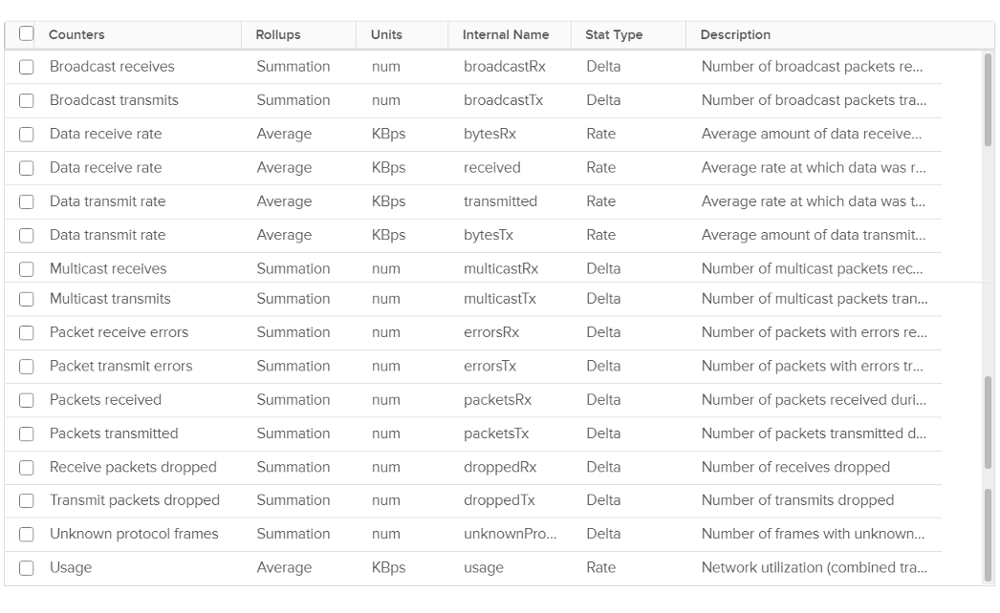

vCenter provides three additional counters at the host level. It can track Packet receive errors, Packet transmit errors, and Unknown protocol frames. The counters are provided at either host level or vmnic level. They are not provided at the switch or port group level. This means you cannot gauge the performance at the port group level or switch level easily using vCenter.

Just like vCenter, vRealize Operations also does not provide the counters at the Standard Switch or port group level. This means you cannot aggregate or analyze the data from these network objects point of view. This is one reason why you should use Distributed Switch. It simply has a much richer monitoring capability.

Usage, Data Received Rate, and Data Transmit Rate are all available at the host level and at the individual NIC level.

You should expect the value for packet loss and unknown packet frames to be 0. A packet is considered unknown if ESXi is unable to decode it and hence does not know what type of packet it is. Discuss with your network admin if you are seeing either a dropped packet or an unknown packet.

Packets loss and Unknown packet frames counters are available at the host level and individual NIC level.
