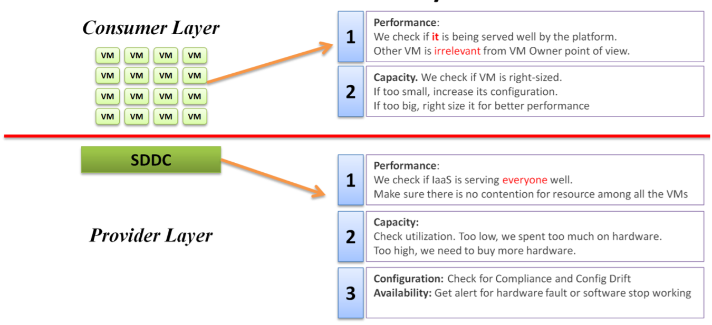

We have covered how all aspects of data center management have changed. If you need details, refer to [this chapter](/miscellaneous/chapter-3-sddc-vs-iaas/). These fundamental changes also change your IT business. You are now a service provider. While your engineering or technical knowledge is still important, your customer measures you on your business service level. While they care about your systems architecture and its capabilities, they measure you on your service quality.

[Sunny Dua](https://www.linkedin.com/in/duasunny/)[^1] and I use the restaurant analogy when explaining the need of formal [Service Level Agreement](/operations-management/chapter-1-overview/1.1.7-service-level-agreement/) (SLA). The analogy has resonated well with many customers. Humans can always relate to food!

Essentially, a restaurant has 2 areas, often with a clear demarcation line:

- The Dining Area.
- The Kitchen.

Think of your IaaS business like a restaurant business. It has a Dining Area, where your customers live, and a Kitchen, where you prepare the food. Guess which one is more important?

You are right. The dining area.

If everything runs smoothly in the dining area, customers are being served on time and on quality, and they are paying you well, it is a good day for the business. Whether you are running around in the hot kitchen is a separate, internal matter. The customers do not need to know about it.

We use the analogy to drive the message that you need to focus on the customers first, and your IaaS second. If you take care of your customers well, and they are happy with your service, the problem you have in your IaaS is a secondary and internal matter.

- The "dining area" is the Consumer layer. Look at the diagram below. It is where your customers' VMs live.
- The "kitchen" is the Provider Layer. This is your infrastructure layer, where VMware and the hardware reside.

Public cloud is part of the kitchen. Just because you no longer owns the infrastructure does not mean you can't take management responsibility. The structure of enterprise IT means the infrastructure team end up being held accountable.

There is clearly a line of demarcation between the two layers. Your customers should not care about the details of your SDDC or EUC. The VM Owner does not care if you are firefighting in the data center. Because they do not care, whether you are using an older VMware Cloud Foundation or the latest, is not something you want them to dictate to you upon. The same goes with your choice of hardware brand and specification.

The application team becomes a consumer of a shared service-the cloud platform. Depending on the SLA, the application team can be served as if they have dedicated access to the infrastructure, or they can take a performance hit in exchange for a lower price. For SLAs where performance is guaranteed, the VM running in the cluster should not be impacted by any other VMs. The performance must be as good as if it is the only VM running in the ESXi.

Let's zoom into the kitchen area, as that's also undergoing a transformation. The Server team or Windows team or Linux team typically took the ownership of the shared platform and evolved to become the platform team. With the evolution of [Hyper Converged Infrastructure](https://en.wikipedia.org/wiki/Hyper-converged_infrastructure), the storage is being absorbed into the platform. The boundary with the Network team is also becoming blurry with network virtualization. Many network services such a Firewall and Load Balancers are virtualized.

[^1]: Sunny and I went back a long way. We both came from the field and eventually became Product Managers.
