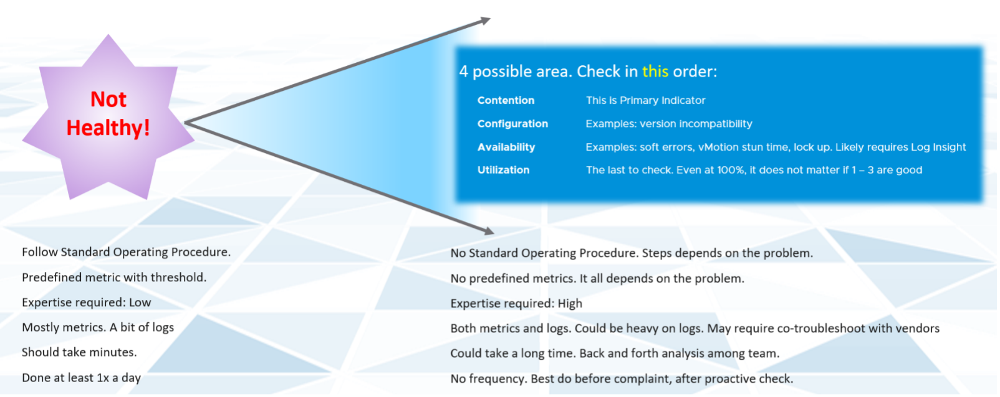

There are four distinct processes in performance management:

#### Plan

This is where you set the performance goal. Make sure the goal is aligned with the business deliverable.

When you architect that vSAN, how many milliseconds of disk latency did you have in mind? For example, you set the goal of 10 ms measured at VM level (not vSAN level and not at individual virtual disk level).

#### Monitor

This is where you compare Plan vs Actual. That's why the goal must be clearly defined. Does the reality match what your architecture was supposed to deliver? If not, then you need to fix it.

#### Troubleshoot

You do this when reality is worse than plan, or something amiss, not when there is a complaint. You want to take time in troubleshooting, so it's best done proactively. And quietly with no one rushing you for results. 

#### Optimize

As part your monitoring, you may not discover problem, but you spot opportunity to make performance even better. It's common for new version to deliver performance improvement. Again, you do this proactively, not waiting for complaint to happen.

---aliases: ['/operations-management/chapter-2-performance-management/1.2.3-plan-monitor-troubleshoot-optimize']
---

Monitor is **What**, while Troubleshoot is **Why**. Monitor is part of a [Standard Operating Procedure](https://en.wikipedia.org/wiki/Standard_operating_procedure) (SOP), while Troubleshoot is an ad hoc, on-demand process. Monitor can be performed by the Level 1 team, with the aid of predefined dashboard and alerts, while Troubleshoot requires expert team. The expert team is also the team setting up the thresholds used by the Level 1 team. Troubleshoot involves logs analysis, as many systems do not generate complete metrics, and there can be many different causes behind a common problem. At the end, the actual root cause may not even be closely related to the problem.

Day to day operations become more systematic when you distinguish between monitor and troubleshoot. The following table shows the difference:

|       | Monitor | Troubleshoot |
|-------|---------|--------------|
|**Question**| What is the problem? | Why does it happen? What is the actual cause of the problem? |
| **Nature** | Proactive | Reactive |
| **Counter** | Generally, 1 counter. And this counter is also the SLA. This is the 1st counter you or your customer check. | Always many counters. There are layers of counters, one impacting another.|
| **SLA** | Yes, meaning SLA is applicable | Yes. It becomes urgent if SLA is breached. |
| **KPI** | Yes, meaning you use KPI in monitoring instead of individual metrics. | Yes, but as a starting point. You then drill down into supporting metrics, which are often raw metrics. |
| **Metrics** | Primary counter. You check it proactively as part of SOP | Secondary counter. You only check if the primary is reaching threshold. |
| **Frequency** | Performed daily. Gold Class will have higher frequency of regular monitoring than Bronze, as part of SLA. | On demand. |
| **Timeline** | Now and Future. You consider future load and anticipate. | Now. Future is irrelevant. Your focus is to put out the fire or potential fire. |

In most cases, Monitor is best done using a 5-minute interval, as 1 minute of bad metrics may not have business impact. Troubleshoot on the other hand may require per second granularity. However, that does not always mean you need to see each and every counter, if your remediation action is the same.
