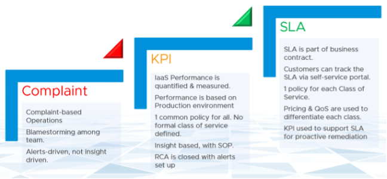

企业级云和非企业级云之间的区别在于 SLA。云提供商可以声明他们拥有最好的技术、最有经验的专业人员、最具创新性的流程、行业认证等，以证明他们是最好的。如果他们害怕在他们的合同中用 SLA 来支持它，那么所有这些都将无济于事。 SLA 使客户能够追究云提供商的责任，因为它会带来经济损失。

一旦定义了 SLA，客户就想知道它将如何交付。这就是流程、架构、认证等的用武之地。什么总是在如何之前。

## IaaS 的 4 个 SLA

IaaS 企业应提供三个 SLA，因为客户需要全面覆盖。

| SLA | 描述 |
| ------ | ----- |
| 可用性 | 这是最基本的SLA。它是最古老和最知名的。事实上，这在很大程度上是给定的。事实上，商定的数字是多少并不重要。如果这该死的事情失败了，你最好在有人抱怨或事情变得更糟之前迅速提出来！ |
| 性能 SLA | 仅仅因为发生了一些事情并不意味着它会很快。虚拟机是可以启动的，但是如果服务太慢，那就关掉就好了。 性能 SLA 涵盖了这一点并解决了基于投诉的操作 [CBO](/zh/operations-management/chapter-1-overview/1.1.1-complaint-based-operations/) 通过定义什么是快速的。 它涵盖了CPU、内存、磁盘和网络，因此使用了四个指标。 |
| 遵守 | 这为行业法规或认证提供了安全合规性。 |
| 服务 | 以上三个SLA是由技术提供的。它们需要得到人类提供的服务的补充。这应该涵盖主动和被动服务。两个流行的例子是响应时间和解决时间。 |

## KPI vs. SLA

KPI 和 SLA 齐头并进。

| 首字母缩略词 | 描述 |
| :-------: | ----------- |
| SLA | 您与客户签订的正式商业合同。通常，这是在 IaaS 提供商（基础架构团队）和 IaaS 消费者（应用程序团队或业务部门）之间进行的。 正式的 SLA 需要运营转型 [OT](https://blogs.vmware.com/services-education-insights/services/operations-transformation-services). 它需要的不仅仅是技术更改，因为您需要查看合同、价格（不仅仅是成本）流程、人员等。如果违反 SLA，它往往会受到经济处罚，例如下一个计费周期的信用。|
| KPI | 这包括 SLA 指标，以及在违反 SLA 指标之前提供预警的相关附加指标。一个给定的 SLA 有很多 KPI，而 KPI 是 SLA 的先决条件。如果您没有适当的 SLA，那么在提交 SLA 之前先从内部 KPI 开始。 首先了解并[分析](/zh/operations-management/chapter-2-performance-management/1.2.10-baseline-profiling/) 你的IaaS的实际性能。 使用 [此处](/zh/operations-management/chapter-2-performance-management/1.2.10-baseline-profiling/) 中描述的分析技术，我分析了超过一百万个数据点。 | 

SLA 是 **每月** 计数器，而不是每天或每年。您使用整个月的数据来计算它。

时间线很重要。在下表中，请注意一年中的 99.999% 实际上比一周中的 99.95% 容易。您的客户不会接受年度柜台，因为他们可能面临长时间停机。你不会接受每日柜台，因为没有错误的余地。月度计数器在服务质量和提供服务的成本之间提供平衡。它还使报告更容易，因为您只需要跟踪日历月。

每添加一个“9”，您的停机时间窗口就会减少 10 倍。这就是为什么每个小数会花费更多的钱，因为可能需要不同的结构。

即使您每月测量一次 SLA，仍然难以满足。看看下表。为简单起见，我们将使用可用性 SLA 而不是性能 SLA，因为 up 或 down 是一个简单的二进制文件。

如果您承诺 99.99%，那么您每个日历月只有 4.0 分钟到 4.5 分钟的停机时间。这意味着您的架构必须能够检测到问题，然后在短短几分钟内完成相应的修复。这是一个狭窄的操作空间。

适用于可用性但不适用于性能的独特节省宽限期是计划停机时间。没有计划的性能停机时间这样的事情。特定于 IaaS，您可以建议计划停机时间不包括在 SLA 中，只要它快速且很少完成即可。 VM 硬件升级、工具升级和 Windows 升级等计划活动可以包含在计划停机活动中。客户造成的停机时间不包括在内，无论是否有意。这就是为什么您需要两个计数器：一个用于 SLA，一个用于实际。实际上，每次停机都会被记录下来，无论它是否属于 SLA 的一部分。

影响可用性但不影响性能的挑战是恢复时间。您的系统可能会在 1 分钟内检测到 VM 已关闭，但是整个操作系统启动并正常运行之前的重启过程需要 5 分钟，因为它需要执行文件系统一致性检查。

KPI 是对 SLA 的补充，因为它跟踪的强度更大，涵盖更多的计数器和事件。使用 vRealize Log Insight 处理更多时间敏感事件，因为 vRealize Operations 每 5 分钟测量一次。

从上表中，请注意不包括来宾操作系统计数器，因为它是“应用程序 KPI”或 VM KPI 的一部分，而不是 IaaS KPI。它们会影响 VM 性能，但 IaaS 无能为力，这意味着修复是在来宾 OS 层完成的。

KPI 还通过为您的运营转型提供垫脚石来补充 SLA。这是真正的业务 SLA 操作的必要步骤。

你从你站的地方走。首先使用 KPI。随着时间的推移，确定您的实际可用性

## 服务水平

The following table shows a basic and generic guideline to a class of service. The actual model that you will implement will certainly differ, taking into account technology and business demand. In the [capacity management section](/zh/operations-management/chapter-3-capacity-management/1.3.3-capacity-planning/), we walk through an actual example.

The table above is further defined by their SLA, because you need to quantify what 10% penalty exactly means.

A Gold class has higher SLA than Silver. For that to happens, that means they are measured against the same benchmark.

- For availability, you measure all classes against the ideal, which is no downtime.
- For performance, you measure them against the same threshold, which is a stringent (read: fast) number.
- For compliance, you measure them against the ideal, which is perfect compliance.
- For service, you measure them against the ideal, which is the best possible service.

### 性能 SLA

Let's elaborate Performance SLA a bit, as it is more complex than the other two.

Following the above, diagram, you offer 99.9% for Gold, and 99% for Silver as the respective SLA.

For Gold to be higher than Silver, that means both are measured against the _same raw threshold_. In other words, a VM in Silver environment will expect that it does not get what it demands as often as a VM in Gold. If the VM Owner wants to have more _consistent_ service in performance, then simply pay more and upgrade to the Gold cluster.

This approach is easier than setting up a different performance threshold for each tier. Say you set the following:

- **Gold**: VM Memory Contention: 0.5%
- **Silver**: VM Memory Contention: 1.5%

You notice the problem already?

It is hard to explain the delta or gaps between the class of services. Why is Silver 3x the value if it is only half the price? Shouldn't it be proportionate?

There is a 2nd problem. If you set _different_ standards, it is possible that Silver will perform better than Gold, because it has lower standard. This can create confusion.

Operationally, having a single threshold is easier to set up. No need to play with vRealize Operations policy. You can also have mixed classes of VM in the same cluster or datastore, as the SLA threshold is the same.

We will cover the counters used in Performance SLA in more details [here](/zh/operations-management/chapter-2-performance-management/1.2.6-performance-sla/).

### Differentiated Service

IaaS is built on commodity hardware and provided as a utility. Having said that, there are many ways to differentiate your service vs your competitors. Use class of service to distinguish premium service. The following table lists some examples.

| Service | Description |
| ------- | ----------- |
| Backup | Gold Tier provides application-level back up. It also provides more frequent full back up, and customers are provided with self-service individual file restore. |
| High Availability | Gold Tier provides application- level monitoring. Customers can also ask for specific boot up sequence of their VMs, and ask for VM-Host affinity rules to minimize risk. |
| Disaster Recovery | Gold Tier provides lower [RPO and RTO](https://en.wikipedia.org/wiki/Disaster_recovery). Customers are also entitled to annual real test, where the production workload are run from the DR site. |
| Snapshot | Gold Tier provides longer snapshot and larger snapshot. |
| OS Management | Gold Tier provides flexibility in patching. Customers can specify delay in patching and request for custom patch package, where not all patches from Microsoft or Red Hat is applied. |
| VM Management | Gold Tier provides flexibility in updating Tools and VM Hardware. Customers are allowed to defer the update |
| Monitoring Service | Gold Tier VMs will be proactively monitored, not just relying on alerts. Gold Tier provides deeper visibility into the underlying physical infrastructure where customers VM are running. Customers are entitled for lower internal metrics such as vMotion stun time and VMkernel latency. Gold tier provides self-service monitoring. Customers are given their own login to a portal where they can monitor their own VMs. They can initiate scheduled downtime. Customers will be alerted over email and messaging network. |
| Support | Gold Tier provides faster response time, longer business hours, and faster resolution time. |
| Network | Gold Tier provides priority network. Customers can opt for periodic ping service to ensure network latency between their applications remain within the agreed threshold. |
| TAM | Gold Tier comes with a Technical Account Manager, acting as single point of contact for customers |