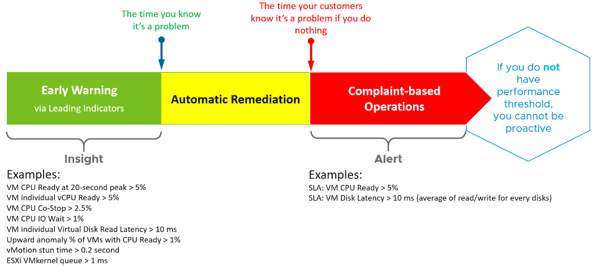

Many operations rely on alerts as the starting point. Actions are taken based on alerts, resulting in reactive day-to-day operations. To turn this situation around, vRealize Operations provides insight. Insights complement alerts, it does not replace it. Alerting misses the big picture, as it can only see what is already triggered. For one object that reached this threshold, there could be many just beneath the it. For one alert, there could many supporting metrics that have shown the potential root cause. Think of an iceberg. The small portion above sea level, the visible part, is an alert. The large, invisible part is insight.

Alerts may auto close if the symptom disappears. This encourages “lazy operations” when no alert is associated with no problem. Insight does not have this “auto close” concept as it does not involve help desk ticket. It's recording a fact that something has gone wrong, and that something could potentially cause an alert. Ideally, you want to detect and address that something before an alert is triggered.

There is a common misconception that Insight is simply alerts that use different threshold on the same metric. So insight is basically an alert with lower threshold. This is valid, but incomplete. Implementing insight this way can result in an alert storm and a lot of tickets. It is better for Insight to use different metrics than Alerts, so you get a different perspective.

Insight should focus on the underlying problem. It also helps buy you time so you can address the problem before the user complains. In the following example, the alerts use the SLA metrics and threshold. The insights use more granular metrics and supporting metrics. For example, vMotion stun time is not part of your SLA.

## Alerts Planning

Your goal is to minimize alerts storm while providing the greatest coverage. This calls for a careful planning on the alert definition, symptom and threshold.
For each alert, ask yourself: what remediation action will be taken by the person seeing the alert?

- If the answer is nothing, then why have the alert? Using a dashboard can give better picture.
- If the answer is something, can that be automated? Be careful of simplified logic as computer has no common sense.
- If the answer is escalating to the next level (e.g. Level 2 support), then ask the team in the next level if they prefer alert or dashboard. If their answer is they need to see a context, then a dashboard makes more sense.

What areas do you want to monitor with alerts? There are 7 pillars of Operations Management, so it's easy to confuse when designing the alerts definition.

#### Availability

You can minimize reactive operations by tracking soft errors, having proactive hardware replacement and ensuring software stack compatibility.

#### Performance

You minimize reactive operations not by using lower threshold, but by tracking early warning metrics. See the above diagram for the example.

#### Capacity

This is often mistaken as performance problem, as high utilization is a common alert.

#### Compliance

This is a subset of configuration check, so limit is to formal security standard.

#### Configuration

Configuration is broader than compliance. Configuration mistakes can cause availability, performance, capacity and security. Examples:

- Availability. Incompatibility between software versions could cause an outage.
- Capacity. Disabling CPU SMT will reduce the number of logical processor.
- Security. Outdated software may contain known security vulneratibility

#### Cost

You don't typically set an alert here as insight with dashboards is a better monitoring solution.

#### Inventory

You don't typically set an alert here as inventory it's merely an account of what you have. There is no good or bad.

------

Managing Alerts is not the same as minimizing Alerts. Managing is dealing with alerts that are already triggered. Minimizing takes us towards preventing alerts to begin with. Use insight to minimize alert definition, as alert should be reserved for urgent and important issue.

In cases where you can't minimize the alert, you can reduce its severity. You do this not by lowering the threshold, but by monitoring early warning events. For example, CPU and network have early warning that something have gone wrong at hardware level. You track this soft errors and perform proactive replacement.

In cases where you can't reduce the severity, you can reduce the occurance of the alert happening in production. You do this by proactive replacement, taken as part of scheduled downtime during green zone. For example, Solid State Drive (SSD) does not have infinite life span in terms of number of writes. The manufacturer has a number in mind for the endurance. If you have thousands of disks, you create a dashboard just to track this limit and schedule proactive replacement for those disks nearing their limit.