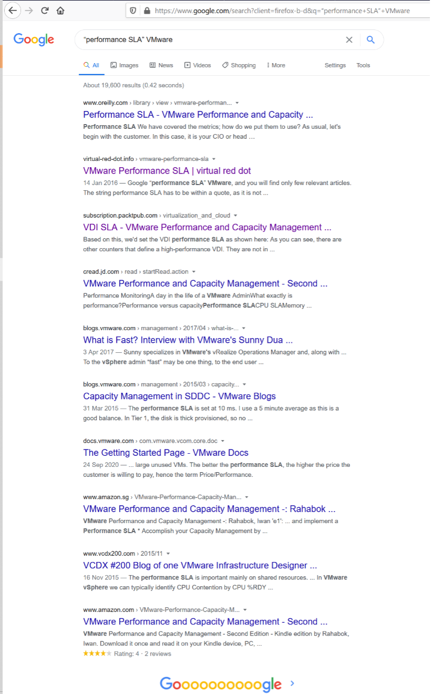

Google “performance SLA” VMware, and you will find only a few relevant articles. The string performance SLA must be within a quote, as it is not performance and SLA, but **Performance SLA**. Yes, I'm after web pages with the words Performance SLA together. You will get many irrelevant results if you simply google VMware Performance SLA without the quote.

I just tried it again on 14 March 2021. Google returned less than 20K results, which is up from 1.6K results in October 2015. The first 10 are shown below. Notice 8 of them are from my blog, book or speaking event. One item from [Sunny Dua](https://sunnydua.com/), talking about the same performance SLA concept we came up with, appears on the top 10. The last one is from Michael Webster, who used to work at VMware years ago.

I checked beyond the first 10 results. Other than my own articles, Google returned only a handful of relevant articles. The rest are not in fact relevant if you read them carefully. The relevant articles mention Performance SLA, but they do not define and quantify what a Performance SLA is. If something is not quantified, it is subjective. It's hard to reach formal agreement with customers quickly and consistently when the line is not clearly drawn. If you have a disagreement with your customers, especially paying customers, guess who wins 😊

Availability SLA protects you when there is downtime. Performance SLA protects you when there is performance issue.

The Performance SLA for vSphere is defined in the following table:

Using a typical 30-day month

Do you know why you should only use CPU Ready and exclude CPU Co-Stop and CPU Contention from Performance SLA?

It took me years to vrealize the mistake.

Answer is in [Part 4: Quiz Answer](/miscellaneous/chapter-1-quiz-answers/4.1.1-part-1-operations-management/), towards the end of the book.

The whole point of having performance management is to be able to know the problem _before_ the customers complain. If you can't see the problem before customers do, then you don't have performance management in place. The word _manage_ implies proactive. Passively waiting for an alert or complaint to trigger the troubleshooting process is not management. Proactive requires an internal threshold that is more stringent than the external, formally agreed SLA. This is where KPI comes from.