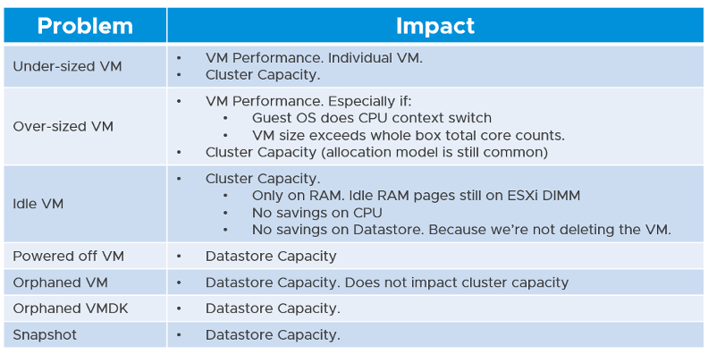
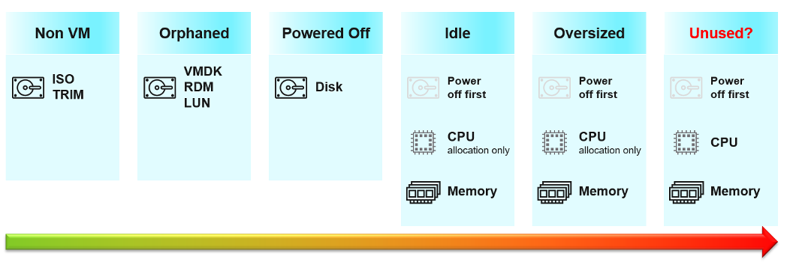

開墾帶來許多好處，其中一些列在下面



有6個填海區，從最簡單到最難。當然，每個人的邏輯都不一樣。



非 VM 文件是最簡單的，因為它們不歸其他人所有。他們是你的！非 VM 對象（例如模板和 ISO）應存儲在每個物理位置的 1 個數據存儲中。當然，只能回收磁盤，不能回收CPU和RAM。

孤立文件是數據存儲中不再與任何 VM 關聯的文件。隔離的 VM 和隔離的 [VMDK](https://en.wikipedia.org/wiki/VMDK) 甚至沒有在 vCenter 中註冊。如果是，它們可能會以斜體顯示，表示有錯誤。他們也可能沒有所有者。

對於孤立的 RDM（原始設備映射），從存儲陣列檢查是否有任何 ESXi 掛載它。

快照不是備份。如果它們保存的時間過長，它們確實會導致 VM 出現性能問題。保留它們只是為了在更改期間提供保護。一旦驗證更改成功，保留快照會對虛擬機造成損壞。快照更容易回收，因此 vRealize Operations 將它們單獨列出。

## 修剪和取消映射

當 Guest OS 刪除一個文件或其中的一部分時，它不會將值替換為 0，而只是離開該塊。這樣更有效，也可以恢復。但這會導致底層 VMDK 增長。同樣的事情發生在數組級別。這就是 [修剪和取消映射](https://en.wikipedia.org/wiki/Trim_(computing)) 的用武之地。

vRealize Operations 通過 ESXi 主機上的 2 個衡量指標跟踪取消映射操作。第一個是 Unmap IO，它跟踪取消映射 SCSI 指令的數量。例如，如果值為 100，則表示 ESXi 已向其數據存儲發送了 100 個取消映射請求。所以把它看作是 IOPS，除了 IO 不是寫/讀實際塊，而是更多請求刪除（取消映射）後端數組中的塊。此值是自 vSphere 每 20 秒報告一次後 20 秒的總和，然後在 5 分鐘內求平均值。在下面的示例中，您可以看到主機在過去 30 天內頻繁發送 unmaps 命令。


第二個指標是 Unmap Size，它跟踪上述操作的總未映射空間。該值以 MB 為單位顯示。


您可以在每個數據存儲上跟踪這兩個操作，但不能按數據存儲聚合它們。

要詳細了解vSAN 中的TRIM 和取消映射，請閱讀[這篇詳細的文章](http://www.patrickkremer.com/save-money-using-vsan-unmap-trim-in-vmware-cloud-on -aws/) 這篇文章是由[Patrick Kremer](https://twitter.com/KremerPatrick).

此問題僅發生在精簡配置的磁盤上。因此，如果要檢查可以回收多少空間，請創建一個視圖，將 Guest 中的值與 VMDK 級別顯示的值進行比較。

## 無電源虛擬機

關閉虛擬機更加困難，因為現在有了虛擬機的所有者。在刪除它們之前，您需要與 VM Owner 打交道。這是他們用所有者的電子郵件或業務部門標記的地方。


汽車為什麼要剎車？

所以他們可以走得更快！

使用斷電作為空閒 VM 的剎車。如果將空閒和關閉電源視為一個連續體，則可以更早地關閉空閒虛擬機。您可以獲得 CPU 和 RAM 回收的好處。這也是一個更安全的過程，因為如果您發現虛擬機實際上正在被使用，您只需重新打開它即可。

一個主要的 ***警告*** 如果這樣做，群集中剩餘虛擬機的平均利用率將變得更高。因此，您可能無法達到收支平衡所需的過度使用率。

## 運行虛擬機的2個方面

就像有兩個大小調整公式（一個用於訪客操作系統，一個用於 VM）一樣，運行 VM（空閒與否）也有兩個回收公式。該公式很複雜，因為它有兩個不同的階段：

#### 前

確定 *** 如果 *** VM 屬於該類別。例如，VM 是否符合空閒 VM 的條件？這應該查看 VM 內部，因為這是工作負載運行的地方。在 ESXi 級別進行測量可能會產生不正確的結果，因為其中包括不是由 VM 生成的負載。

#### 之後

確定 ***什麼*** 可以回收。由於正在回收的是 ESXi 資源，因此來賓操作系統內部的使用無關緊要。 Guest 內部的隊列不會影響管理程序，因此在 ESXi 層沒有任何可回收的內容。所有計數器都來自 ESXi。來賓操作系統計數器不適用，因為我們不會從來賓內部回收。

所以你需要應用兩種不同類型的邏輯。

## 空閒虛擬機

空閒 VM 是一個很好的目標，因為您現在可以在關閉電源時聲明 CPU 和 RAM。您還不能聲明磁盤，因為您還沒有刪除它們。請注意，您並沒有回收真正的 CPU 週期，因為它一開始是空閒的。空閒虛擬機實際上不消耗任何 ESXi CPU 週期。因此，回收僅運行 1 個 vCPU 的 10 個 vCPU 虛擬機不會為您提供 9 個 vCPU。你正在回收空白的空氣。對於內存，您將回收真實的 ESXi 內存，因為空閒 VM 往往會將其消耗的內存保留在 ESXi 上。

讓我們看看公式的第一部分，在這裡我們決定 VM 是否空閒。如果您在很長一段時間內測量空閒狀態，那麼很少使用的 VM 可能會顯示為空閒狀態。例如，如果虛擬機每週只有 2 小時（從業務角度來看）有生產力，則意味著剩餘的 166 小時應歸類為空閒。那是 98.8% 空閒。

請注意，較長的時間窗口會提高準確性，但也會延長移入和移出空閒 VM 定義所需的時間。


您可以通過創建列表視圖來應用上述邏輯。注意極端情況，例如具有月末處理的 VM。即使您將 99% 設置為 1 個月，邏輯仍然可能錯誤地將活動 VM 標記為空閒。 1% 活躍意味著它在 30 天內總共只活躍了 8 小時（0.3 天）。請注意，這是一個總數，而不是連續的 8 小時。它在 30 天內累積。理想情況下，您需要進行每日檢查，這意味著它必須每天都處於閒置狀態。

連續閒置 30 天，然後活動 8 小時的 VM，只需 8 小時即可標記為非閒置。沒有累積 8 小時 CPU > 100 MHz 的 VM，顯然需要更多時間。因此，VM 可能會在激活後的幾天內被錯誤地標記為空閒。

設置為 99% 的缺點是我們必須等待整整 30 天才能決定。在某些極端情況下，VM 可能永遠不會被標記為空閒。看一個場景：

- 一台虛擬機一直處於活動狀態並已投入使用數月。兩年後，隨著新版本的發布，該應用程序將被淘汰。
- 結果，VM 處於空閒狀態，因為它只是在等待被刪除。但是因為我們將其設置為 99%，邏輯將等待整整 30 天才能做出決定。
- 在此期間，由於 AV 和操作系統補丁等基本服務仍在運行，因此會消耗 CPU/RAM。如果這些非應用程序工作負載在 30 天內加起來超過 8 小時，VM 將永遠不會被標記為空閒。

從 vRealize Operations 7.5 開始，空閒虛擬機的固定閾值為 100 Mhz。這意味著在 2 GHz ESXi 上運行的單個 vCPU 虛擬機的利用率為 5%。這也意味著在同一 ESXi 上的 20 個 vCPU 上為 0.25%。根據定義，靜態空閒的原因是絕對的，與 VM 的大小無關。非常大的 VM 是相對的。

雖然 VM 使用了 CPU、RAM、磁盤和網絡，但我們只使用 CPU 作為空閒的定義。沒有必要考慮所有 4 個並要求所有 4 個都是免費的，因為它們是相互關聯的。處理網絡數據包和執行磁盤活動需要 CPU 週期。來自網卡和磁盤的數據也必須複製到 RAM 中，複製工作需要 CPU 週期。

請注意具有失控 CPU 的 VM 的極端情況限制，其中 CPU 很高但沒有有意義的內存訪問、網絡傳輸 (TX) 和磁盤處理。空閒的 VM 將無法檢測到它。這是一個角落案例，所以我認為不值得複雜化。另外，CPU失控通常發生在一個進程中，可能是單個線程。使用 CPU 使用率差異 (%) 指示器來檢測。

閒置必須被定義，所以它是可衡量的，而不是主觀的。將其宣佈為正式政策，這樣您就不會與客戶發生爭議。

閒置必須考慮它在這個閾值下持續了多長時間。

虛擬機在幾個月內不會不間斷地使用 CPU。有時候懶惰是正常的。月底處理工資單的虛擬機可以閒置29天。

根據定義，空閒意味著它沒有執行有用的業務工作負載。僅執行非業務工作負載（例如 AV 掃描、定期 Windows 更新）的 VM 應被視為空閒。

vRealize Operations 使用可回收空閒衡量指標來指示虛擬機是否空閒。如果連續 N 天的計數器空閒指示器 = 1（N 的默認值為 7 天），則該值設置為 1（真）。這是一個每日計數器，每天顯示一次，如下例所示：


Idleness Indicator 是一個屬性，因此只有在更改時才會顯示值。它是滾動計數器，每 5 分鐘計算一次，但每個值都需要過去 24 小時。正如您在以下示例中看到的那樣，只有在發生更改時才存儲其值。


如果 CPU 使用率連續 24 小時 <100 MHz，則空閒指標值 = 1。

在某些環境中，使用新配置的 VM 可能需要一些時間。在關閉 VM 之前檢查 VM 的創建日期。

##超級虛擬機

超大虛擬機的邏輯不同於空閒虛擬機的邏輯，因為空閒虛擬機的定義不依賴於虛擬機的大小。空閒虛擬機的定義只是衡量虛擬機是否產生足夠的工作負載。

空閒具有絕對定義（在 vRealize Operations 7.5 中為 100 MHz）。超大 VM 取決於 VM 的大小。運行 7 個 vCPU 的 64 個 vCPU 虛擬機非常大，而運行 7 個 vCPU 的 8 個 vCPU 則不是。

空閒以 GHz 為單位定義，超大以 % 定義。

#### 虛擬機容量不足

根據 CPU 和 RAM 的總容量和建議的大小值計算。

如果對於至少一個容器（CPU 或 RAM），建議大小 > 總計

增加CPU的最小值為1 vCPU，內存為1 GB

#### 虛擬機太大

如果可以回收CPU或內存，說明虛擬機容量過大。

根據 CPU 和 RAM 的總容量和建議的大小值計算。

#### VM 可回收 CPU

根據虛擬機的槽數和核心數計算

```text
= 在最低限度 (( 可回收插座 * 每個插槽的核心數 + 剩餘插槽中的可回收核心), CPU內核數 - 2)
```

如果 CPU Reclaimable 值 < MHz Per Core 值，則不會建議回收

#### 虛擬機可回收內存

```text
= 總容量 - 推薦尺寸
```

必須=> 1 GB，回收後的剩餘容量應=> 2 GB

## 開墾方法

Active VM 在政治上是最難的，因為它們服務於業務工作負載。首先關注大型虛擬機。分別使用 CPU 和 RAM，因為拆分它們時更容易處理。分而治之。如果兩者都降低，並且應用程序團隊聲稱對性能產生影響，則需要同時恢復兩者。無論閒置情況如何，從小型虛擬機中獲取 CPU 和 RAM 都是徒勞的。無法進一步減少具有一個 vCPU 的空閒 VM。關注大型虛擬機，原因已涵蓋 [這裡](/operations-management/chapter-3-capacity-management/1.3.12-rightsizing/#severity-of-over-provisioning).

在減少超大虛擬機或關閉空閒虛擬機時，請注意大型虛擬機。舉個例子來比較：

- 減少 20 個大型虛擬機。平均減少 10 個 vCPU。
- 減少 100 個小型虛擬機。平均減少 2 個 vCPU。

在這兩種情況下，您都回收了 200 個 vCPU。但是大型 VM 選項帶來更多好處並且更容易實現。原因如下：

- 每次縮小規模都是一場戰鬥，因為您正在通過“少即是多”改變範式。此外，它需要停機時間，這需要審批和變更請求流程。
- 現在，使用 20 核以上的至強處理器，從 4 個 vCPU 縮減到 2 個並不多。
- 沒有人喜歡放棄他們得到的東西，尤其是如果他們得到的很少。通過專注於大的，你花費 20% 的努力來獲得 80% 的結果。
- 大型 VM 對其他 VM 也不利，而不僅僅是對它們自己。它們可以影響其他大小的虛擬機。 ESXi VMkernel 調度程序必須為所有 vCPU 找到可用內核，即使它們處於空閒狀態。因此，其他 VM 可能會從核心遷移到核心，或從套接字遷移到套接字。 esxtop 中有一個計數器可以跟踪此遷移。
- 大型虛擬機的性能往往較慢。 ESXi 可能沒有所有可用的 vCPU。大型虛擬機速度較慢，因為必須調度它們的所有 vCPU。計數器 CPU CoStop 對此進行跟踪。
- 大型虛擬機會降低整合率。與大型 VM 相比，您可以使用較小的 VM 打包更多的 vCPU。

## 未使用的虛擬機

未使用的 VM 不會閒置，但它們不再提供業務價值。應用程序團隊可能已停止使用它，但仍繼續運行該應用程序，以備將來需要時使用。 VM 不會空閒，因為它仍然會生成 CPU 活動。活動可以是業務工作負載、IT 工作負載或兩者兼而有之。

IT 工作負載有多種形式。來賓操作系統升級、更新和補丁可以是具有不同模式的 3 種不同工作負載。 VMware Tools 補丁、防病毒掃描、入侵檢測掃描和基於代理的備份是其他常見示例。在一個高安全性的環境中，可以有很多與安全相關的代理在運行。

業務工作負載可以是批處理作業、報告或監控。沒有人再使用該應用程序，但該應用程序繼續運行。這比運行純 IT 工作負載更難識別。

未使用的虛擬機很難檢測到，因為基礎設施團隊缺乏業務背景，並且模式差異很大。關閉虛擬機前需要進行所有者驗證。這就是將 VM 與部門或所有者相關聯的能力很重要的原因。我們在第 1 部分中討論了以業務為中心的基礎架構的重要性。