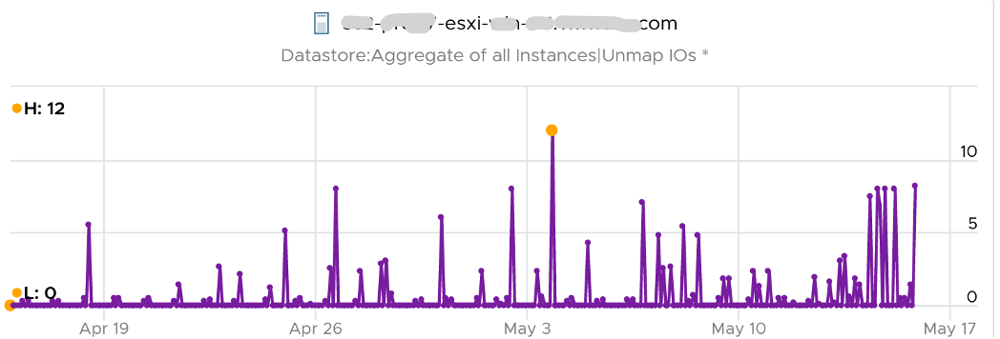
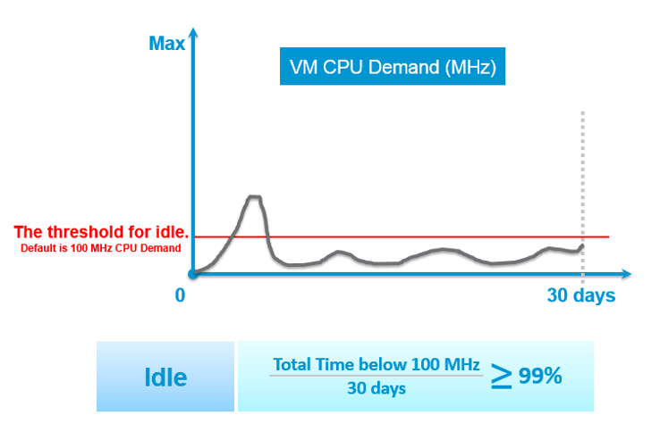

开垦带来许多好处，其中一些列在下面


有6个填海区，从最简单到最难。当然，每个人的逻辑都不一样。


非 VM 文件是最简单的，因为它们不归其他人所有。他们是你的！非 VM 对象（例如模板和 ISO）应存储在每个物理位置的 1 个数据存储中。当然，只能回收磁盘，不能回收CPU和RAM。

孤立文件是数据存储中不再与任何 VM 关联的文件。隔离的 VM 和隔离的 [VMDK](https://en.wikipedia.org/wiki/VMDK) 甚至没有在 vCenter 中注册。如果是，它们可能会以斜体显示，表示有错误。他们也可能没有所有者。

对于孤立的 RDM（原始设备映射），从存储阵列检查是否有任何 ESXi 挂载它。

快照不是备份。如果它们保存的时间过长，它们确实会导致 VM 出现性能问题。保留它们只是为了在更改期间提供保护。一旦验证更改成功，保留快照会对虚拟机造成损坏。快照更容易回收，因此 vRealize Operations 将它们单独列出。

## 修剪和取消映射

当 Guest OS 删除一个文件或其中的一部分时，它不会将值替换为 0，而只是离开该块。这样更有效，也可以恢复。但这会导致底层 VMDK 增长。同样的事情发生在数组级别。这就是 [修剪和取消映射](https://en.wikipedia.org/wiki/Trim_(computing)) 的用武之地。

vRealize Operations 通过 ESXi 主机上的 2 个衡量指标跟踪取消映射操作。第一个是 Unmap IO，它跟踪取消映射 SCSI 指令的数量。例如，如果值为 100，则表示 ESXi 已向其数据存储发送了 100 个取消映射请求。所以把它看作是 IOPS，除了 IO 不是写/读实际块，而是更多请求删除（取消映射）后端数组中的块。此值是自 vSphere 每 20 秒报告一次后 20 秒的总和，然后在 5 分钟内求平均值。在下面的示例中，您可以看到主机在过去 30 天内频繁发送 unmaps 命令。



第二个指标是 Unmap Size，它跟踪上述操作的总未映射空间。该值以 MB 为单位显示。


您可以在每个数据存储上跟踪这两个操作，但不能按数据存储聚合它们。

要详细了解 vSAN 中的 TRIM 和取消映射，请阅读 [这篇详细的文章](http://www.patrickkremer.com/save-money-using-vsan-unmap-trim-in-vmware-cloud-on-aws/) 这篇文章是由 [Patrick Kremer](https://twitter.com/KremerPatrick).

此问题仅发生在精简配置的磁盘上。因此，如果要检查可以回收多少空间，请创建一个视图，将 Guest 中的值与 VMDK 级别显示的值进行比较。

## 无电源虚拟机

关闭虚拟机更加困难，因为现在有了虚拟机的所有者。在删除它们之前，您需要与 VM Owner 打交道。这是他们用所有者的电子邮件或业务部门标记的地方。


汽车为什么要刹车？

所以他们可以走得更快！

使用断电作为空闲 VM 的刹车。如果将空闲和关闭电源视为一个连续体，则可以更早地关闭空闲虚拟机。您可以获得 CPU 和 RAM 回收的好处。这也是一个更安全的过程，因为如果您发现虚拟机实际上正在被使用，您只需重新打开它即可。

一个主要的 ***警告*** 如果这样做，群集中剩余虚拟机的平均利用率将变得更高。因此，您可能无法达到收支平衡所需的过度使用率。

## 运行虚拟机的2个方面

就像有两个大小调整公式（一个用于访客操作系统，一个用于 VM）一样，运行 VM（空闲与否）也有两个回收公式。该公式很复杂，因为它有两个不同的阶段：

#### 前

确定 *** 如果 *** VM 属于该类别。例如，VM 是否符合空闲 VM 的条件？这应该查看 VM 内部，因为这是工作负载运行的地方。在 ESXi 级别进行测量可能会产生不正确的结果，因为其中包括不是由 VM 生成的负载。

#### 之后

确定 ***什么*** 可以回收。由于正在回收的是 ESXi 资源，因此来宾操作系统内部的使用无关紧要。 Guest 内部的队列不会影响管理程序，因此在 ESXi 层没有任何可回收的内容。所有计数器都来自 ESXi。来宾操作系统计数器不适用，因为我们不会从来宾内部回收。

所以你需要应用两种不同类型的逻辑。

## 空闲虚拟机

空闲 VM 是一个很好的目标，因为您现在可以在关闭电源时声明 CPU 和 RAM。您还不能声明磁盘，因为您还没有删除它们。请注意，您并没有回收真正的 CPU 周期，因为它一开始是空闲的。空闲虚拟机实际上不消耗任何 ESXi CPU 周期。因此，回收仅运行 1 个 vCPU 的 10 个 vCPU 虚拟机不会为您提供 9 个 vCPU。你正在回收空白的空气。对于内存，您将回收真实的 ESXi 内存，因为空闲 VM 往往会将其消耗的内存保留在 ESXi 上。

让我们看看公式的第一部分，在这里我们决定 VM 是否空闲。如果您在很长一段时间内测量空闲状态，那么很少使用的 VM 可能会显示为空闲状态。例如，如果虚拟机每周只有 2 小时（从业务角度来看）有生产力，则意味着剩余的 166 小时应归类为空闲。那是 98.8% 空闲。

请注意，较长的时间窗口会提高准确性，但也会延长移入和移出空闲 VM 定义所需的时间。



您可以通过创建列表视图来应用上述逻辑。注意极端情况，例如具有月末处理的 VM。即使您将 99% 设置为 1 个月，逻辑仍然可能错误地将活动 VM 标记为空闲。 1% 活跃意味着它在 30 天内总共只活跃了 8 小时（0.3 天）。请注意，这是一个总数，而不是连续的 8 小时。它在 30 天内累积。理想情况下，您需要进行每日检查，这意味着它必须每天都处于闲置状态。

连续闲置 30 天，然后活动 8 小时的 VM，只需 8 小时即可标记为非闲置。没有累积 8 小时 CPU > 100 MHz 的 VM，显然需要更多时间。因此，VM 可能会在激活后的几天内被错误地标记为空闲。

设置为 99% 的缺点是我们必须等待整整 30 天才能决定。在某些极端情况下，VM 可能永远不会被标记为空闲。看一个场景：

- 一台虚拟机一直处于活动状态并已投入使用数月。两年后，随着新版本的发布，该应用程序将被淘汰。
- 结果，VM 处于空闲状态，因为它只是在等待被删除。但是因为我们将其设置为 99%，逻辑将等待整整 30 天才能做出决定。
- 在此期间，由于 AV 和操作系统补丁等基本服务仍在运行，因此会消耗 CPU/RAM。如果这些非应用程序工作负载在 30 天内加起来超过 8 小时，VM 将永远不会被标记为空闲。

从 vRealize Operations 7.5 开始，空闲虚拟机的固定阈值为 100 Mhz。这意味着在 2 GHz ESXi 上运行的单个 vCPU 虚拟机的利用率为 5%。这也意味着在同一 ESXi 上的 20 个 vCPU 上为 0.25%。根据定义，静态空闲的原因是绝对的，与 VM 的大小无关。非常大的 VM 是相对的。

虽然 VM 使用了 CPU、RAM、磁盘和网络，但我们只使用 CPU 作为空闲的定义。没有必要考虑所有 4 个并要求所有 4 个都是免费的，因为它们是相互关联的。处理网络数据包和执行磁盘活动需要 CPU 周期。来自网卡和磁盘的数据也必须复制到 RAM 中，复制工作需要 CPU 周期。

请注意具有失控 CPU 的 VM 的极端情况限制，其中 CPU 很高但没有有意义的内存访问、网络传输 (TX) 和磁盘处理。空闲的 VM 将无法检测到它。这是一个角落案例，所以我认为不值得复杂化。另外，CPU失控通常发生在一个进程中，可能是单个线程。使用 CPU 使用率差异 (%) 指示器来检测。

闲置必须被定义，所以它是可衡量的，而不是主观的。将其宣布为正式政策，这样您就不会与客户发生争议。

闲置必须考虑它在这个阈值下持续了多长时间。

虚拟机在几个月内不会不间断地使用 CPU。有时候懒惰是正常的。月底处理工资单的虚拟机可以闲置29天。

根据定义，空闲意味着它没有执行有用的业务工作负载。仅执行非业务工作负载（例如 AV 扫描、定期 Windows 更新）的 VM 应被视为空闲。

vRealize Operations 使用可回收空闲衡量指标来指示虚拟机是否空闲。如果连续 N 天的计数器空闲指示器 = 1（N 的默认值为 7 天），则该值设置为 1（真）。这是一个每日计数器，每天显示一次，如下例所示：


Idleness Indicator 是一个属性，因此只有在更改时才会显示值。它是滚动计数器，每 5 分钟计算一次，但每个值都需要过去 24 小时。正如您在以下示例中看到的那样，只有在发生更改时才存储其值。


如果 CPU 使用率连续 24 小时 <100 MHz，则空闲指标值 = 1。

在某些环境中，使用新配置的 VM 可能需要一些时间。在关闭 VM 之前检查 VM 的创建日期。

##超级虚拟机

超大虚拟机的逻辑不同于空闲虚拟机的逻辑，因为空闲虚拟机的定义不依赖于虚拟机的大小。空闲虚拟机的定义只是衡量虚拟机是否产生足够的工作负载。

空闲具有绝对定义（在 vRealize Operations 7.5 中为 100 MHz）。超大 VM 取决于 VM 的大小。运行 7 个 vCPU 的 64 个 vCPU 虚拟机非常大，而运行 7 个 vCPU 的 8 个 vCPU 则不是。

空闲以 GHz 为单位定义，超大以 % 定义。

#### 虚拟机容量不足

根据 CPU 和 RAM 的总容量和建议的大小值计算。

如果对于至少一个容器（CPU 或 RAM），建议大小 > 总计

增加CPU的最小值为1 vCPU，内存为1 GB

#### 虚拟机太大

如果可以回收CPU或内存，说明虚拟机容量过大。

根据 CPU 和 RAM 的总容量和建议的大小值计算。

#### VM 可回收 CPU

根据虚拟机的槽数和核心数计算

```text
= 在最低限度 (( 可回收插座 * 每个插槽的核心数 + 剩余插槽中的可回收核心), CPU内核数 - 2)
```

如果 CPU Reclaimable 值 < MHz Per Core 值，则不会建议回收

#### 虚拟机可回收内存

```text
= 总容量 - 推荐尺寸
```

必须=> 1 GB，回收后的剩余容量应=> 2 GB

## 开垦方法

Active VM 在政治上是最难的，因为它们服务于业务工作负载。首先关注大型虚拟机。分别使用 CPU 和 RAM，因为拆分它们时更容易处理。分而治之。如果两者都降低，并且应用程序团队声称对性能产生影响，则需要同时恢复两者。无论闲置情况如何，从小型虚拟机中获取 CPU 和 RAM 都是徒劳的。无法进一步减少具有一个 vCPU 的空闲 VM。关注大型虚拟机，原因已涵盖[这里](/operations-management/chapter-3-capacity-management/1.3.12-rightsizing/#severity-of-over-provisioning).

在减少超大虚拟机或关闭空闲虚拟机时，请注意大型虚拟机。举个例子来比较：

- 减少 20 个大型虚拟机。平均减少 10 个 vCPU。
- 减少 100 个小型虚拟机。平均减少 2 个 vCPU。

在这两种情况下，您都回收了 200 个 vCPU。但是大型 VM 选项带来更多好处并且更容易实现。原因如下：

- 每次缩小规模都是一场战斗，因为您正在通过“少即是多”改变范式。此外，它需要停机时间，这需要审批和变更请求流程。
- 现在，使用 20 核以上的至强处理器，从 4 个 vCPU 缩减到 2 个并不多。
- 没有人喜欢放弃他们得到的东西，尤其是如果他们得到的很少。通过专注于大的，你花费 20% 的努力来获得 80% 的结果。
- 大型 VM 对其他 VM 也不利，而不仅仅是对它们自己。它们可以影响其他大小的虚拟机。 ESXi VMkernel 调度程序必须为所有 vCPU 找到可用内核，即使它们处于空闲状态。因此，其他 VM 可能会从核心迁移到核心，或从套接字迁移到套接字。 esxtop 中有一个计数器可以跟踪此迁移。
- 大型虚拟机的性能往往较慢。 ESXi 可能没有所有可用的 vCPU。大型虚拟机速度较慢，因为必须调度它们的所有 vCPU。计数器 CPU CoStop 对此进行跟踪。
- 大型虚拟机会降低整合率。与大型 VM 相比，您可以使用较小的 VM 打包更多的 vCPU。

## 未使用的虚拟机

未使用的 VM 不会闲置，但它们不再提供业务价值。应用程序团队可能已停止使用它，但仍继续运行该应用程序，以备将来需要时使用。 VM 不会空闲，因为它仍然会生成 CPU 活动。活动可以是业务工作负载、IT 工作负载或两者兼而有之。

IT 工作负载有多种形式。来宾操作系统升级、更新和补丁可以是具有不同模式的 3 种不同工作负载。 VMware Tools 补丁、防病毒扫描、入侵检测扫描和基于代理的备份是其他常见示例。在一个高安全性的环境中，可以有很多与安全相关的代理在运行。

业务工作负载可以是批处理作业、报告或监控。没有人再使用该应用程序，但该应用程序继续运行。这比运行纯 IT 工作负载更难识别。

未使用的虚拟机很难检测到，因为基础设施团队缺乏业务背景，并且模式差异很大。关闭虚拟机前需要进行所有者验证。这就是将 VM 与部门或所有者相关联的能力很重要的原因。我们在第 1 部分中讨论了以业务为中心的基础架构的重要性。