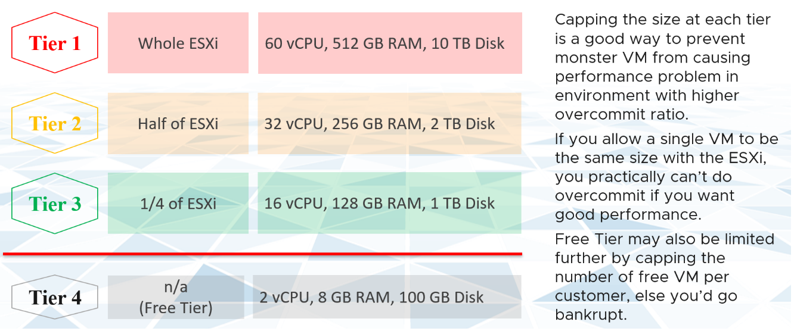

對於 IaaS 或 DaaS，容量管理早在部署硬件之前就開始了。它從一個商業計劃開始，它決定了將提供什麼級別的服務。每個服務等級（例如金、銀、銅）都因服務質量而有所不同。這通常包括可用性（例如，黃金級為 99.99% 的正常運行時間，白銀級為 99.95% 的正常運行時間）、性能和安全性/合規性。這在之前的 [SLA](/operations-management/chapter-1-overview/1.1.7-service-level-agreement/) 中有介紹。

上表是通用指南。作為 IT​​ 管理計劃的一部分，您可以幫助他們定義和決定每個服務等級。此計劃會話需要供應商輸入，因為您希望優化成本。使用供應商折扣和許可模式來補充計劃，而不是規定計劃。

在計劃會議結束時，您可能會得到這樣的結果。

在此示例中，IT 管理部門決定僅提供兩種業務產品：

- **白銀**：33% 的折扣和 2% 的性能損失
- **銅獎**：67% 的折扣和 5% 的性能損失

[Kim Ramirez](https://www.linkedin.com/in/kimkiser1/) 建議，從定價心理學的角度來看，提供黃金可能是有意義的，期望沒有人會購買它，它只會起到銀色看起來很划算。這也解決了一個潛在的困惑，如果客戶只看到銀牌和銅牌優惠，他們會想知道金牌在哪裡。

質量會產生成本，而成本反過來又會影響價格。 Gold VM 的每 vCPU 和每 GB 內存的價格更高，因為它具有更高的服務質量。需要規劃合適的定價模型。 Silver Tier 上 16 個 vCPU VM 的成本確實比 Gold Tier 上 1 個 vCPU VM 的成本高。這是您想要驅動的行為。合適的層級，合適的尺寸。

如果您希望您的客戶提前調整大小，那麼 64 個 vCPU 虛擬機的價格需要是 1 個 vCPU 虛擬機價格的 64 倍以上。如果定價模型是一條簡單的直線，則不會有小規模的動機，也不會因過度提供而受到懲罰。您最終將在生產中強制調整規模，這是一個昂貴且耗時的過程。

參考 [成本管理](/operations-management/chapter-5-cost-management/) 的定價示例，因為成本和價格是相輔相成的。

因為你過度使用，所以你冒著爭用的風險。要將其最小化，一種方法是控制 VM 的大小。您希望避免龐大的虛擬機支配過度使用的 ESXi 主機。下表提供了與每個服務類別關聯的大小限制示例。

相比之下，EC2 VM 的 [AWS 免費套餐](https://aws.amazon.com/free/) 只有 1-2 個 vCPU、1 GB RAM，因為它基於 t2.micro 和 t3.micro。