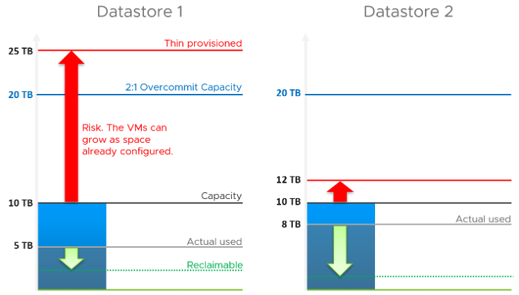
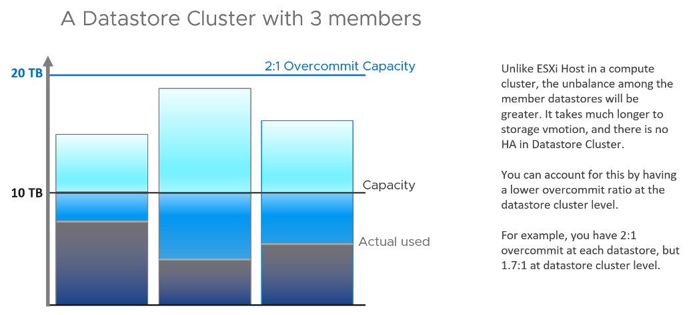

Storage Capacity differs to Compute Capacity and presents a challenge on its own. Unlike compute capacity, which is basically vSphere cluster, storage varies in shape. The two major ones are datastore and vSAN, as local datastore and RDM is rarely used. We will discuss vSAN capacity separately as it has its own unique factors such as FTT, plus it needs to consider compute too.

## Datastore Capacity

Similar to compute capacity, storage capacity is driven by 2 factors:

##### Contention

If the datastore is unable to serve its existing VMs, meaning they are getting bad latency, are you going to add more VM? You are right, the datastore is full, regardless of how space it has left.

The key counters here are latency and outstanding IO. 

##### Utilization

How much disk space is left? Thin provisioning makes this challenging. It requires us to use both the Demand Model and Allocation Model to properly answer the capacity remaining of a datastore.

----- 

Take a look at the following two datastores. 

Which one has lower capacity remaining? Which one would you choose to deploy additional VM?

Both have identical usable physical capacity at 10 TB, as shown by the black line. Both have identical allocation model, based on 2:1 overcommit. But they have different utilization and actual overcommit ratio. Datastore 1 has 5 TB used but 25 TB thin provisioned. Datastore 2 has 8 TB actual used but 12 TB thin provisioned. The red arrow shows the risk.

|       | Total Capacity | Used Capacity |
| ------ | ----------| ----------| ------|
| **Demand Model** | 10 TB | Datastore 1 = 5 TB Datastore 2 = 8 TB | Datastore 1 = 50% Datastore 2 = **80%**|
| **Allocation Model** | 20 TB | Datastore 1 = 25TB Datastore 2 = 12 TB | Datastore 1 = **125%** Datastore 2 = 60% | 

Datastore 1 has lower actual usage, but higher risk because it has more space over-committed than reclaimable. You should take the lower of the two capacity models. In this case, Datastore 2 is what you should choose.

Thin provisioning brings another complexity in the form of newly provisioned VMs, as their growth are not predictable. They can remain idle for months and suddenly grow their storage consumption. Their growth becomes relatively more predictable after they mature, which vary per business application.

Lastly, there is reclamation. I added the green arrow to indicate that you can have different reclaimable values. In the example above, Datastore 1 happens to have has more reclaimable space.

## Capacity Rollup

Now that we know how to calculate the capacity of a single datastore, we are in the position to solve the roll up.

Datastore may belong to datastore cluster. As datastore cluster groups datastores into a larger pool, we can treat them as one logical pool. This simplifies the capacity calculation.

It also makes capacity management easier in large environment with many datastores, as you treat the cluster as one. It makes the information & visualization more compact and manageable. From the datastore cluster, build a drill down. 

For the overcommit ratio, we should allow a lower overcommit ratio at the datastore cluster level to account for the fact that the distribution among the datastore is not granular. The following diagram illustrates why.

How about rolling up to Data Center or vSphere?

This is not advisable. Different datastores in a vCenter can have different purposes, such as NSX Edge and business workload. The capacity they have are not interchangeable. Yes, that means we should not even calculate Total Capacity. If you have 1000 datastores globally with each having 1 TB of remaining space, you do not have 1 PB of space.

So what can you roll up? 

You can roll up VM Remaining. This is simply the sum of VM Remaining on each datastore. 