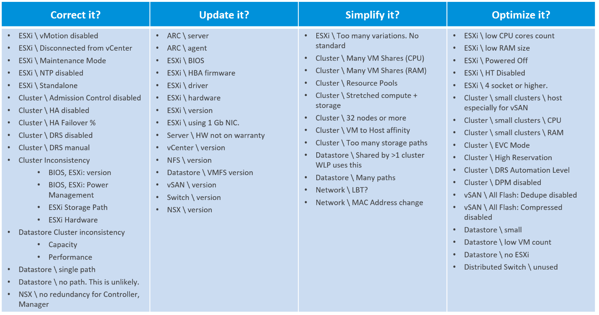

There are literally thousands of settings that you need to manage to ensure security, performance and availability. To ensure the critical ones are tracked and resolved first, consider prioritizing them. vRealize Operations 8.2 uses a 4-step check, starting from the most urgent. 

##### Step 1
Address settings that are incorrect, insecure, not following your corporate standards or against best practice. You should correct them as appropriate.

This is typically the most urgent step.

##### Step 2
The settings are correct, but on older version. It’s hard to keep up with all the vendors releases, so you should prioritize those oldest versions, especially those no longer supported.

A typical SDDC or EUC architecture spans many components. While each can run the latest version, they may not be compatible or supported. 

##### Step 3
The settings are correct and up to date, but they complicates your IaaS operations. Since you are unlikely to eliminate them all, establish policy that minimize them as part of simplifying your operations.

##### Step 4
The last step is about cost and capacity, as there is nothing wrong already. You want to maximize the usage of your resources while minimizing your cost. It’s a balancing act!

-----

Note that each customer runs their operations in unique way. Each operation is like a human fingerprint. So what is right for other customers, may not be right for you. Even in the same environment, what is right for development environment may not be appropriate for production. 

The following table lists some of the possibilities. Use them as an input to tailor the configuration dashboards to your need. It provides examples of what to check in the IaaS Consumer layer. This layer consists of VM and everything that runs inside the VM, such as process, applications, Guest OS and Container.

The next table covers the IaaS Provider layer. This layer consists of the software and hardware infrastructure, such as Telegraf, ESXi, compute cluster, datastore & datastore cluster, resource pool, distributed virtual switch and port group, vSAN, NSX and certainly hardware.

