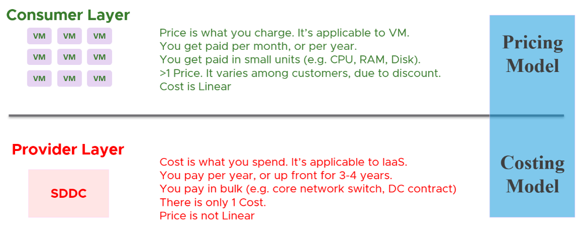

在雲時代，今天的應用團隊提供了更多的基礎設施選項。他們只需要一張信用卡即可開始應用程序開發。無需處理內部繁文縟節來獲得一堆硬件，因為它們都可以作為按需服務提供。

因此，公共雲提供商是內部本地雲的競爭對手。作為內部雲提供商，您需要將公共雲提供商變成盟友。這需要改變您的業務模式，從基礎設施提供商轉變為多雲服務代理。您與最合適的提供商協調基礎設施請求。如果本地云不能滿足業務需求，您可以評估、選擇和交付多個雲。如果本地雲更符合您的業務需求，它也可以是您購買的服務（意味著您不擁有硬件和軟件）。

一個小型而簡潔的內部 IT 基礎架構團隊確實可以補充一個更大的雲提供商。小規模，特別是因為你在現場和在同一家公司工作，可以讓你提供更好的服務。沒有人喜歡在大公司的支持組織中與 **瘋狂** 的官僚打交道。您可能會迷失在政策中。

您還需要將蘋果與蘋果進行比較。列出服務的整個組件。下表提供了一個示例，您可以在其中添加私有云和外部託管雲。您應該使用另一個比較 SLA 和價格的表來補充此表。我提供了一個 SLA 表的示例 [容量管理](/operations-management/chapter-3-capacity-management/1.3.3-capacity-planning).

成本和價格是相關的，但又是不同的。價格是您的客戶關心的，因為這是他們支付的費用。如果你因為成本太高而把價格抬得太高，你的客戶只會轉向公有云。

與術語保持一致。你的價格就是你的客戶的成本。在向客戶描述成本時，使用術語價格更容易。否則，您可能會感到困惑，如以下句子所示：“容量足夠的集群更昂貴，因為成本僅由少數虛擬機分擔。”

這句話的意思是每個 VM 的成本，這是一個假設成本，因為您不會產生該成本。

您需要同時開發定價模型和成本模型，最好是同時開發。

我們先看價格，因為我們要從客戶說起。